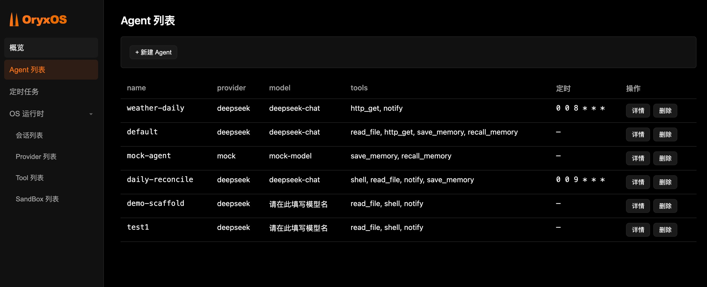

<p align="center">
  
</p>

<p align="center">
  <strong>Distributed Agent Harness OS — a production-grade harness for every agent, run like processes on an OS</strong>
</p>

<p align="center">
  <a href="https://github.com/oryx-labs/oryxos/releases"></a>
  <a href="https://www.java.com"></a>
  <a href="https://spring.io/projects/spring-boot"></a>
  <a href="https://www.apache.org/licenses/LICENSE-2.0"></a>
</p>

---

OryxOS is an open-source **Agent Harness OS** built on Java 21. It gives every agent a production-grade *harness* — the scaffolding that turns a model into a working agent — and runs a fleet of them like an operating system runs processes. One directory defines one Agent; one platform harnesses and runs them all. Deploy privately on your own K8s or servers — agents share channels, LLM routing, tools, memory, and sandboxed execution.

> Long-term vision: enter the Apache Software Foundation as a top-level project.

## What is an agent harness

**An agent harness is the scaffolding around a model that turns it into a working agent:** the loop that drives reason → act → observe, the tools it can call and the execution that runs them, the context assembled before every call, the memory it accumulates, the sandbox that contains it, and the audit trail that records what it did. A bare model only generates text — the harness is what lets it *do* things, reliably and safely.

**The bottleneck for reliable agents in production is not the model — it's the harness around it.** Most Agent frameworks give you one harness, in Python, coupled to a cloud. For enterprises where Java is the backend standard and private deployment is a compliance requirement, there is no native, production-ready harness — let alone a platform that hands the same one to a whole fleet. OryxOS fills this gap.

## Model → Harness → OS

| | Bare Model | Agent Harness | Agent Harness OS |
| --- | --- | --- | --- |
| Scope | A single LLM call | **One** reliable agent | A **fleet** of agents |
| Provides | Text generation | Loop, tools + execution, context, memory, sandbox, audit, delivery | Lifecycle, channels, routing, shared registries, scheduling, governance, admin + API |
| Analogy | A CPU instruction | A process with its runtime | An OS running many processes |

OryxOS is the third column — and it ships the second one for every agent it runs.

## Features

**🤖 One Directory = One Agent**
An Agent is a directory: `.oryxos/agents/<name>/AGENT.md` — YAML frontmatter (the Agent's profile: model, tools, channels, schedules) plus a body of task instructions. Optional private Skills, scripts, and references are loaded progressively. Multiple agents co-exist on one instance.

**⚡ Dynamic Agent Management**
Create an agent via REST, generate a draft `AGENT.md` from one sentence with an LLM, or just drop a directory into the workspace — a `WorkspaceWatcher` picks it up and the agent goes live with no restart.

**🧩 Agent-private Skills**
Standard `skills/<name>/SKILL.md` packages expose only metadata at L1, then load instructions and resources on demand through existing, explicitly granted tools. The REST API and Web Manager support trusted ZIP import, enable/disable, validation status, and archived deletion.

**☕ Java Native**
Built on Java 21 with virtual threads and a self-implemented ReAct loop (Spring AI is used only for protocol translation and `@Tool` schema generation). Single executable JAR, single binary deployment — no Python runtime.

**🔒 Private & Compliant**
Runs on your own K8s, VM, or bare metal. Data never leaves your environment. No cloud lock-in. Credentials go through environment variables and your enterprise key management.

**🔀 Dynamic Provider Registry**
LLM providers and notify channels are stored in SQLite with full CRUD — add, edit, or remove them at runtime. Explicit `name → ChatModel` routing is preserved; the model is rebuilt and cached when its key or base URL changes.

**🛡️ Security as Foundation**
Tool calls pass through file-path, command, and domain whitelists (no Java `SecurityManager`). Full audit trail from day one — every tool invocation and LLM call is persisted to SQLite, not just logged.

**🔌 Open Standards**
Tools via MCP with a three-tier plugin model (zero-code SKILL.md → custom MCP server → native `@Tool`). Notify channels addressed by name. Agent-to-agent collaboration via A2A on the roadmap.

## Architecture

<p align="center">
  
</p>

## Five Core Capabilities

| Capability | Description |
| --- | --- |
| **LLM Routing** | Dynamic, SQLite-backed provider registry with CRUD. Agents are provider-agnostic; explicit `name → ChatModel` routing keeps multi-provider dispatch correct. Switch or add providers at runtime. Local inference supported. |
| **ReAct Loop** | Self-implemented reasoning engine — no external framework. LLM decides whether and which tool to call; OryxOS executes, feeds the result back; LLM decides the next step. Sync execution on Java 21 virtual threads; loop fully controllable. |
| **Memory** | Per-agent long-term memory (`.oryxos/agents/<name>/MEMORY.md`, keyword search, timestamped entries; global fallback when no agent context). Auto-injected into every system prompt, with a vector-retrieval upgrade path. |
| **Tool System** | Built-in file, shell, and HTTP tools. Agent-private `SKILL.md` packages progressively disclose instructions that use explicitly granted built-in/MCP tools; custom MCP servers and native `@Tool` methods cover code extensions. |
| **REST API** | All capabilities exposed via REST. Any language can integrate. Business systems connect via HTTP. |

## Roadmap

**Phase 1 — Single-node Runtime Kernel** *(current)*
Five core capabilities operational: config-as-agent, multi-agent coexistence, REST API, MCP integration. Goal: single-node running and managing a fleet of agents — actually usable.

**Phase 2 — Distributed Foundation** *(planned)*
Stateless instances, externalized state, multi-replica deployment. Supports larger scale and high availability.

**Phase 3 — Cross-node Agent Collaboration** *(vision)*
Introduce agent communication infrastructure. Integrate A2A protocol. Cross-node agent discovery, delegation, and reliable async coordination.

*Horizontal capabilities added across phases: multi-tenancy, SSO, full audit, tool policies, observability, web management console.*

## Module Structure

```text
oryxos/
├── oryxos-core          # OryxTool, Session, ReActLoop, PromptBuilder, ToolExecutor, AgentScheduler
├── oryxos-provider      # ProviderService, Function Calling adapter, explicit multi-provider map
├── oryxos-memory        # MemoryService, LongTermMemory, MemoryTools (save/recall)
├── oryxos-tool          # Built-in tools (file/shell/http), MCP Client, ToolRegistry, SandboxChecker
├── oryxos-channel-cli   # CLI channel: oryxos chat implementation
├── oryxos-web           # REST API controllers, Web admin console, GlobalExceptionHandler
├── oryxos-storage       # SQLite, SessionRepository, ToolInvocationRepository, LlmCallRepository
├── oryxos-cli           # Picocli entry, 12 subcommands, ConfigLoader
└── oryxos-boot          # Spring Boot main class, auto-configuration, dependency aggregation
```

Modules are decoupled through interfaces. Adding a new Channel or Tool requires only a new module — `oryxos-core` stays untouched.

## Quick Start

**Prerequisites**: Java 21, Maven 3.9+, and an LLM API key (DeepSeek / Qwen / OpenAI / Ollama). The Maven build installs a local Node.js on first run to bundle the admin UI — no global Node.js required.

### 1 · Build

```bash
git clone https://github.com/oryx-labs/oryxos.git
cd oryxos
mvn package -DskipTests          # compiles all modules + bundles the Vue admin UI into the fat JAR
```

### 2 · Configure the LLM key

```bash
cp config/application.yml.example config/application.yml
# edit config/application.yml → fill in the deepseek api-key
```

`config/application.yml` is gitignored, so your key stays local and is never committed. Only **one** provider key is needed to boot — Spring AI's eager OpenAI auto-config is excluded, so `serve` starts without `spring.ai.openai.api-key`.

### 3 · One-click start — server + manager

```bash
bin/start.sh                     # defaults to port 8080; or: bin/start.sh 9000
bin/stop.sh                      # stop
```

`start.sh` launches a single process that serves **both** the REST API and the Web Manager on the same port, waits for the health check to pass, then prints the URLs (`/api/v1/health`, `/admin/`, `/swagger-ui`). Logs stream to `logs/oryxos.log`. On the first run it creates `config/application.yml` from the template and asks you to fill in the key.

### CLI alternative

```bash
JAR=oryxos-boot/target/oryxos-boot-*.jar
java -jar $JAR init                       # initialize the .oryxos/ workspace (agents/ memory/ sessions/ logs/)
export DEEPSEEK_API_KEY=your-key-here      # the CLI reads the key from the environment
java -jar $JAR chat --profile default      # interactive multi-turn chat
java -jar $JAR serve --port 8080           # REST API + Web Manager (same as start.sh)
```

The workspace defaults to `.oryxos/` but is configurable — set `ORYXOS_ROOT` (or `-Doryxos.root=`, or `oryxos.root` in `application.yml`) to point OryxOS at a custom workspace directory. The configured root is auto-added to the file sandbox whitelist.

### Web Service & Web Manager

`serve` (and `bin/start.sh`) exposes one process with two faces on the same port:

| URL | What |
| --- | --- |
| `http://localhost:8080/api/v1/**` | REST API (see below) |
| `http://localhost:8080/admin/` | **Web Manager** — Vue 3 console |
| `http://localhost:8080/swagger-ui` | OpenAPI docs |

The Web Manager is a Vue 3 + Vite console (same stack and dark-orange theme as the site) with pages for **agent management** (create, one-sentence LLM generation, file editor, per-agent session, memory, and private Skill management), **provider and notify-channel CRUD**, **scheduled tasks**, **sessions, tools, sandbox whitelist**, and a **workspace file browser**. The Skill tab supports trusted ZIP import, enable/disable, validation details, and archived deletion. It is built to `oryxos-web/src/main/resources/static/admin/` and served by Spring at `/admin`, so the fat JAR ships it — no separate frontend process.

<p align="center">
  
</p>

#### Manager dev mode (hot reload)

When iterating on the console UI, run the Vite dev server instead of rebuilding the JAR each time — it hot-reloads on save and bypasses the browser cache:

```bash
# 1. Keep the backend running — the dev server proxies the API to it
bin/start.sh                              # REST API on :8080

# 2. In another terminal, start the Vite dev server
cd oryxos-web/src/main/frontend
npm install                               # first time only
npm run dev                               # → http://localhost:5173/admin/
```

The dev server runs on port **5173** with base `/admin/` and proxies `/api` → `localhost:8080` (see `vite.config.js`). Edit any file under `src/` and the page updates instantly. When finished, `npm run build` bundles the production assets into `static/admin/` so the next `mvn package` ships them in the fat JAR.

## Agent Definition

**One directory = one Agent.** Each agent lives in `.oryxos/agents/<name>/` with an `AGENT.md` — YAML frontmatter (its profile) plus a body of task instructions injected into the system prompt. Optional `skills/*.md`, `scripts/`, and `REFERENCE.md` in the same directory are loaded on demand via `read_file` / `shell`. There is no `.oryxos/profiles/` directory.

```markdown
---
name: ops-agent
description: DevOps assistant
identity:
  agent_name: ops-agent
  prompt: You are a professional DevOps assistant...
provider:
  name: deepseek          # Switch to qwen / ollama / openai — zero code change
  model: deepseek-chat
  api_key: ${DEEPSEEK_API_KEY}
tools:
  - shell
  - read_file
  - http_get
  - save_memory
  - recall_memory
schedules:
  - cron: "0 9 * * *"
settings:
  max_iterations: 10
  max_history_turns: 20
---

You are a professional DevOps assistant. When triggered, ... (task instructions)
```

Drop this directory into the workspace and the `WorkspaceWatcher` registers the agent live — no restart. Agents can also be created via `POST /api/v1/agents` or drafted from one sentence via the admin console.

### Private Skills

Each Agent is one self-contained directory. `AGENT.md` contains Profile frontmatter plus the Agent's always-loaded instructions; standard private Skills live at `skills/<skill-name>/SKILL.md`:

```text
.oryxos/agents/ops-agent/
├── AGENT.md
└── skills/
    └── incident-triage/
        ├── SKILL.md
        ├── references/
        │   └── severity.md
        ├── scripts/
        │   └── collect.sh
        └── assets/
```

```markdown
---
name: incident-triage
description: Analyze production alerts and propose severity-based actions; use for incident triage.
license: Apache-2.0
compatibility: Requires read_file; optional scripts require shell.
metadata:
  author: ops-team
allowed-tools: read_file shell
---

# Incident Triage

Read `references/severity.md` when severity classification is needed. Run `scripts/collect.sh` only when local diagnostics are required.
```

The Skill directory name and frontmatter `name` must match. Loading is progressive and request-consistent:

1. **L1** — a new top-level request receives only enabled Skill names, descriptions, and readable entry paths.
2. **L2** — after the model selects a relevant Skill, it uses the existing `read_file` tool to read that `SKILL.md`.
3. **L3** — references/assets are read and scripts are run only when the L2 instructions require them, using existing `read_file`/`shell` paths.

There is no global Skill library, global index, or `use_skill` tool. `allowed-tools` is descriptive metadata and never grants permissions; the Agent must explicitly declare each tool in `AGENT.md`, and execution still passes through `ToolExecutor`, sandbox checks, and audit persistence. Legacy flat files such as `skills/old-guide.md` remain unmanaged: they are not migrated, added to L1, disabled, or deleted by the Skill API, but `AGENT.md` may still reference them explicitly.

Managed Skills have `enabled`, `disabled`, or `invalid` status. A valid local ZIP import is an explicit administrator trust action and is enabled for the next request. Disable persists across restart without deleting files; re-enable performs full validation. Delete atomically moves the complete package under `.oryxos/archive/.skills/` instead of physically erasing it; archived Skills are not discoverable and restore is not yet exposed. These changes affect the next top-level request and do not rewrite old Session history or Tool/LLM audit records.

Treat every Skill like code. Archive/path/size validation protects the filesystem but cannot prove instructions, references, or scripts are benign. Review the entire package and import only trusted sources. Disabled means excluded from OryxOS L1 and its normal progressive-loading path; it is not an OS-level per-path ACL for a broadly granted `shell` tool.

## REST API

All endpoints are prefixed with `/api/v1` and every response is wrapped in a unified envelope: `{ "code": 0, "message": "success", "data": <payload>, "timestamp": ... }` (non-zero `code` on error). No auth in the core phase — assumes an internal network.

| Method | Path | Description |
| --- | --- | --- |
| `POST` `GET` | `/agents`, `/agents/{name}` | Agent CRUD (create / list / get / `PUT` update / `DELETE` archive) |
| `POST` | `/agents/{name}/invoke` | Stateless single-turn invocation |
| `GET` | `/agents/{name}/memory` | This agent's long-term memory |
| `GET` `POST` | `/agents/{name}/session`, `/agents/{name}/session/messages` | Console session + send message |
| `POST` | `/agents/{name}/generate-files` | One sentence → LLM-drafted `AGENT.md` (preview only) |
| `POST` | `/agents/{name}/files` | Save edited agent files |
| `POST` `GET` | `/providers`, `/providers/{name}` | Provider CRUD (create / list / get / `PUT` / `DELETE`) |
| `POST` `GET` | `/notify-channels`, `/notify-channels/{name}` | Notify-channel CRUD |
| `POST` `GET` | `/sessions`, `/sessions/{id}` | Session create / list / history / `DELETE` archive |
| `POST` | `/sessions/{id}/messages` | Send a message (triggers ReAct Loop) |
| `GET` `POST` `PUT` | `/schedules`, `/schedules/{id}/executions`, `/schedules/{id}/run`, `/schedules/{id}` | List / history / run-now / enable-disable |
| `GET` `POST` `DELETE` | `/sandbox/whitelist`, `/sandbox/whitelist/{category}` | List / add / remove sandbox entries (`FILE`\|`SHELL`\|`HTTP`) |
| `GET` `POST` | `/workspace/tree`, `/workspace/file` | Workspace file browser (read tree / read / write file) |
| `GET` `POST` | `/agents/{name}/skills` | List private Skills / import one local Skill ZIP as multipart `file` |
| `GET` `PUT` `DELETE` | `/agents/{name}/skills/{skillName}` | Safe metadata / enable-disable / archived deletion |
| `GET` | `/profiles` | List derived profiles (one per agent) |
| `GET` | `/memory` | Read long-term memory |
| `GET` | `/tools` | List available tools |
| `GET` | `/health`, `/info` | Health check / runtime info + provider status |

## Design Principles

- **Platform before Agent** — the most important deliverable is not a powerful Agent, but the environment that lets any Agent run reliably
- **Self-implement the core** — reasoning loop is self-implemented; protocol adapters reuse mature libraries; no reinventing the wheel
- **Directory = Agent** — an Agent is defined by `AGENT.md` plus optional private Skills and resources, not Java code
- **Open standards** — MCP for tools, A2A for collaboration, open formats for skills
- **Stateless instances** — state externalized from the start; the prerequisite for scaling to distributed
- **Security as foundation** — controlled tool sources, least privilege, mandatory sandbox, credentials never persisted, full audit trail from day one
- **Phased and disciplined** — build the minimal complete runtime kernel first; every architecture upgrade is proven by real usage data

## Tech Stack

| Component | Choice |
| --- | --- |
| Language / Runtime | Java 21 (virtual threads) |
| Framework | Spring Boot 3.x |
| LLM Integration | Spring AI Alibaba (protocol translation + `@Tool` schema only) |
| CLI | Picocli |
| Config | SnakeYAML |
| Persistence | SQLite + Spring Data JPA |
| Logging | Logback + SLF4J (structured JSON) |
| Build | Maven multi-module |

## License

[Apache License 2.0](LICENSE) · [oryx-labs](https://github.com/oryx-labs) · Goal: Apache Software Foundation top-level project
