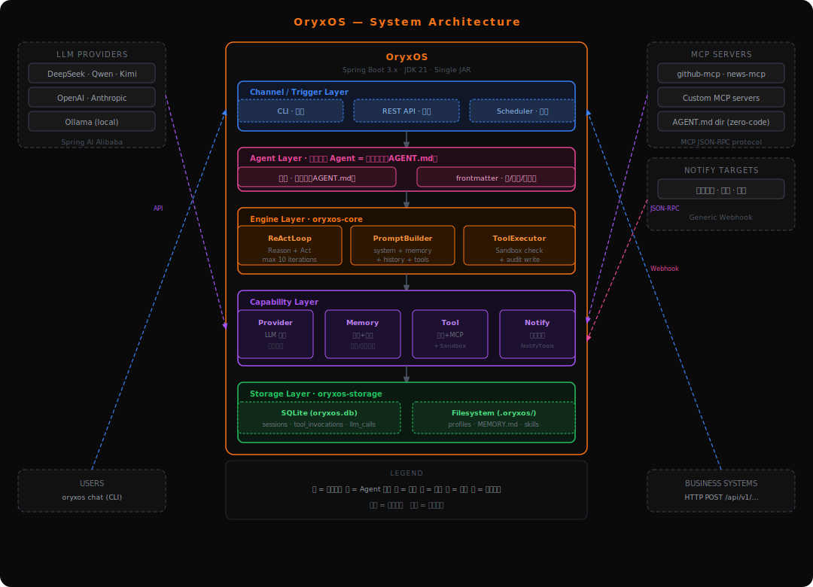
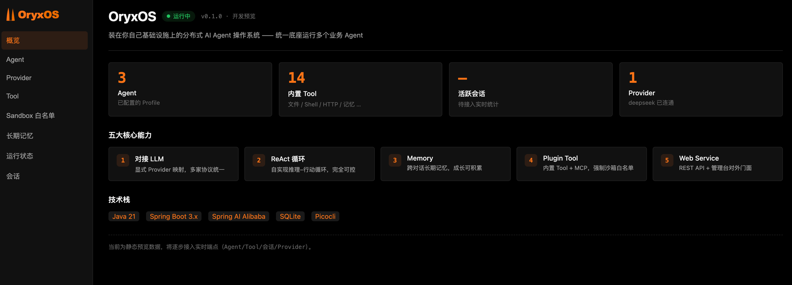

<p align="center">
  
</p>

<p align="center">
  <strong>Distributed AI Agent OS — let agents run and collaborate like processes on an OS</strong>
</p>

<p align="center">
  <a href="https://github.com/oryx-labs/oryxos/releases"></a>
  <a href="https://www.java.com"></a>
  <a href="https://spring.io/projects/spring-boot"></a>
  <a href="https://www.apache.org/licenses/LICENSE-2.0"></a>
</p>

---

OryxOS is an open-source **Distributed AI Agent OS** built on Java 21. One config defines one Agent; one platform runs a fleet. Deploy privately on your own K8s or servers — agents run and collaborate like processes on an OS, sharing channels, LLM routing, tools, memory, and sandboxed execution.

> Long-term vision: enter the Apache Software Foundation as a top-level project.

## Why OryxOS

The Agent ecosystem has mature frameworks — but almost all are Python-based, cloud-coupled, or developer prototypes. For enterprises where Java is the backend standard and private deployment is a compliance requirement, there is no native, production-ready Agent OS in the Java ecosystem. OryxOS fills this gap.

More fundamentally: **the bottleneck for reliable agents in production is not the model — it's the runtime environment.** Whether an agent can actually work depends on having a reliable foundation: the right context, controlled tools, isolated and auditable execution, and reliable message delivery for cross-node coordination. OryxOS is not another agent — it is the OS-level foundation that lets a fleet of agents run reliably.

### Agent OS vs Agent Runtime

| | Agent Runtime | Agent OS |
| --- | --- | --- |
| Scope | Runs **one** agent | Manages a **fleet** of agents |
| Analogy | A process execution environment | An OS managing processes, scheduling, and shared services |
| Provides | Model calls, tool execution, context, loop | Lifecycle, channels, memory, governance, cross-node coordination |

OryxOS is the latter.

## Features

**🤖 Config = Agent**
One Profile YAML defines one Agent — no code required. Multiple agents co-exist on the same instance, each with its own model, tools, memory, and channel config.

**☕ Java Native**
Built on Java 21 with virtual threads. Single executable JAR, single binary deployment. Reuses existing Java ops toolchain — no Python runtime, no Node.js.

**🔒 Private & Compliant**
Runs on your own K8s, VM, or bare metal. Data never leaves your environment. No cloud lock-in. Credentials go through your enterprise key management — never written to disk.

**🛡️ Security as Foundation**
Tool calls pass through file-path, command, and domain whitelists. Sandbox isolation enforced. Full audit trail from day one — every tool invocation and LLM call is persisted, not just logged.

**🔌 Open Standards**
Tools via MCP. Agent-to-agent collaboration via A2A. Skills via SKILL.md. OryxOS interoperates with the ecosystem rather than inventing new protocols.

## Architecture

<p align="center">
  
</p>

## Five Core Capabilities

| Capability | Description |
| --- | --- |
| **LLM Routing** | Provider abstraction unifies mainstream models. Agents are provider-agnostic. Switch at runtime with zero code change via Profile YAML. Local inference supported. |
| **ReAct Loop** | Self-implemented reasoning engine — no external framework. LLM decides whether and which tool to call; OryxOS executes, feeds the result back; LLM decides the next step. Loop is fully controllable. |
| **Memory** | Cross-conversation state persistence. Session memory + long-term memory (file-based, keyword search, vector retrieval upgrade path). Auto-injected into every system prompt. |
| **Tool System** | Built-in file, shell, and HTTP tools. Three-tier extension: zero-code SKILL.md + community MCP server → light-code custom MCP server → heavy-code native `@Tool` method. |
| **REST API** | All capabilities exposed via REST. Any language can integrate. Business systems connect via HTTP. |

## Roadmap

**Phase 1 — Single-node Runtime Kernel** *(current)*
Five core capabilities operational: config-as-agent, multi-agent coexistence, REST API, MCP integration. Goal: single-node running and managing a fleet of agents — actually usable.

**Phase 2 — Distributed Foundation** *(planned)*
Stateless instances, externalized state, multi-replica deployment. Supports larger scale and high availability.

**Phase 3 — Cross-node Agent Collaboration** *(vision)*
Introduce agent communication infrastructure. Integrate A2A protocol. Cross-node agent discovery, delegation, and reliable async coordination.

*Horizontal capabilities added across phases: multi-tenancy, SSO, full audit, tool policies, observability, web management console.*

## Module Structure

```text
oryxos/
├── oryxos-core          # OryxTool, Session, ReActLoop, PromptBuilder, ToolExecutor, AgentScheduler
├── oryxos-provider      # ProviderService, Function Calling adapter, explicit multi-provider map
├── oryxos-memory        # MemoryService, LongTermMemory, MemoryTools (save/recall)
├── oryxos-tool          # Built-in tools (file/shell/http), MCP Client, ToolRegistry, SandboxChecker
├── oryxos-channel-cli   # CLI channel: oryxos chat implementation
├── oryxos-web           # 10 REST endpoints, ApiController, GlobalExceptionHandler
├── oryxos-storage       # SQLite, SessionRepository, ToolInvocationRepository, LlmCallRepository
├── oryxos-cli           # Picocli entry, 12 subcommands, ConfigLoader
└── oryxos-boot          # Spring Boot main class, auto-configuration, dependency aggregation
```

Modules are decoupled through interfaces. Adding a new Channel or Tool requires only a new module — `oryxos-core` stays untouched.

## Quick Start

**Prerequisites**: Java 21, Maven 3.9+, and an LLM API key (DeepSeek / Qwen / OpenAI / Ollama). The Maven build installs a local Node.js on first run to bundle the admin UI — no global Node.js required.

### 1 · Build

```bash
git clone https://github.com/oryx-labs/oryxos.git
cd oryxos
mvn package -DskipTests          # compiles all modules + bundles the Vue admin UI into the fat JAR
```

### 2 · Configure the LLM key

```bash
cp config/application.yml.example config/application.yml
# edit config/application.yml → fill in the deepseek api-key
```

`config/application.yml` is gitignored, so your key stays local and is never committed. Only **one** provider key is needed to boot — Spring AI's eager OpenAI auto-config is excluded, so `serve` starts without `spring.ai.openai.api-key`.

### 3 · One-click start — server + manager

```bash
bin/start.sh                     # defaults to port 8080; or: bin/start.sh 9000
bin/stop.sh                      # stop
```

`start.sh` launches a single process that serves **both** the REST API and the Web Manager on the same port, waits for the health check to pass, then prints the URLs (`/api/v1/health`, `/admin/`, `/swagger-ui`). Logs stream to `logs/oryxos.log`. On the first run it creates `config/application.yml` from the template and asks you to fill in the key.

### CLI alternative

```bash
JAR=oryxos-boot/target/oryxos-boot-*.jar
java -jar $JAR init                       # initialize the .oryxos/ workspace
export DEEPSEEK_API_KEY=your-key-here      # the CLI reads the key from the environment
java -jar $JAR chat --profile default      # interactive multi-turn chat
java -jar $JAR serve --port 8080           # REST API + Web Manager (same as start.sh)
```

### Web Service & Web Manager

`serve` (and `bin/start.sh`) exposes one process with two faces on the same port:

| URL | What |
| --- | --- |
| `http://localhost:8080/api/v1/**` | REST API (see below) |
| `http://localhost:8080/admin/` | **Web Manager** — Vue 3 console |
| `http://localhost:8080/swagger-ui` | OpenAPI docs |

The Web Manager is a read-only Vue 3 + Vite console (same stack and dark-orange theme as the site) with pages for **overview, agents, providers, tools, sandbox whitelist, long-term memory, runtime status, and sessions**. It is built to `oryxos-web/src/main/resources/static/admin/` and served by Spring at `/admin`, so the fat JAR ships it — no separate frontend process.

<p align="center">
  
</p>

#### Manager dev mode (hot reload)

When iterating on the console UI, run the Vite dev server instead of rebuilding the JAR each time — it hot-reloads on save and bypasses the browser cache:

```bash
# 1. Keep the backend running — the dev server proxies the API to it
bin/start.sh                              # REST API on :8080

# 2. In another terminal, start the Vite dev server
cd oryxos-web/src/main/frontend
npm install                               # first time only
npm run dev                               # → http://localhost:5173/admin/
```

The dev server runs on port **5173** with base `/admin/` and proxies `/api` → `localhost:8080` (see `vite.config.js`). Edit any file under `src/` and the page updates instantly. When finished, `npm run build` bundles the production assets into `static/admin/` so the next `mvn package` ships them in the fat JAR.

## Agent Profile

Each agent is defined by a single YAML file under `.oryxos/profiles/`:

```yaml
name: ops-agent
description: DevOps assistant
identity:
  agent_name: ops-agent
  prompt: You are a professional DevOps assistant...
provider:
  name: deepseek          # Switch to qwen / ollama / openai — zero code change
  model: deepseek-chat
  api_key: ${DEEPSEEK_API_KEY}
tools:
  - shell
  - read_file
  - http_get
  - save_memory
  - recall_memory
settings:
  max_iterations: 10
  max_history_turns: 20
```

## REST API

All endpoints are prefixed with `/api/v1`:

| Method | Path | Description |
| --- | --- | --- |
| `POST` | `/sessions` | Create a session |
| `POST` | `/sessions/{id}/messages` | Send a message (triggers ReAct Loop) |
| `GET` | `/sessions/{id}` | Get session history |
| `DELETE` | `/sessions/{id}` | Archive a session |
| `POST` | `/agents/{name}/invoke` | Stateless agent invocation |
| `GET` | `/profiles` | List all profiles |
| `GET` | `/memory` | Read long-term memory |
| `GET` | `/tools` | List available tools |
| `GET` | `/health` | Health check |
| `GET` | `/info` | Runtime info + provider status |

## Design Principles

- **Platform before Agent** — the most important deliverable is not a powerful Agent, but the environment that lets any Agent run reliably
- **Self-implement the core** — reasoning loop is self-implemented; protocol adapters reuse mature libraries; no reinventing the wheel
- **Config = Agent** — an Agent is defined by configuration, not code
- **Open standards** — MCP for tools, A2A for collaboration, open formats for skills
- **Stateless instances** — state externalized from the start; the prerequisite for scaling to distributed
- **Security as foundation** — controlled tool sources, least privilege, mandatory sandbox, credentials never persisted, full audit trail from day one
- **Phased and disciplined** — build the minimal complete runtime kernel first; every architecture upgrade is proven by real usage data

## Tech Stack

| Component | Choice |
| --- | --- |
| Language / Runtime | Java 21 (virtual threads) |
| Framework | Spring Boot 3.x |
| LLM Integration | Spring AI Alibaba (protocol translation + `@Tool` schema only) |
| CLI | Picocli |
| Config | SnakeYAML |
| Persistence | SQLite + Spring Data JPA |
| Logging | Logback + SLF4J (structured JSON) |
| Build | Maven multi-module |

## License

[Apache License 2.0](LICENSE) · [oryx-labs](https://github.com/oryx-labs) · Goal: Apache Software Foundation top-level project
