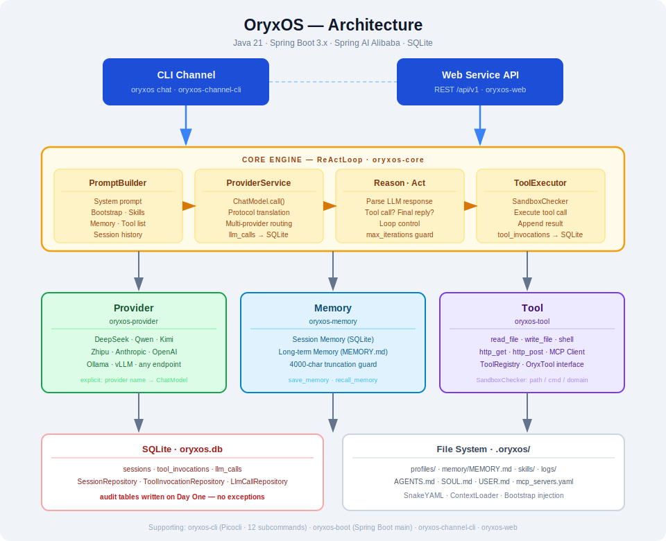

<p align="center">
  
</p>

> **Enterprise Agent OS built on Java** — run multiple AI agents on your own infrastructure, sharing channels, model routing, tool execution, memory, and sandbox capabilities.

[](https://openjdk.org/projects/jdk/21/)
[](https://spring.io/projects/spring-boot)
[](https://github.com/alibaba/spring-ai-alibaba)
[](LICENSE)

---

## What is OryxOS?

OryxOS is a **Java-based Agent Operating System** designed for enterprise deployment. Install it on your own Kubernetes cluster or server, and run multiple business agents (DevOps assistant, customer service, HR assistant, sales assistant, knowledge management) on top of a shared runtime — all on infrastructure you own, with no cloud lock-in.

### Agent OS vs. Agent Runtime

| | Agent Runtime | Agent OS |
| --- | --- | --- |
| **Scope** | Runs a single agent | Manages a fleet of agents |
| **Capabilities** | LLM calls, tool execution, context management | Runtime + lifecycle management, unified channels, shared memory, audit, multi-tenancy |
| **Analogy** | A process execution environment | The OS that schedules processes and provides shared services |

OryxOS delivers an Agent OS kernel first, then adds the full enterprise governance layer (multi-tenancy, SSO, audit, Tool policy) incrementally.

---

## Features

- **Multi-Provider LLM Routing** — DeepSeek, Qwen, Kimi, Zhipu, Hunyuan, Doubao, Anthropic, OpenAI, Ollama, vLLM, and any OpenAI-compatible endpoint. Switch providers at runtime without agent changes.
- **Self-implemented ReAct Loop** — Full control over the Reason+Act cycle. No framework magic; tool scheduling and execution are 100% owned by OryxOS.
- **Three-layer Memory** — Session memory (current conversation), long-term memory (`MEMORY.md`, persisted across sessions), and episodic memory (roadmap).
- **Extensible Tool System** — Built-in file/shell/HTTP tools plus a three-tier plugin model: zero-code (SKILL.md + MCP), light-code (custom MCP server), or heavy-code (Java `@Tool` bean).
- **Sandboxed Execution** — Path/command/domain whitelists enforced at the application layer (no deprecated `SecurityManager`).
- **Auditable by Design** — Every tool invocation and LLM call is written to SQLite on day one.
- **Single-binary Deployment** — Fat JAR with no external runtime dependencies. GraalVM Native Image support on the roadmap.
- **CLI + REST** — Interactive `oryxos chat` for local use and a full REST API for integration.

---

## Architecture



### Module Layout

| Module | Responsibility |
| ------ | -------------- |
| `oryxos-core` | Core abstractions: `OryxTool`, `Session`, `Profile`, `ContextLoader`, `ReActLoop`, `PromptBuilder`, `ToolExecutor`, `AgentService` |
| `oryxos-provider` | `ProviderService`, Function Calling adapter, explicit multi-provider mapping |
| `oryxos-memory` | `MemoryService` facade, `LongTermMemory`, `MemoryTools` (save / recall) |
| `oryxos-tool` | Built-in tools (file / shell / HTTP), MCP client, `ToolRegistry`, `SandboxChecker` |
| `oryxos-channel-cli` | CLI channel — interactive `oryxos chat` |
| `oryxos-web` | REST controllers, `GlobalExceptionHandler`, OpenAPI spec |
| `oryxos-storage` | SQLite, `SessionRepository`, `ToolInvocationRepository`, `LlmCallRepository` |
| `oryxos-cli` | Picocli entry point, 12 subcommands, `ConfigLoader` |
| `oryxos-boot` | Spring Boot main class, auto-configuration, dependency aggregation |

---

## Quick Start

### Prerequisites

- Java 21+
- Maven 3.9+
- At least one LLM provider API key (e.g. `DEEPSEEK_API_KEY`)

### Build

```bash
git clone https://github.com/your-org/oryxos.git
cd oryxos
mvn package -DskipTests
```

### Initialize a workspace

```bash
export DEEPSEEK_API_KEY=your_key_here

java -jar oryxos-boot/target/oryxos.jar init
```

This creates a `.oryxos/` directory in the current folder with default configuration files.

### Start chatting

```bash
java -jar oryxos-boot/target/oryxos.jar chat
```

Or use a specific agent profile:

```bash
java -jar oryxos-boot/target/oryxos.jar chat --profile ops-agent
```

### Start the REST API server

```bash
java -jar oryxos-boot/target/oryxos.jar serve --port 8080
```

---

## Configuration

### Agent Profile (`profiles/ops-agent.yaml`)

Each agent is defined by a Profile YAML under `.oryxos/profiles/`:

```yaml
name: ops-agent
description: DevOps assistant
identity:
  agent_name: OpsBot
  prompt: You are a professional DevOps assistant...
provider:
  name: deepseek          # maps to an explicit provider entry
  model: deepseek-chat
  temperature: 0.7
tools:
  - read_file
  - shell
  - http_get
  - save_memory
  - recall_memory
skills:
  - daily-pr-digest       # loads .oryxos/skills/daily-pr-digest.md into the system prompt
mcp_servers:
  - github-mcp
channels:
  - name: cli
bootstrap:
  - AGENTS.md
  - SOUL.md
  - USER.md
settings:
  max_iterations: 10
  max_history_turns: 20
```

### Provider credentials

Sensitive values are read from environment variables — never hardcoded:

```bash
export DEEPSEEK_API_KEY=sk-...
export QWEN_API_KEY=sk-...
export KIMI_API_KEY=sk-...
```

Reference them in the profile with `${ENV_VAR_NAME}`.

---

## CLI Reference

```bash
# Workspace
oryxos init                        # initialize .oryxos/ workspace
oryxos status                      # show config and runtime status

# Channels
oryxos chat [--profile <name>]     # interactive multi-turn conversation
oryxos serve [--port 8080]         # start REST API server
oryxos gateway                     # daemon mode (multiple channels)

# Profile management
oryxos profile list
oryxos profile create <name>
oryxos profile show <name>
oryxos profile delete <name>

# Inspection
oryxos provider list
oryxos tool list
oryxos session list
```

---

## REST API

Base path: `/api/v1`

| Method | Path | Description |
| ------ | ---- | ----------- |
| `POST` | `/sessions` | Create a session |
| `POST` | `/sessions/{id}/messages` | Send a message (triggers ReAct Loop) |
| `GET` | `/sessions/{id}` | Retrieve session history |
| `DELETE` | `/sessions/{id}` | Archive a session |
| `POST` | `/agents/{name}/invoke` | Stateless agent invocation |
| `GET` | `/profiles` | List all profiles |
| `GET` | `/memory` | Read long-term memory |
| `GET` | `/tools` | List available tools |
| `GET` | `/health` | Health check |
| `GET` | `/info` | Runtime info and provider status |

---

## Workspace Layout

```text
.oryxos/
├── profiles/           # one YAML file per agent profile
├── memory/
│   └── MEMORY.md       # long-term memory written by save_memory tool
├── skills/             # SKILL.md instruction templates (injected into system prompt)
├── logs/               # structured JSON logs
├── mcp_servers.yaml    # MCP server configuration
├── oryxos.db           # SQLite database
├── AGENTS.md           # project-level agent behavior bootstrap
├── SOUL.md             # agent personality bootstrap
└── USER.md             # user preferences (read-only for agents)
```

---

## Extending OryxOS

### Zero-code: SKILL.md + MCP Server

Write a `SKILL.md` under `.oryxos/skills/` and reference a community MCP server in `mcp_servers.yaml`. No Java required.

### Light-code: Custom MCP Server

Implement an MCP server in any language and register it in `mcp_servers.yaml`. OryxOS connects over JSON-RPC.

### Heavy-code: Java `@Tool` Bean

Annotate a Spring Bean method with `@Tool` and register it in `ToolRegistry`. The bean runs in-process for maximum performance.

---

## Roadmap

| Phase | Scope |
| ----- | ----- |
| **Week 1** | Provider abstraction + ReAct Loop + CLI channel |
| **Week 2** | Memory system + built-in tool suite + MCP client |
| **Week 3** | Web Service (10 REST endpoints) + SQLite audit |
| **Week 4** | Multi-agent demo + session persistence across restarts |
| **Extension** | Multi-tenancy, RBAC, SSO, vector memory, SSE streaming, GraalVM Native Image |

---

## Contributing

Contributions are welcome. Please read the coding principles in [CLAUDE.md](CLAUDE.md) before submitting a PR — especially the rules around the ReAct Loop, Spring AI usage boundaries, and audit table writes.

1. Fork the repository
2. Create a feature branch (`git checkout -b feat/your-feature`)
3. Commit your changes
4. Open a Pull Request

---

## License

[MIT](LICENSE)
