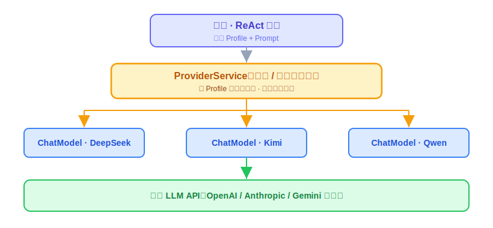
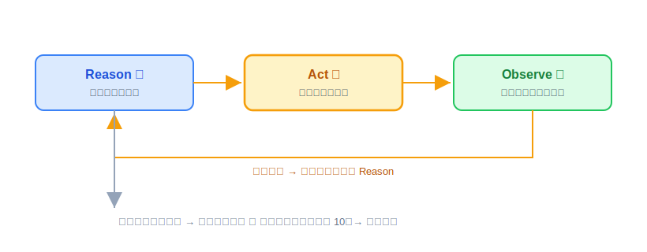
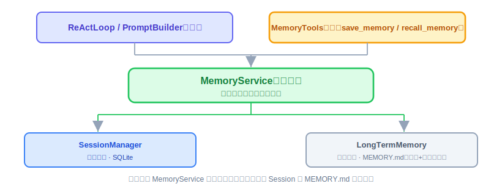
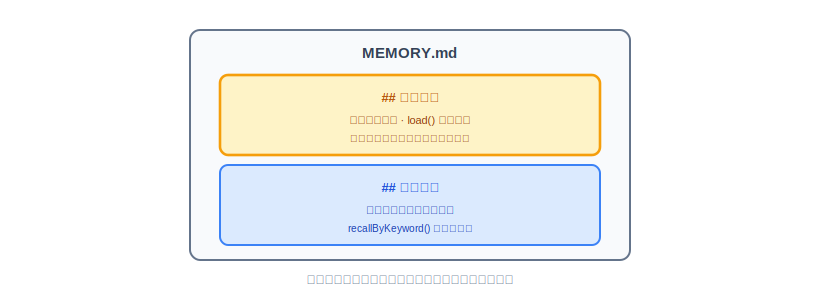
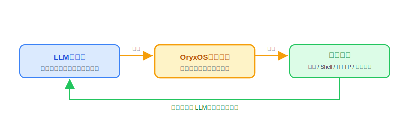
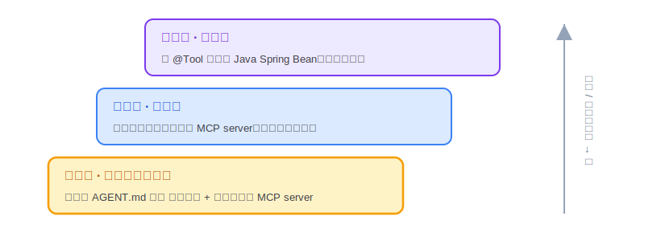
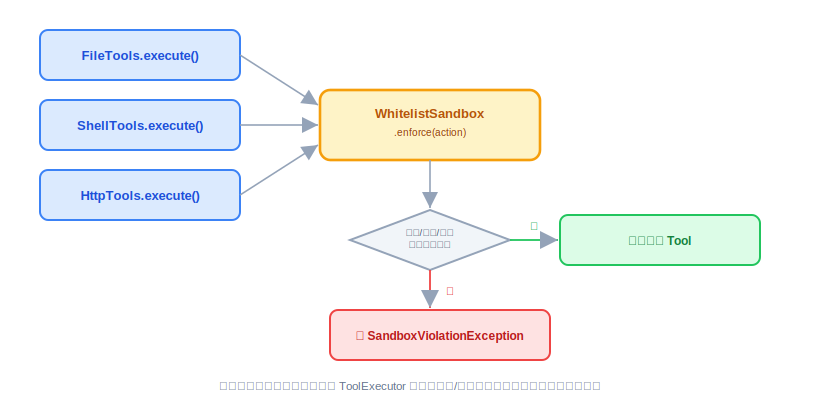
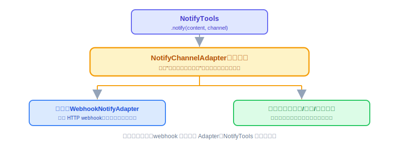
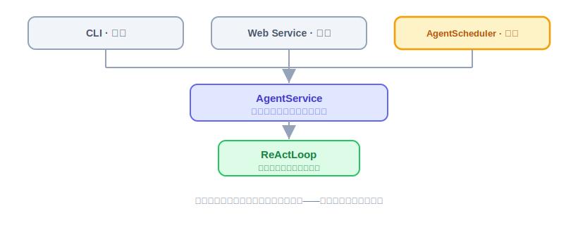
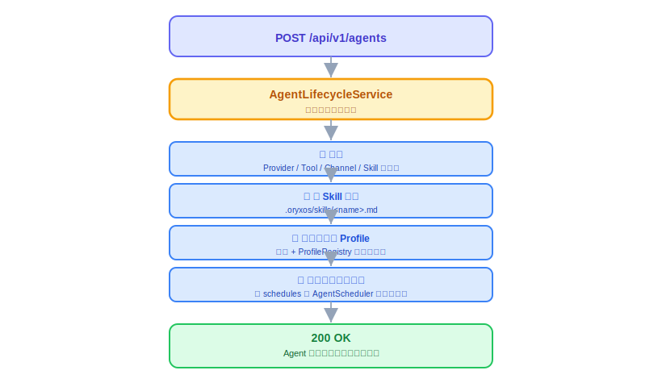

# OryxOS 技术方案

本文档定义 OryxOS 的技术方案，回答 How 的问题。前置阅读《项目篇 OryxOS 业界调研》和《OryxOS 需求文档》。本文档以需求文档定义的五大核心能力（对接 LLM、ReAct 循环、Memory 记忆、Plugin Tool、Web Service）为骨架展开，每个模块只给职责和功能说明，不展开代码细节。代码层面的实现细节在研发阶段补充。

> 承接需求文档的定位判断：核心阶段交付的是 Agent OS 的运行时内核，能力上对齐业界开源 Agent OS 的基础层；让 OryxOS 成为真正企业级 Agent OS 的治理层（多租户、SSO、完整审计、Tool 治理）在扩展和社区阶段补齐。本技术方案只覆盖核心阶段的运行时内核，并在架构上为治理层预留扩展点。

> **文档结构提示：** 全文分三部分。第一部分（第 1-10 章）是**底座**——让任意 Agent 都能可靠运行的引擎、能力和支撑设施，本身不是某个具体的业务 Agent。第二部分（第 11 章）讲底座之上怎么真正**定义一个业务 Agent**（Skill 定义做什么，Profile 绑定怎么跑，Web Service 是对外的定义入口）。第三部分（第 12-15 章）是两部分放到一起之后的整合验证、实施节奏和收尾。

---

# 第一部分：底座（Agent OS 内核）

## 1. 方案概述

OryxOS 是一个 **Spring Boot 3.x** 单体应用，跑在 **JDK 21** 上，基于 **Spring AI Alibaba** 做 LLM 调用，自己实现 **ReAct loop** 作为 Agent 核心。整个 OryxOS 是一个可执行 JAR，单二进制部署，扩展阶段引入 **GraalVM Native Image** 进一步压缩启动时间和内存占用。

> **技术栈选型一句话总结**：JDK 21 + Spring Boot 3.x + Spring AI Alibaba + 自实现 ReAct loop + SQLite + Picocli 命令行。

### 1.1 关键技术决策

需求文档定义了五大核心能力，下面统一列出 7 个关键决策的取舍。先用一张表速览，再逐条展开。

| # | 决策 | 选择 | 理由 |
|---|------|------|------|
| 1 | ReAct loop 实现方式 | 自实现，不依赖 Spring AI Agent 抽象 | 完全可控，保留未来定制循环行为的空间 |
| 2 | Spring AI 使用边界 | 只用 Provider 抽象 + 协议转换 + `@Tool` schema 生成，禁用自动 tool 执行 | 避免 tool 被调两次，ReAct 循环完全由 OryxOS 自己掌控 |
| 3 | 执行模型 | 同步阻塞 + Java 21 virtual thread | 直观简洁，无需响应式编程，单节点撑高并发 |
| 4 | Tool 注册机制 | `@Tool` 注解 + **OryxTool** 抽象层 | 统一内置 Tool 和 MCP Tool 接口，ReAct 循环不感知 Tool 来源 |
| 5 | HTTP 服务层 | Spring MVC + Java 21 virtual thread | 同步直观，单机撑千级并发，扩展阶段 `SseEmitter` 支持流式 |
| 6 | Sandbox 策略 | 接口先行：`Sandbox` 抽象 + `WhitelistSandbox`（应用层 Path/Pattern 白名单）实现，扩展阶段按容器→microVM 演进 | `SecurityManager` 在 JDK 17 起废弃、JDK 21 已不可用，与 JDK 21+ 要求冲突；接口独立于白名单实现，未来换重隔离方案不用改调用方 |
| 7 | 持久化方案 | SQLite + Spring Data JPA + `MEMORY.md` 文件 | 单二进制，审计表 day one 写入，避免后期从日志反解析返工 |

**决策一：自己实现 ReAct loop。** Spring AI 负责 LLM 调用、Function Calling 的协议格式转换、Provider 抽象这些底层工作，ReAct loop 自己写，保证 Agent 核心完全可控，也保留未来定制循环行为的空间。

**决策二：明确划清 Spring AI 的使用边界。** 这是最容易埋 bug 的地方，单列为一条决策。Spring AI 自身带有一套完整的 tool calling 自动执行机制（能自动执行 tool 再把结果回灌给模型）。

OryxOS **不使用**这套自动执行，只用 Spring AI 的两件事：
- 一是 Provider 抽象和向各家 LLM 的协议转换
- 二是 `@Tool` 注解的 JSON Schema 生成

Tool 的实际调度和执行完全由 OryxOS 自己的 **`ReActLoop`** 加 **`ToolExecutor`** 控制。换句话说，Spring AI 在 OryxOS 里只做协议适配器和 schema 生成器，不做循环引擎。研发时必须禁用 Spring AI 的自动 tool 执行，否则会出现 tool 被调两次的问题。

**决策三：同步执行模型。** 核心阶段采用同步阻塞执行模型，跟 Spring MVC 一致。一次消息从进来、ReAct loop 执行、Tool 调用、Provider 调用到最终响应返回，全程同步。这跟 Java 21 的 virtual thread 配合得很好，单节点支撑高并发不需要响应式编程。扩展阶段引入流式输出（SSE）和异步 Tool 调用。

**决策四：Tool 注册机制用 `@Tool` 注解加 `OryxTool` 抽象层。** Spring AI 注解负责扫描 Java 方法生成 JSON Schema，OryxOS 在其上加一层 **`OryxTool`** 抽象，统一内置 Tool 和 MCP Tool 的接口形式，让 ReAct loop 不感知 Tool 来源。注解的确切名称和用法以采用的 Spring AI 版本为准，研发前需对当前版本核实。

**决策五：HTTP 服务层用 Spring MVC 加 Java 21 virtual thread。** 同步直观的代码加 virtual thread 的高并发能力，单机轻松撑住几千并发。扩展阶段要 SSE 流式返回时，Spring MVC 的 `SseEmitter` 也能支持。

**决策六：Sandbox 先定接口，核心阶段只填一档实现。** 隔离强度和开销是一个跷跷板，从轻到重依次是应用层白名单校验、容器隔离（namespace + cgroups + seccomp）、microVM（Firecracker / Kata / gVisor）、完整虚拟机或物理隔离。为了不让核心阶段的实现选择绑死未来的架构，先抽象出一个 `Sandbox` 接口，表达"在受控环境里执行一个动作"这个意图，不携带任何一档实现特有的概念（不出现"容器镜像""VM 配置"字样）。核心阶段只实现 `WhitelistSandbox` 这一档：文件操作限制工作目录、Shell 命令白名单、HTTP 域名白名单，在应用层做校验，不使用 Java `SecurityManager`（它在 JDK 17 起已废弃、JDK 21 已不可用，与本项目 JDK 21+ 要求冲突）。扩展阶段按信号驱动升级：出现"要跑不可信代码或要多租户"时上容器隔离；出现"要跑完全不可信代码或要规模化多租户"时上 microVM。接口不随升级变化，新增的是实现类。

**决策七：持久化用 SQLite 加 Spring Data JPA，Memory 长期记忆用 `MEMORY.md` 文件加关键词检索。** Profile YAML 放 `.oryxos/profiles/`，Session、Tool Invocation、LLM Call 落 SQLite。其中审计相关的 `tool_invocations` 和 `llm_calls` 两张表在核心阶段就做写入（不做查询接口），让可审计这个差异化能力的数据地基在 day one 就立起来，避免后期从日志反解析返工。完整的向量检索方案在扩展阶段升级（详见第 8 章）。

### 1.2 整体技术栈

OryxOS 的完整技术栈：

1. **JDK 21** 加 **Spring Boot 3.x**（virtual thread 处理高并发）
2. **Spring AI** 加 **Spring AI Alibaba**（LLM Provider 抽象，复用现成的主流 LLM connector）
3. 自实现 **ReAct loop**（Agent 核心循环）
4. **Spring MVC**（HTTP API 服务层）
5. **Picocli**（命令行工具）
6. **SnakeYAML**（Profile YAML 解析）
7. **SQLite** 加 **Spring Data JPA**（Session、审计和元数据持久化）
8. **MCP Java SDK**（MCP Client 集成，社区项目，可能需要部分自实现）
9. **Logback** 加 **SLF4J**（结构化日志）
10. **Micrometer** 加 **Prometheus**（指标采集，扩展阶段）

---

## 2. 整体架构

OryxOS 的整体架构按"五大核心能力加支撑模块"组织。五大核心能力是 Agent OS 运行时内核的主体，支撑模块是让这些能力跑起来需要的工程基础设施。

整体上，OryxOS 是一个 Spring Boot 单体应用，对外有两个人工触发入口，加一个内部自动触发入口：

1. **CLI Channel** 用于本地交互和调试，**Web Service** 用于业务系统通过 REST API 集成，这两个是"人推"；**`AgentScheduler`**（8.5）按 cron 到点自动发起调用，是"钟推"。三个入口的消息最终都汇入同一个引擎，`AgentService` 作为统一入口不区分消息从哪个入口来。
2. 引擎是 **ReAct 循环**，它是整个系统的中枢，负责把"接收消息、组装 Prompt、调用 LLM、执行 Tool、回填结果、继续推理"这条链路驱动起来。引擎自己不直接干活，而是调度三块能力：
   1. **Provider** 负责 LLM 调用并向外对接各家大模型 API
   2. **Memory** 负责会话和长期记忆并读写本地文件
   3. **Tool** 负责工具执行并通过 MCP Client 向外对接外部 MCP server

这三块能力之下是存储层，Session 和审计数据落 SQLite，Profile、Bootstrap、Memory、Skill 这些用户可维护的数据落文件系统。

这个架构有两个要点：

1. 所有能力收敛到一个引擎、一套存储、一个进程内，符合"单二进制、装好就跑"的定位，外部依赖（LLM 厂商 API、外部 MCP server）都在应用边界之外，OryxOS 自身不绑定任何一家。
2. 引擎和能力之间、能力和外部之间都通过抽象接口解耦，这让扩展阶段加新 Channel、新 Provider、新 Tool 时只需在边缘扩展，不动核心引擎。


### 2.1 分层视图

从上到下分四层：

1. **接入层**（CLI Channel、Web Service 的 REST API、`AgentScheduler` 定时触发），负责消息进出。
2. **引擎层**（`ReActLoop`、`PromptBuilder`、`ToolExecutor`），是 Agent 的大脑。
3. **能力层**（Provider、Memory、Tool），给引擎提供 LLM 调用、上下文、执行能力。
4. **基础层**（Profile/Bootstrap/Skill 加载、Session 存储、SQLite、配置与密钥加载），是工程地基。

### 2.2 五大能力之间的关系

五大能力不是平行的功能模块，它们之间有明确的协作关系：

- **ReAct 循环（能力二）** 是引擎，负责把"用户消息到 LLM 思考到 Tool 执行到结果回填到继续"这件事跑起来。
- **Provider（能力一）** 给 ReAct 循环提供 LLM 调用能力，每轮思考都要调一次。
- **Memory（能力三）** 给 ReAct 循环提供上下文，每轮组装 prompt 时把会话历史和长期记忆注入进去。
- **Tool（能力四）** 给 ReAct 循环提供执行能力，LLM 决定调哪个 Tool 后由 ReAct 循环负责执行。
- **Web Service（能力五）** 是这套内部能力的对外出口，把前四个能力包装成 REST API 供业务系统集成，它不参与 Agent 内部循环，而是循环的触发入口和结果出口之一（另外两个入口是 CLI Channel 和 `AgentScheduler` 定时触发，见 8.5）。

> **简化成一句话**：Provider、Memory、Tool 三个能力供养 ReAct 循环这个引擎，引擎跑出的能力通过 CLI、Web Service、定时任务三个入口对外提供。

---

## 3. 核心能力一：对接 LLM（Provider 抽象）

LLM 调用的复杂度都被 **Spring AI Alibaba** 吸收掉了。OryxOS 在其上做一层薄包装，把 Spring AI 的 `ChatClient` 转成 OryxOS 内部的 **`ProviderService`** 抽象。

### 3.1 模块组成

**`ProviderService` 模块。** 职责是统一管理所有 LLM Provider，对 ReAct 循环屏蔽不同 LLM 厂商的差异。ReAct 循环调 LLM 时传入 Profile 和 Prompt，`ProviderService` 按 Profile 配置选对应的底层 `ChatModel` 完成调用。

**Function Calling 适配模块。** 职责是把 OryxOS 内部的 **`OryxTool`** 抽象转成 Spring AI 的工具调用格式。Spring AI 已经做好了向各家 LLM 协议的转换（OpenAI tools、Anthropic tools、Gemini function declarations），OryxOS 不需要关心每家协议的差异。注意这里只用 Spring AI 的格式转换，不用它的自动执行（见决策二）。

**Provider 配置模块。** 通过 `application.yaml` 配置 Provider 的 API key 和 base URL，Spring AI Alibaba 根据配置创建对应的 `ChatModel` Bean。



### 3.2 Provider 名到 ChatModel 的显式映射

这是一个需要讲清楚的关键点。Spring AI Alibaba 配多个 Provider 时，Spring 容器里会有多个 `ChatModel` Bean。仅靠"扫描容器里所有 `ChatModel`"无法可靠区分哪个是 deepseek、哪个是 kimi，因为 Bean 类型相同、Bean name 未必等于 provider name。

OryxOS 的做法是维护一份显式的 **provider name 到 `ChatModel` 的映射**，而不是靠类型扫描自动来。

具体是在 Provider 配置里为每个 Provider 声明唯一的 provider name（`deepseek`、`qwen`、`kimi` 等），`ProviderService` 启动时按这个 name 建立映射表，Profile 通过 provider name 引用。这样多 Provider 并存时不会有歧义。映射的具体实现方式（用 Spring 的 `@Qualifier`、还是自己维护配置表）在研发阶段定，但"**显式映射、不靠类型扫描**"这个原则要守住，否则多 Provider 跑不起来。

### 3.3 关键设计点

**核心阶段不做 fallback 和 hedge racing。** Provider 故障时直接报错给 Agent。fallback 链路、circuit breaker、hedge racing 放扩展阶段，通过 Profile 的 `fallback` 字段声明备用 Provider。

**成本透明在核心阶段做基础版。** 每次 LLM 调用记录 token 使用量、Provider、模型，写入 `llm_calls` 表（见第 8 章）。扩展阶段做完整的成本聚合和 Web 看板。

---

## 4. 核心能力二：ReAct 循环

ReAct 循环是 OryxOS 最核心的一段代码。输入一条用户消息，输出 Agent 的最终响应，中间可能调用若干次 LLM 和若干次 Tool。

### 4.1 ReAct loop 算法

ReAct 是 **Reason** 加 **Act** 的简称。算法步骤：

1. 接到用户消息追加到 Session 对话历史
2. 组装 Prompt（system prompt 加 Bootstrap 加 Skill 加 Memory 加对话历史加可用 Tool 列表）
3. 调用 LLM Provider 获取响应
4. 如果响应**没有** Tool 调用，返回最终响应
5. 如果**有** Tool 调用，OryxOS 执行 Tool 并把结果作为 tool 消息追加到对话历史
6. 回到组装 Prompt 步骤继续循环
7. 达到最大迭代次数（默认 10 次）强制结束



### 4.2 模块组成

**`ReActLoop` 模块。** Agent 的核心循环引擎。输入 Session 和用户消息，输出最终响应。内部维护当前迭代次数，调用 `ProviderService` 调 LLM，调用 `ToolExecutor` 执行 Tool，把每轮的响应和工具结果累积到 Session 对话历史。核心循环逻辑精简，约数十行 Java，不依赖 Spring AI 的 Agent 抽象，让实现者完整掌握 Agent 的工作机制。

**`PromptBuilder` 模块。** 组装每轮 LLM 调用的 Prompt。按四部分顺序拼接：

1. system prompt（Profile 的 identity prompt 加 Bootstrap 文件加 Skill 文件内容，由 `ContextLoader` 提供；末尾附当前日期时间——LLM 自己不知道今天几号，定时场景的"今天"全靠这一行）
2. Memory 注入（会话历史加长期记忆，由 `MemoryService` 提供）
3. 对话历史（按 `maxHistoryTurns` 截断后的 Session messages）
4. 当前 Profile 可用的 Tool 列表（按 Function Calling 格式）

**`ToolExecutor` 模块。** 执行 LLM 返回的 Tool 调用请求。从 `ToolRegistry` 找到对应 Tool，做 Sandbox 检查，执行 Tool，把结果包装成 `ToolResult` 返回给 ReAct 循环，并写入 `tool_invocations` 表。失败时按可重试策略返回错误信息。

**`AgentService` 模块。** 三种触发源共用的统一入口，也是一次处理的编排者：`process(Session, String)` 内部依次做——把当前 Profile 放进 `ProfileContext`（ThreadLocal，虚拟线程下每个请求天然独立）、调 `ReActLoop.run` 跑完循环、持久化 Session、`finally` 里清掉 `ProfileContext`。`ProfileContext` 解决的是"工具执行时怎么知道当前是哪个 Agent"：`OryxTool.execute` 的签名不带 Profile，`NotifyTools` 取 `notify_channels`、按 Profile 过滤工具子集这类需求，都从 `ProfileContext` 读，不改工具接口。

### 4.3 关键设计点

**`MAX_ITERATIONS` 限制。** 核心阶段默认 10 次，防止 Agent 陷入 Tool 调用死循环，可在 Profile 里覆盖。

**消息累积。** 每次迭代都把 LLM 响应和 Tool 结果追加到 Session 的 messages 列表。Session 的对话历史包含完整的 LLM 调用链和 Tool 调用链，对外可查可审计。

**上下文长度管理。** 核心阶段策略简单：保留 system prompt 和最近 N 轮对话，超出部分丢弃，N 由 Profile 配置默认 20 轮。扩展阶段引入总结压缩。

**核心阶段不做：** Tool 调用并行（一次响应里多个 Tool 调用按顺序执行）、Agent 间任务委托、流式响应。这些放扩展阶段。

---

## 5. 核心能力三：Memory 三层记忆

Memory 是 Agent OS 区别于普通 chatbot 的核心能力。三层记忆是完整设计，核心阶段做会话和长期两层，情景记忆放扩展。

> **架构调整说明：** Memory 做成三层记忆的统一门面，对 ReAct 循环只暴露一个 `MemoryService` 接口，内部再分会话记忆和长期记忆。这样对外叙述的"三层记忆"和内部实现一致，ReAct 循环不需要分别去问 Session 和 `MEMORY.md` 两个地方。

### 5.1 模块组成

**`MemoryService` 模块（统一门面）。** 对 ReAct 循环暴露统一的记忆读写接口。内部把会话记忆委托给 `SessionManager`（底层是 SQLite 的 Session 存储），把长期记忆委托给 `LongTermMemory`（底层是 `MEMORY.md` 文件）。ReAct 循环组装 prompt 时只调 `MemoryService` 一个接口拿到完整上下文。这是相对原设计的关键调整，避免 Memory 概念横跨两个模块却没有统一入口。



**`LongTermMemoryStore` 后端接口（可插拔）。** 长期记忆抽成一个后端接口，把"长期记忆的读写契约"和"具体存哪、怎么存"解耦——这是第 21 节评审那道"接口墙"在实现层的落地。对外三个方法：

- `append(content, scope)`（追加内容到指定分区，`scope` 取 `MemoryScope.CORE` 或 `ARCHIVAL`，默认 `ARCHIVAL`）
- `load`（返回核心记忆区全量 + 归档记忆区截断后的内容，核心区永远完整不截断）
- `recallByKeyword`（按关键词检索，只在归档记忆区做匹配，核心区不参与检索因为它本来就会被全量注入）

所有实现共同遵守四条行为契约：①不缓存（每次重新读文件/查库/调 API）；②核心记忆区永不被截断，截断只作用在归档区；③写核心还是写归档由 Agent 经 `scope` 显式指定，系统不猜；④`recall` 是关键词检索不做复杂化。核心阶段**不做自动抽取**，分区完全由 Agent 通过 `save_memory` 的调用时机和 `scope` 参数手动决定，这是信号驱动升级原则在 Memory 模块的体现——自动从对话历史提炼记忆放到扩展阶段。

**三档后端实现（核心阶段一次交付，靠配置 `memory.backend` 选一个）。** 递进对应第 21 节讲的三级演进：

- **`MarkdownMemoryStore`（默认）。** 底层操作 `.oryxos/memory/MEMORY.md` 一个 Markdown 文件，按 `## 核心记忆` / `## 归档记忆` 两个 header 分区（详见 5.2）；截断是字符串裁归档段，检索是 `String.contains` 行匹配。零依赖、人可读、git 可跟踪，记忆量不大时的首选。
- **`SqliteMemoryStore`。** 记忆按条入库到 `memory_entries` 表（手工建表脚本，与 sessions/审计表同口径），截断变成归档查询的 `LIMIT N`、检索变成 SQL `LIKE`、核心区用 `WHERE scope='CORE'` 全量取。仍**零外部依赖**（复用已有 SQLite），记忆量上千、要结构化查询时的升级档。
- **`Mem0MemoryStore`。** 接一个**自托管** Mem0 记忆层（数据不出域），Java 侧走 REST 集成，`append/load/recall` 翻译成 Mem0 的 add/get/search——提炼、冲突消解、语义检索都交给 Mem0。凭证与地址走环境变量占位。这是"真需要智能记忆"时的外部集成档，对应第 21 节第十四节"记忆若非核心差异化能力、集成可自托管方案是理性选择"。

换后端只改 `memory.backend` 一行配置，`MemoryService` 以上（`PromptBuilder`/`MemoryTools`/`ReActLoop`）一个字不动——这就是接口墙的价值兑现。`recallByKeyword` 也预留了语义升级空间（Mem0 档已是语义检索），切换底层不影响上层。

**`MemoryTools` 子模块。** 把长期记忆暴露给 Agent 调用，包含 `save_memory` 和 `recall_memory` 两个内置 Tool，标注 `@Tool` 注解自动注册到 `ToolRegistry`，跟其他内置 Tool 一视同仁。

**会话记忆。** 由 `SessionManager` 实现（见第 8 章），通过 SQLite 持久化，按 Channel 加用户加 Profile 联合标识管理。`MemoryService` 把它作为三层之一统一对外。

### 5.2 MEMORY.md 文件设计（默认后端 `MarkdownMemoryStore`）

默认后端的文件位置 `.oryxos/memory/MEMORY.md`，内部用两个一级分区组织，每条记忆带日期 header：



格式不做更严格的规定，Agent 写什么 LLM 自己理解就行，简单但有效；两个分区只是组织方式上的区分。换到 `SqliteMemoryStore` 时同一套"核心/归档"语义落到 `memory_entries` 表的 `scope` 列，换到 `Mem0MemoryStore` 时落到 Mem0 的 metadata——分区约定不变，存储形态随后端而变。

### 5.3 Memory 注入到 system prompt

ReAct 循环每次组装 prompt 时，`MemoryService` 把会话历史和长期记忆（核心记忆区加归档记忆区，经 `LongTermMemoryStore.load()` 取得）提供给 `PromptBuilder`。长期记忆每次重新读不做缓存（契约一），这样 Agent 调用 `save_memory` 后下一轮立刻能看到——Markdown 档每次读一个小文件、SQLite 档每次查库、Mem0 档每次调 API，性能都可接受。扩展阶段可在门面背后加 in-memory cache 加失效机制。

### 5.4 MEMORY.md 跟 USER.md 的区别

| 文件 | 来源 | 读写方 | 用途 |
|------|------|--------|------|
| `USER.md` | 用户手写 | OryxOS 只读不写 | 用户的"初始设定"（Bootstrap 文件） |
| `MEMORY.md` | Agent 通过 `save_memory` 写入 | OryxOS 读写 | Agent 的"成长记录"（长期记忆） |

两者都进 system prompt，但来源和生命周期不同。

### 5.5 核心阶段不做的部分

- 自动抽取（由 LLM 自己决定何时调 `save_memory`，Markdown/SQLite 两档不自动从对话提取；Mem0 档的自动抽取是其自带能力，用不用取决于是否切到该后端）
- 内置向量库（核心阶段 md/sqlite 两档不引入向量依赖；需要语义检索时切到 `Mem0MemoryStore` 由外部服务承担，不在 OryxOS 进程内自建向量层）
- 情景记忆（放扩展）
- Memory Wiki（结构化 claim/evidence、矛盾检测）
- 记忆压缩（超长简单截断，md 裁字符串、sqlite 用 LIMIT）
- 知识图谱后端（第 21 节第九节：门槛比向量更高，真需要时集成 Graphiti 类可自托管方案，不自造）

---

## 6. 核心能力四：Tool 体系

Tool 是 Agent 可以调用的外部能力。OryxOS 的 Tool 分两类：**内置 Tool** 由 OryxOS 提供，**Plugin Tool** 由业务方扩展。Plugin Tool 有三种接入方式，按门槛从低到高排。

> **模块调整说明：** 核心阶段 Tool 相关合并为一个 `oryxos-tool` 模块（内置 Tool、MCP Client、`ToolRegistry`、Sandbox 都在里面），不拆成 builtin/skill/mcp 三个模块。原因是它们共享同一个 `OryxTool` 抽象和 `ToolRegistry`，耦合度高，核心阶段没必要拆细。
>
> 另外，`SKILL.md` 严格说不是一种 Tool，而是注入 system prompt 的指令模板，因此 `SkillLoader` 不放在 Tool 体系里，归到上下文加载那一层（见 8.3），跟 Bootstrap 文件一类。这样概念更齐整。

### 6.1 OryxTool 抽象

OryxOS 内部统一的 Tool 抽象接口。内置 Tool、`@Tool` 注解的 Plugin Tool、MCP Tool 都被包装成 **`OryxTool`** 实例注册到 `ToolRegistry`，ReAct 循环不感知具体 Tool 的来源。

`OryxTool` 接口约定四个核心方法：

- `getName`
- `getDescription`
- `getInputSchema`（JSON Schema）
- `execute`（接收 JSON 输入返回 `ToolResult`）

`ToolResult` 包含成功标识、结果内容、错误信息、是否可重试。



### 6.2 内置 Tool（九个）

核心阶段提供九个内置 Tool，分五组：

- **`FileTools`**：`read_file`、`write_file`、`list_dir`，执行前调用 `Sandbox.enforce(...)` 做路径白名单检查
- **`ShellTools`**：`shell` Tool 执行 bash 命令，带超时和命令白名单
- **`HttpTools`**：`http_get`、`http_post`，带域名白名单
- **`MemoryTools`**：`save_memory`、`recall_memory`（归 Memory 模块，但作为内置 Tool 注册）
- **`NotifyTools`**：`notify`（把消息推送到 Profile 配置好的通知渠道，详见 6.8）

这九个覆盖"让 Agent 能读写文件、跑命令、调外部 API、记事、往外推通知"的最短链路。



### 6.3 Plugin Tool 方式一：零代码 SKILL.md 加复用 MCP

OryxOS **主推**的接入方式。业务方不写代码，只写一份 markdown 描述要做的事，LLM 自己理解任务、自己组合调用 MCP 工具。

`SKILL.md` 是一份带 frontmatter（`name`、`description`、`trigger`、`required_tools`）加任务说明正文的 markdown 文件。Profile 通过 `skills` 字段引用它，通过 `mcp_servers` 字段引用需要的 MCP server。

OryxOS 把 `SKILL.md` 内容加载进 system prompt，LLM 读到后自己理解任务、自己决定调哪个 MCP 工具、自己组合完成。OryxOS 不解析任务步骤、不做工作流引擎，所有逻辑交给 LLM。

> 注意 `SKILL.md` 的加载由 `ContextLoader`（8.3）负责，不在 Tool 模块里。它本质是 prompt 的输入源，跟 Bootstrap 文件同类。

### 6.4 Plugin Tool 方式二：自己写 MCP server

业务方用任何语言写 MCP server，通过 MCP 协议暴露工具，OryxOS 作为 MCP Client 连接进来。MCP server 配置在 `.oryxos/mcp_servers.yaml`，声明 `name`、`transport`、`command`、`env`。

**`McpClientService` 子模块。** MCP server 的连接维护和工具注册。OryxOS 启动时连接所有配置的 MCP server，调 `tools/list` 拿工具列表，把每个 MCP 工具包装成 `OryxTool` 注册到 `ToolRegistry`，处理 server 失联、超时、错误恢复。

**`McpToolAdapter` 子模块。** 把 MCP Tool 适配成 `OryxTool` 接口。Tool 调用时通过 MCP 协议（JSON-RPC over stdio 或 SSE）转发给对应 MCP server 执行，结果包装成 `ToolResult` 返回。

### 6.5 Plugin Tool 方式三：写 Java Spring Bean

用 Spring AI `@Tool` 注解标注 Java 方法，OryxOS 启动时自动扫描注册。工程量最大但集成深度最好，适合需要直接调用企业内部 Java 服务、复用现有 Spring Bean、跟 Spring Security 集成做权限控制的场景。写法跟 OryxOS 内置 Tool 完全一样，直接在进程内调用 Java 方法，不走 MCP 协议、不起独立进程、不序列化，性能最好。

### 6.6 ToolRegistry

统一管理所有 Tool。启动时通过 Spring 容器扫描所有 `@Tool` 注解的方法（内置 Tool 和方式三的 Plugin Tool），加上 MCP Client 注册的工具（方式二），全部包装成 `OryxTool` 实例。Profile 启动 Agent 时按 `tools` 字段从 Registry 过滤出该 Profile 可用的 Tool 子集。

### 6.7 Sandbox 检查

Sandbox 遵循"接口先行"原则：先定一个不携带任何实现细节的抽象接口，核心阶段只在接口后面挂一档实现，未来加重隔离方案时只新增实现类，不改接口、不改调用方。

**`Sandbox` 接口。** 只有一个方法，表达"在受控环境里执行一个动作"这个意图：

```text
Sandbox.enforce(SandboxAction action)

SandboxAction  = { type: ActionType, target: String }
ActionType     = FILE_READ | FILE_WRITE | SHELL_COMMAND | HTTP_REQUEST
```

> ActionType 取四值（文件读 / 文件写 / Shell 命令 / HTTP 请求）——文件读写分开便于未来按读/写分权限；`WhitelistSandbox` 的 `enforce` 把 `FILE_READ`、`FILE_WRITE` 两 case 同路由到 `checkFilePath`。

接口签名里不出现"白名单""容器镜像""VM 配置"这类某一档实现特有的词——用最重的 microVM 实现去反向套这个签名，也应该能干净套入，这是校验接口是否中立的办法。

**`WhitelistSandbox`（核心阶段唯一实现）。** 配置在 `application.yaml`（`file.allowed_paths`、`shell.allowed_commands`、`http.allowed_domains`），内部按 `ActionType` 路由到三个私有校验方法：

- `checkFilePath`（路径标准化后比对白名单，需处理 `../` 路径穿越）
- `checkShellCommand`（拆出命令首个 token 比对白名单）
- `checkHttpUrl`（解析 host 后做通配符匹配）

任意校验失败抛 `SandboxViolationException`，Tool 执行终止；异常信息直接复用 `ToolExecutor` 已有的失败审计路径写入 `tool_invocations`（`success=false`、`error_message`），不需要为 Sandbox 单独新增审计逻辑。

`FileTools`、`ShellTools`、`HttpTools` 在各自 `execute` 方法开头调用 `sandbox.enforce(...)`，校验通过才执行真正的 IO：



**扩展阶段按信号驱动升级，接口不变，只新增实现类：**

| 阶段 | 实现 | 升级信号 |
|------|------|------|
| 核心阶段 | `WhitelistSandbox`（应用层 Path/Pattern 白名单） | — |
| 扩展阶段一 | 容器隔离（namespace + cgroups + seccomp） | 要跑相对不可信代码，或要做多租户 |
| 扩展阶段二 | microVM（Firecracker / Kata / gVisor） | 要跑完全不可信代码，或要规模化多租户 |

> **要点一：** 应用层白名单是"劝阻级"防线，防的是模型犯傻误操作，防不住蓄意绕过，核心阶段不建议用它跑完全不可信的代码或对外做多租户。
>
> **要点二：** Sandbox 加白名单是核心阶段唯一的 Tool 治理手段，而 Profile 级的 Tool Policy（哪个 Agent 能用哪些 Tool）放在扩展阶段。核心阶段 Profile 的 `tools` 字段已经能限定 Agent 可用 Tool 子集，算是 Tool 治理的雏形，完整的 allow/deny 策略扩展阶段补。

### 6.8 通知推送（`NotifyTools`）

一句话：**入站有 Channel Adapter 负责"消息怎么进来"，出站现在缺一个对称的东西负责"消息怎么出去"——`NotifyTools` 补的就是这一块。**

在两个验收 Demo 出现之前，OryxOS 没有真正需要"主动往外推一条消息"这件事——CLI 和 Web Service 都是别人发消息进来、Agent 回一句话，回复方式是同步返回，不需要额外的推送机制。但"每日天气""每日科技日报"这类定时触发的 Demo 不一样：`AgentScheduler` 到点自动跑，没有人在等着看响应，Agent 必须**主动**把结果送到人能看到的地方（企业 IM 群），这就需要一个"往外推"的能力。

**如果没有这个模块会怎样：** 每个业务方定义 Agent 时都要自己在 Skill 里手写"调 `http_post` 打这个 webhook URL"，或者自己去找一个企业微信/飞书的 MCP server 配上——每个 Skill 各写一份，重复且不统一，跟前面 Sandbox、Memory 强调的"接口先行"原则相反。

**`NotifyChannelAdapter` 接口。** 跟 6.7 Sandbox 同样的思路：先定一个不携带具体渠道细节的抽象接口，表达"把一条内容送到某个通知目标"这个意图：

```text
NotifyChannelAdapter.send(NotifyTarget target, String content)

NotifyTarget = { channelType: String, config: Map<String, String> }
```

**`WebhookNotifyAdapter`（核心阶段唯一实现）。** 用通用 HTTP webhook 承接所有场景——企业微信、飞书、钉钉的群机器人都提供 webhook 地址，核心阶段不用逐家接它们的专用 API（签名算法、AccessToken 刷新这些认证细节核心阶段不做），直接把 `content` 包成对方 webhook 约定的 JSON 格式发一次 POST。发送前一样要过 `Sandbox.enforce(new SandboxAction(HTTP_REQUEST, url))` 域名白名单校验，跟 `http_post` 共享同一份 `http.allowed_domains` 配置，不新增 Sandbox 逻辑。

**`NotifyTools`（内置 Tool，归 `oryxos-tool`）：**

```text
@Tool notify(content: String, channel: String = 默认渠道)
```

`channel` 参数对应 Profile 新增的 `notify_channels` 字段（声明这个 Agent 能推送到哪些目标，每项带 `type` 和渠道特定配置如 `url`）；LLM 大多数时候只需要传 `content`，不需要知道具体 webhook 地址——地址是运行时配置，不是对话里的信息，这跟 Sandbox 域名白名单"配置在 Profile/`application.yaml`，不暴露在接口签名里"是同一个设计考虑。



**跟已有机制的关系：**

- **审计：** `notify` 跟其他 Tool 一样走 `ToolExecutor` 现有的成功/失败审计路径，写入 `tool_invocations`，不新增审计逻辑。
- **Sandbox：** 复用已有的 `Sandbox.enforce(HTTP_REQUEST, ...)`，不新增沙箱概念。
- **跟入站 Channel 的对称关系，但不是同一个东西：** `ChannelAdapter`（8.4）解决"什么触发 Agent 开始跑"，`NotifyChannelAdapter` 解决"Agent 跑完把结果送到哪"——语义方向相反，所以分开建模，不合并成一个抽象；同一个企业微信群，可能同时是某个 Agent 的入站 Channel、又是另一个 Agent 的出站通知目标。
- **和 Plugin Tool 方式二（MCP）的边界：** 如果业务方需要企业微信官方富文本卡片消息这种更复杂的格式，`notify` 简单场景之外仍然可以走 MCP 方式二自己接一个专用 MCP server，两条路并存，`notify` 只是把"最常见的纯文本/webhook 推送"这个重复劳动统一掉，不是要吃掉 MCP 方式二的场景。

---

## 7. 核心能力五：Web Service

Web Service 是 OryxOS 的对外完整门面，业务系统通过 REST API 接入。前面四大能力是 OryxOS 的内部能力，Web Service 是对外暴露。没有 Web Service，OryxOS 只是一个 CLI 工具，无法跟企业现有业务系统集成。这也是 OryxOS 区别于偏个人定位的 OpenClaw、Hermes 的关键能力。

### 7.1 模块组成

**`WebServer` 模块。** 启动 Spring MVC 服务器，`oryxos serve` 命令触发，默认端口 `8080`，开启 Java 21 virtual thread。

**`ApiController` 集合。** 按资源分六个 Controller：`SessionApiController`（会话管理）、`AgentApiController`（无状态调用）、`ProfileApiController`（Profile 查询）、`MemoryApiController`（Memory 查询）、`ToolApiController`（Tool 信息）、`SystemApiController`（系统状态）。每个 Controller 只做参数校验、响应包装、错误处理，实际逻辑委托给核心层的服务。

**`GlobalExceptionHandler` 模块。** 统一异常处理，把异常转成标准 JSON 响应信封 `ApiResponse`（`code`、`message`、`data`、`timestamp`；成功与错误共用一个信封）。此信封第24节随白名单管理端点已建于 `oryxos-web`，26 节复用、不另建 ErrorBody。

**OpenAPI 文档模块。** 通过 `springdoc-openapi` 自动生成 OpenAPI 3.0 文档，暴露在 `/swagger-ui`。

### 7.2 核心阶段 10 个端点

**会话管理（4 个）：**

1. `POST /api/v1/sessions`（创建）
2. `POST /api/v1/sessions/{id}/messages`（发消息）
3. `GET /api/v1/sessions/{id}`（查历史）
4. `DELETE /api/v1/sessions/{id}`（归档）

**Agent 调用（1 个）：**

1. `POST /api/v1/agents/{name}/invoke`（无状态调用）

**Profile / Memory / Tool 信息（3 个）：**

1. `GET /api/v1/profiles`
2. `GET /api/v1/memory`
3. `GET /api/v1/tools`

**系统状态（2 个）：**

1. `GET /api/v1/health`
2. `GET /api/v1/info`

### 7.3 扩展阶段补齐的端点

Profile 的 show/reload/create/update/delete；**`SKILL.md` 的上传/查看/更新/删除**（业务方通过 API 而不是手动上传文件到 `.oryxos/skills/` 来创建新 Skill，跟 Profile create 是同一批扩展阶段能力，两者结合起来才是"纯 API 定义一个新 Agent"的完整闭环）；Memory 的 append/clear/search；Tool describe 和调用历史；LLM call 历史和 token 统计；**`AgentScheduler` 的调度管理**（增删查改某个 Agent 的 `schedules` 配置，不用改 YAML 文件重启进程）；Webhook 触发；SSE 流式响应；Prometheus metrics；OpenAPI spec。

> **核心阶段为什么不做：** 核心阶段"用 SKILL.md 定义一个 Agent"的路径是业务方手写 `.oryxos/skills/*.md` 加 `.oryxos/profiles/*.yaml` 两个文件、重启或热加载生效（`ContextLoader` 每次组装 prompt 都重新读取，不需要重启也能生效，见 8.3），Web Service 核心阶段的 Profile/Tool 端点都只做查询，不做创建，这跟"业务系统通过 API 动态创建新 Agent"是两件事——后者需要 Skill 上传接口、Profile 创建接口、`AgentScheduler` 的运行时增删接口三者一起补齐，任何一个缺了这条链路都不完整，所以放在同一批扩展阶段一起做，不拆开先做一半。

### 7.4 关键设计点

- **错误码规范：** 标准 HTTP 状态码加内部错误码（400 参数错误、404 资源不存在、500 内部错误、503 Provider 故障）。
- **CORS：** 核心阶段开放所有源方便调试，扩展阶段加白名单。
- **请求大小限制：** 单条消息最大 32KB，Session 历史返回最多最近 100 条。
- **超时：** Agent 调用最长 60 秒超时返回 504。

### 7.5 核心阶段不做的部分

- 认证机制（无认证假设内网，扩展补 API Key 加 JWT）
- 流式响应 SSE
- WebSocket
- RBAC 权限
- 限流

这些放扩展阶段。

### 7.6 业务系统集成场景

- **同步调用**（最常用，业务系统调 invoke 等返回，适合 stateless 短任务）
- **会话保持**（先创建 Session 再多次发消息，适合连续对话）
- **Webhook 触发**（告警系统、CI/CD、定时任务调 Agent，打通监控的感知到分析到行动闭环）
- **跨语言集成**（任何能发 HTTP 请求的语言都能接，核心阶段不出 SDK，扩展阶段才出）

---

## 8. 支撑模块

五大核心能力之外，OryxOS 还有几个支撑模块让整个系统跑起来。这些不是运行时内核的核心能力，但缺一不可。

### 8.1 工作区初始化

**`InitCommand` 模块。** `oryxos init` 命令的执行逻辑，创建 `.oryxos/` 工作目录及完整结构：

```
.oryxos/
├── profiles/          # Profile YAML
├── memory/
│   └── MEMORY.md      # 长期记忆
├── skills/            # SKILL.md
├── mcp_servers.yaml   # MCP 配置
├── sessions/          # Session 数据
├── logs/              # 日志
├── AGENTS.md
├── SOUL.md
├── USER.md            # Bootstrap
└── oryxos.db          # SQLite
```

创建目录、写默认模板、生成默认 Profile。

### 8.2 Profile 配置

**`ProfileLoader` 模块。** 从 `.oryxos/profiles/` 加载所有 YAML，解析后注册到 `ProfileRegistry`。启动时做合法性校验：Provider 是否存在、Tool 是否注册、Channel 是否支持、Bootstrap 文件是否存在。校验失败的 Profile 不阻断启动但记录错误日志。

**`ProfileRegistry` 模块。** Profile 的内存索引，按 name 提供快速查找。Channel 接收消息时通过它拿到具体 Profile。Profile 的 YAML 包含：`name`、`description`、`identity`（`agent_name`、`prompt`）、`provider`（`name`、`model`、`temperature`）、`tools`、`skills`、`mcp_servers`、`channels`、`notify_channels`（`type`、渠道特定配置如 `url`，供 `NotifyTools` 用，见 6.8）、`schedules`、`bootstrap`、`settings`（`max_iterations`、`max_history_turns`）。核心阶段支持多个 Profile 并存，多个 Agent 在同一实例上同时可用，这是"OS"在核心阶段的最小体现。

### 8.3 上下文加载（Bootstrap + Skill 统一）

> **调整说明：** 把 Bootstrap 文件加载和 Skill 文件加载合并到一个 `ContextLoader` 模块，因为两者本质相同，都是注入 system prompt 的 markdown 上下文，只是来源不同。

**`ContextLoader` 模块。** 按 Profile 的 `bootstrap` 字段和 `skills` 字段，从 `.oryxos/` 读取 `AGENTS.md`、`SOUL.md`、`USER.md`（Bootstrap）和 `.oryxos/skills/` 下引用的 `SKILL.md`（Skill），拼接成 system prompt 的上下文部分，提供给 `PromptBuilder`。每次组装 prompt 时重新加载不缓存，用户修改后立即生效。把 `SKILL.md` 归到这里而不是 Tool 模块，是因为它是 prompt 的输入、不是可执行的 Tool。

### 8.4 Channel 接入

Channel 是 Agent 对外的消息接入入口，主要解决"消息进来、响应出去"。HTTP 接入归 Web Service，不在 Channel 范畴内。

**`CliChannel` 模块。** `oryxos chat` 命令的实现，读 stdin 写 stdout 实现交互式对话，维护当前 Session，每次输入调 `AgentService.process`，支持 `/quit` 退出。扩展阶段补企业微信、飞书、钉钉、Slack 等 IM Channel，每个通过 Channel Adapter 插件机制扩展，所有 IM Channel 底层都调 Web Service 的 Agent 接口，不重复实现 Agent 逻辑。

### 8.5 定时任务（第三种触发源）

定时任务不是新增的核心能力，而是给 `AgentService` 加第三条触发路径。CLI 和 Web Service 都是"人推"——需要有人发起一次调用；`AgentScheduler` 是"钟推"——按 cron 表达式到点自动生成一条消息，调用链路跟人推完全一样，`ReActLoop` 不感知消息从哪个入口来。



**`AgentScheduler` 模块（归 `oryxos-core`）。** 基于 Spring 的 `ThreadPoolTaskScheduler` 加 `CronTrigger` 动态注册任务，不用静态的 `@Scheduled` 注解，因为触发规则要按 Profile 配置动态生成，编译期写死的注解做不到。Profile 新增 `schedules` 字段声明 cron 表达式、时区、要发给 Agent 的消息内容；OryxOS 启动时扫描所有 Profile 的 `schedules` 字段逐个注册。

**并发控制。** 每个定时任务用一把进程内的 `ReentrantLock`（按任务 id 维度）防止同一任务重叠执行——上一次还没跑完，下一次触发点到了就跳过，不排队、不并行跑两份。核心阶段是单实例部署，这把锁只解决"同一进程内不重叠"，**不是**分布式锁，多实例部署下的分布式协调放扩展阶段。

**失败处理。** 定时任务执行失败只记日志，不能让调度器本身崩溃、影响后续任务触发；失败的这次调用依然走 `AgentService.process` 内部完整的 `llm_calls`/`tool_invocations` 审计路径，跟人推触发的失败没有区别。

**会话身份。** 钟推也要落 Session：`session_id` 沿用既有公式（channel + user + profile 联合生成，见 9.2），channel 和 user 都固定为 `scheduler`。即同一个 Profile 的历次定时触发复用同一个 Session，对话历史自然累积、靠 `max_history_turns` 截断兜底——不为钟推新设任何概念。

**核心阶段 vs 扩展阶段的边界。** 核心阶段的 `schedules` 只能写在 Profile YAML 里，跟着进程启动一起注册，改配置要重启（或触发 `ProfileLoader` 重新加载）才生效。"业务方通过 Web Service 上传一份 SKILL.md、创建一个引用它的 Profile（带 `schedules` 字段）、由此定义一个新 Agent 并让它定时自动运行"这个完整闭环，依赖的是 7.3 里扩展阶段才补齐的三个能力——Skill 上传接口、Profile 创建接口、`AgentScheduler` 的运行时增删接口——核心阶段这条链路要靠手动编辑文件走通，扩展阶段补上这三个接口后才是纯 API、免重启的闭环。

### 8.6 三种运行模式

| 命令 | 模式 | 说明 |
|------|------|------|
| `oryxos chat` | 交互对话 | 本地 CLI 交互 |
| `oryxos serve` | Web Service | 启动 REST API 服务（定时任务随 `serve`/`gateway` 一起常驻调度） |
| `oryxos gateway` | 守护进程 | 同时挂多个 Channel |

三种模式共享同一份 Profile 配置和 Session 存储，差异只是接入层。

### 8.7 命令行工具

**`OryxOsCli` 模块。** Picocli 命令行入口，整个 OryxOS 的 `main` 函数，注册 12 个子命令：

```
init
status
chat
serve
gateway
profile list / create / show / delete
provider list
tool list
session list
```

每个子命令一个 `@Command` 类。不需要 Spring 上下文的命令（`init`、`profile list`）直接走文件操作启动快；需要 LLM 调用的命令（`chat`、`serve`、`gateway`）启动 Spring 上下文。

### 8.8 配置与密钥加载

**`ConfigLoader` 模块** 负责统一加载 LLM API key、Provider 凭证、MCP server 凭证等敏感配置。核心阶段做基础版：敏感配置通过环境变量注入或独立的本地配置文件加载，不明文写死在 Profile YAML 里（Profile 里用 `${ENV_VAR}` 占位，加载时从环境变量解析）；配置加载时做必填项和格式的基础校验，缺失或非法时给清晰报错。完整的加密存储、密钥轮转、对接企业 KMS/Vault 放扩展阶段。单列这个模块，是因为对企业级底座，配置和密钥的加载校验是 day one 该有的，不能散落各模块无人负责。

---

## 9. 数据持久化

### 9.1 持久化选型说明

核心阶段选 **SQLite** 加 **Spring Data JPA** 做关系型持久化，**`MEMORY.md`** 文件加关键词检索做长期记忆。

**为什么核心阶段不用向量数据库：** LanceDB 在向量加全文检索上做得好，是 Memory 自然的升级方向，但它的 Java 本地嵌入式支持还在开发中，当前 Java SDK 只支持远程的 Cloud 或 Enterprise，不符合 OryxOS 单二进制部署的定位。其他向量库（Qdrant、Chroma、Milvus）都需要外部进程，pgvector 要外部 PostgreSQL。JVector 这种纯 Java 嵌入式向量库是另一条路但成熟度待验证。

核心阶段的判断是先用 SQLite 加 `MEMORY.md` 跑通最短链路，让实现者先掌握 Agent OS 的核心机制，向量检索这种检索体验优化放扩展阶段。

**扩展阶段升级路径：**

- **方案 A：** 等 LanceDB Java 本地嵌入式 GA 后切换，保持单二进制
- **方案 B：** 接 PostgreSQL pgvector，企业部署多起一个 PG 服务，社区最成熟
- **方案 C：** 用 JVector 纯 Java 嵌入式向量索引跟 SQLite 双写，保持单二进制

具体选哪个扩展阶段决议。核心阶段 `LongTermMemory` 接口已预留升级空间（`recallByKeyword` 可升级为带 `mode` 的 `recall`），切换底层不影响上层 Tool。

### 9.2 SQLite 关系型数据

通过 Spring Data JPA 集成，`application.yaml` 配置数据源指向 `.oryxos/oryxos.db`。

> **工程风险提示：** SQLite 本身 `ALTER TABLE` 能力有限，`hibernate.ddl-auto=update` 在 SQLite 上对表结构演进的支持很弱。核心阶段首次建表用 `update` 可以，但表结构后续演进时不要依赖 `update` 自动迁移，需要手动维护建表脚本或引入 Flyway/Liquibase。

核心表三张：

1. **`sessions`**：Session 元数据加 JSON 序列化的对话历史
2. **`tool_invocations`**：每次 Tool 调用记录
3. **`llm_calls`**：每次 LLM 调用记录

> **相对原方案的调整：** `tool_invocations` 和 `llm_calls` 在核心阶段就做写入（不一定做查询接口），因为"可审计"是 OryxOS 的差异化卖点之一，审计数据的地基应该 day one 就立起来，纯靠日志后期要做审计还得反解析返工。查询接口和审计报表放扩展阶段，但写入核心阶段就有。

**`sessions` 实体字段：**

| 字段 | 说明 |
|------|------|
| `session_id` | 主键，channel 加 user 加 profile 联合生成 |
| `profile_name` | 关联 Profile |
| `channel` | 接入 Channel |
| `user_id` | 用户标识 |
| `messages_json` | JSON 序列化的对话历史 |
| `status` | `active` / `archived` |
| `created_at` | 创建时间 |
| `last_active_at` | 最后活跃时间 |
| `archived_at` | 归档时间 |

### 9.3 文件系统数据

`.oryxos/` 里几类数据放文件系统不放 SQLite：Profile YAML、Bootstrap 文件、Memory（`MEMORY.md`）、`SKILL.md`、MCP 配置、日志。文件系统的优势是用户可以直接编辑、git 跟踪、备份。Profile 和 Bootstrap 这种用户主动维护的数据放文件系统比放数据库友好。

---

## 10. 项目工程结构

OryxOS 是 Maven 多模块项目，由 9 个模块组成：

| 模块名 | 职责 |
|--------|------|
| `oryxos-core` | 核心抽象和接口：`OryxTool` 接口、`Session`、`Profile`、`ContextLoader`、`ReActLoop`、`PromptBuilder`、`ToolExecutor`、`AgentService`、`AgentScheduler`（定时触发）、`AgentLifecycleService`（扩展阶段，编排"定义一个 Agent"：Skill 落盘 + Profile 派生注册 + Scheduler 注册） |
| `oryxos-provider` | 核心能力一：`ProviderService`、Function Calling 适配、Provider 配置（provider name 到 `ChatModel` 显式映射） |
| `oryxos-memory` | 核心能力三：`MemoryService` 统一门面、`LongTermMemory`、`MemoryTools`（`save_memory` / `recall_memory`） |
| `oryxos-tool` | 核心能力四：内置 Tool（`FileTools`、`ShellTools`、`HttpTools`、`NotifyTools`）、`McpClientService`、`McpToolAdapter`、`ToolRegistry`、`Sandbox` 接口 + `WhitelistSandbox` 实现、`NotifyChannelAdapter` 接口 + `WebhookNotifyAdapter` 实现（三合一模块） |
| `oryxos-channel-cli` | CLI Channel：`CliChannel`、`oryxos chat` 命令实现 |
| `oryxos-web` | 核心能力五：`WebServer`、6 个 `ApiController`、`GlobalExceptionHandler`、OpenAPI 文档 |
| `oryxos-storage` | 持久化层：SQLite、`SessionRepository`、`ToolInvocationRepository`、`LlmCallRepository` |
| `oryxos-cli` | 命令行入口：Picocli 主入口、12 个子命令、`ConfigLoader` |
| `oryxos-boot` | Spring Boot 启动模块：主类、自动配置、依赖聚合 |

模块之间通过接口解耦。扩展阶段加新 Channel 或新 Tool 实现只加新模块不改 core，所有 Channel 模块底层都调 `oryxos-web` 的 Agent 接口。

打包：

```bash
mvn clean package
```

生成 fat JAR，`java -jar` 启动，扩展阶段通过 **GraalVM Native Image** 编译成原生二进制。

---

# 第二部分：定义一个 Agent（业务能力）

## 11. 定义一个 Agent：一份 Skill（Profile 自动派生）+ Web Service

前面十章是**底座**——让任意 Agent 都能可靠运行的引擎、能力、支撑设施，本身不是某个具体的业务 Agent。这一章讲底座之上怎么真正"定义出一个业务 Agent"，以及这个定义动作通过哪个入口对外暴露。

### 11.1 术语：Skill 就是 Agent 的定义，Profile 由它派生

- **Skill（`SKILL.md`）= 一个 Agent 的完整声明**：`frontmatter` 是机器可读的配置（`name`、`description`、可选 `provider`/`model`、`tools`、`notify_channels`、`schedules`——"什么时候自己跑"也在这里），正文是给 LLM 的任务指令。业务方定义一个新 Agent，写的就是这**一份**文件。形态与 Claude 自己的 SKILL.md 一致：frontmatter 管配置、正文管内容。
- **Profile = 由 Skill 派生的运行时值对象**：底座（第 1~10 章的一切）都吃 `Profile`，所以系统用 `deriveProfile(skill)` 把 Skill 的 frontmatter 映射成一个 `Profile`，作为 Skill 与底座之间的桥——**业务方不用手写 Profile**。
- 一个**业务 Agent** = 一份 Skill（系统据此派生 Profile 并注册）。此外仍保留"手写 Profile YAML 的通用助手骨架"（如 `ops-agent`）作为无 Skill 的基础 agent；**Skill 派生与 YAML 加载两条来源，汇进同一个 `ProfileRegistry`、过同一套校验**，下游不区分。
- 底线不变（宪法原则四）：Skill **正文**仍只走 `ContextLoader` 注入 system prompt，`frontmatter` 交给 `SkillLoader` 解析、不进 prompt——Skill 永远不是一个 Tool。

Skill 怎么被加载（6.3）、Profile 字段结构（8.2）、定时怎么绑定（8.5）底座部分已分别讲过，这一章讲一份 Skill 怎么自动变成一个会自己跑的 Agent、以及这个动作怎么对外暴露。

### 11.2 核心阶段：一份文件定义一个 Agent

核心阶段业务方定义一个新 Agent，走的是文件系统，且只写**一份**文件：

1. 在 `.oryxos/skills/` 下新建 `<name>.md`：frontmatter 写清 `name`、`description`、`tools`、需要定时就加 `schedules`（可选 `provider`/`model`/`notify_channels`，不填走系统默认），正文写任务指令
2. 系统启动时 `SkillLoader` 扫描 `.oryxos/skills/`，对每份 Skill `deriveProfile` → `ProfileRegistry.register`，有 `schedules` 的交 `AgentScheduler`；`ContextLoader` 每次组装 prompt 重读正文、不缓存
3. 定时写在 Skill 的 frontmatter 里，扫到即注册、到点自动跑

这条路径不用手写 Profile；配合运行时注册（见 11.3 的改造点）新增无需重启。

### 11.3 扩展阶段：统一入口 `POST /api/v1/agents` + 一句话生成

业务系统 / 运营要完全通过 API 或页面定义一个新 Agent、不摸文件系统，需要把"写 Skill 文件 + 派生注册"打包成一个对外资源——**Agent**，而不是暴露 Skill/Profile 两套 CRUD 让调用方自己拼。

**`AgentApiController` 扩展**（在已有无状态调用端点基础上加生成/创建/管理）：

- `POST /api/v1/agents/generate`：body `{sentence}`——一句话经 LLM 生成一份规范 `SKILL.md` 草稿**原样返回**（不落盘、不注册），供页面预览、修改（尤其 cron/tools 这类敏感项要人过一眼）
- `POST /api/v1/agents`：body `{name, description, tools, notify_channels, schedules, skill_content}`（或直接一段 skill 正文）——拼成一份 `SKILL.md` 写盘，再派生注册；可选运行时字段不填走系统默认
- `GET /api/v1/agents` / `GET /api/v1/agents/{name}`：查询已定义的 Agent
- `PUT /api/v1/agents/{name}`：更新正文（覆写即时生效）和/或运行时绑定（`schedules` 变则先注销旧句柄再注册新的）
- `DELETE /api/v1/agents/{name}`：注销定时 → 移出索引 → `SKILL.md` 归档 `.oryxos/archive/`（不物理删）
- `POST /api/v1/agents/{name}/invoke`：已有的无状态调用端点，不变

**`AgentLifecycleService`（新增，归 `oryxos-core`）。** 一次 `create` 内部按顺序编排、中途失败回滚：



写完 `SKILL.md` 后走的 `deriveProfile → ProfileRegistry.register → AgentScheduler.registerProfile`，与启动扫描是**同一段代码**——保证"API 建的 Agent 和手写文件建的 Agent 行为一模一样"。校验复用 `ProfileLoader` 那套（Provider 存在、Tool 注册），`ProfileRegistry` 和 `AgentScheduler` 各补的运行时注册方法在核心阶段（对应课程第 29 节）就已立好，本阶段直接调；`generateSkill` 走既有 `ProviderService`（并落 `llm_calls` 审计）。

### 11.4 为什么这几件事要打包在一起交付

单独做任何一件都拼不出"说一句话 / 调一次 API 就上线一个会自动定时运行的新 Agent"这个闭环：少了 Skill 落盘，无从派生 Profile；少了运行时注册，新 Agent 要等重启；少了定时注册，"会自己跑"是空话；少了一句话生成，运营还得手写 frontmatter。所以放在同一批一起交付，不拆开先做一半。

### 11.5 两个例子

下一章（12.1、12.2）的两个 Demo——每日天气、每日科技日报——都是通过这一章描述的方式定义出来的 Agent：业务方各定义一个 Agent（前者只需要内置 HTTP Tool 加 `schedules`，后者需要引用新闻和推送 MCP server）。核心阶段先靠 11.2 的手动路径跑通，扩展阶段升级到 11.3 的统一 API 后，不用重启进程就能上新 Agent。

---

# 第三部分：整合与验证

## 12. 关键流程

早期按"一个 Demo 验证一个能力"拆过五个流程，但真实场景里能力从来不是分开跑的。改成两个**每日自动运行**的端到端流程，对应需求文档第 13 章验收的两个 demo。两个流程横向串起全部五大核心能力加定时任务这个第三触发源，不再一个流程只验一个能力——而且两个流程本身就是第 11 章"定义一个 Agent"的具体产出：每个流程里的 Agent 都是一份 Skill（系统据此派生 Profile 并注册），底座和 Agent 定义两部分在这里合到一起跑通。

### 12.1 Demo 一：每日天气

**场景：** 每天早上 8 点，Agent 自动查天气、生成穿搭建议，推送到企业 IM 群，不需要人工发起。

1. `AgentScheduler` 按 Profile 里 `schedules` 声明的 cron 表达式到点触发，生成一条消息，调 `AgentService.process`——跟 `CliChannel`/`ApiController` 调用的是同一个方法，`ReActLoop` 不感知这次触发是"钟推"
2. `ReActLoop` 第一轮，`PromptBuilder` 通过 `ContextLoader` 和 `MemoryService` 加载上下文组装 Prompt
3. `ProviderService` 调 DeepSeek，返回包含 `http_get` 的 Tool 调用
4. `ToolExecutor` 执行，`HttpTools` 调用 `Sandbox.enforce(...)` 检查 URL 通过，拿到天气 JSON，并写 `tool_invocations`
5. 结果追加到 Session 进入第二轮，DeepSeek 看到天气生成穿搭建议，决定调 `notify(content="...")` 推送——不需要知道具体 webhook 地址，地址是 Profile 的 `notify_channels` 字段配置好的
6. `ToolExecutor` 再次执行，`NotifyTools` 委托给 `WebhookNotifyAdapter`，发送前同样先过 `Sandbox.enforce(...)` 域名白名单校验，推送成功后写第二条 `tool_invocations`
7. 无更多 Tool 调用，循环结束，最终响应留在这次自动触发的 Session 里

**验收要点：** 全程不需要人工触发；查天气（`http_get`）和推送（`notify`）两次涉外调用都过 Sandbox 白名单且都有审计记录；`GET /api/v1/sessions/{id}` 能查到这次自动触发留下的完整对话记录；同一个 Profile 也能通过 `oryxos chat` 或 `POST /agents/{name}/invoke` 手动补跑一次，验证"人推"和"钟推"复用同一条链路。

涉及能力一（Provider）+ 能力二（ReAct）+ 能力四（内置 HTTP Tool + `NotifyTools` + Sandbox）+ 定时任务（`AgentScheduler`）+ 能力五（Session 查询兜底）。

### 12.2 Demo 二：每日科技日报

**场景：** 每天早上 9 点，Agent 自动汇总当日科技新闻并推送，且日报内容会体现用户之前提过的关注方向。业务方全程不写 Java 代码。

1. 业务方写 `.oryxos/skills/daily-tech-digest.md`：正文描述"每天汇总科技新闻并推送"这个任务，frontmatter 里声明用到的 `tools`、`notify_channels`（推送用内置 `NotifyTools`，不需要专用推送 MCP server）、以及每天 09:00 触发的 `schedules`；需要新闻聚合 MCP server 的话在 `mcp_servers.yaml` 里配一条。系统据此派生 Profile 并注册
2. 用户此前在某次对话里说过"更关注 AI 和芯片方向"，DeepSeek 判断值得长期记，调 `save_memory` 写入 `MEMORY.md` 的归档记忆区
3. OryxOS 启动时 `ContextLoader` 加载 `SKILL.md`，`McpClientService` 连接新闻 MCP server，把工具注册到 `ToolRegistry`；`AgentScheduler` 同时注册这个 Profile 的每日触发
4. 到点，`AgentScheduler` 触发 `AgentService.process`，`PromptBuilder` 组装 Prompt 时把 `SKILL.md` 和 `MEMORY.md`（含"关注 AI 和芯片"这条记忆）一起注入 system prompt
5. LLM 自己决定先调新闻 MCP 工具拉取当日科技新闻，`McpToolAdapter` 通过 MCP 协议转发，结果回填；LLM 自己组织日报内容，因为看到了记忆里的偏好，自然会侧重 AI 和芯片方向的条目——OryxOS 不解析任务步骤、不做工作流引擎
6. LLM 再调内置 `notify(content="...")` 把日报发出去，跟 Demo 一共用同一套 `NotifyChannelAdapter` 机制，`ToolExecutor` 写入这次调用的 `tool_invocations`

**验收要点：** 业务方全程只写 SKILL.md（需要 MCP 时再加 `mcp_servers.yaml`），不写一行 Java 代码、也不用手写 Profile；`GET /api/v1/tools` 能查到新闻 MCP server 暴露的工具确实注册成功；日报内容能体现 `MEMORY.md` 里记住的偏好，验证长期记忆真正在跨天场景里生效；`notify` 的推送有独立的 `tool_invocations` 审计记录；同一个 Profile 同样能被人工触发一次做验证。

涉及能力四方式一 + 方式二（SKILL.md 零代码 + MCP）+ 能力四内置 `NotifyTools`（推送）+ 能力三（Memory）+ 定时任务（`AgentScheduler`）。

---

## 13. 实施节奏（4 周）

实施按需求文档第 11 章的 4 周节奏组织，每周 3 小时，合计 12 小时。每周对应一组核心能力，每周末有可演示成果。

### 第一周（3 小时）：核心能力一 + 能力二（对接 LLM + ReAct 循环）

- 搭 Maven 多模块骨架（9 个模块）、`oryxos init`、Profile YAML 解析
- `ProviderService` 包装 Spring AI Alibaba（先跑通 DeepSeek 或 Kimi，含 provider name 映射）
- `ReActLoop` + `PromptBuilder` + `ToolExecutor`、一个内置 HTTP Tool、`CliChannel`
- Session 内存版（第四周加 SQLite）

**可演示：** `oryxos chat` 多轮对话，Agent 调 HTTP Tool 完成简单任务。

### 第二周（3 小时）：核心能力三 + 能力四（Memory + Tool）

- `MemoryService` 三层门面 + `LongTermMemory`（`MEMORY.md` 读写）、`save_memory` + `recall_memory`
- `PromptBuilder` 加 Memory 注入
- 文件 Tool + Shell Tool（`Sandbox` 接口 + `WhitelistSandbox` 应用层白名单）、`McpClientService`（连接外部 MCP server）
- `ContextLoader` 加载 `SKILL.md`

**可演示：** Agent 记住偏好并后续用到，调本地文件读写、调外部 MCP server 完成跨工具任务。

### 第三周（3 小时）：核心能力五 Web Service

- `WebServer`（Spring MVC + virtual thread）、六个 `ApiController` 的核心 10 个端点
- `GlobalExceptionHandler`、`ConfigLoader`（配置与密钥加载）

**可演示：** 外部系统通过 10 个 REST 端点完整调用 OryxOS。

### 第四周（3 小时）：多 Agent 演示 + 工程化收尾

- 多 Agent 演示（两个不同 Profile 的 Agent 在同一实例并存）
- Session 持久化到 SQLite（含 `tool_invocations`、`llm_calls` 写入）
- `ContextLoader` 的 Bootstrap 加载、Picocli 12 个命令完整、结构化日志
- `AgentScheduler` 第三触发源（`ThreadPoolTaskScheduler` + `CronTrigger`，Profile `schedules` 字段驱动）
- 项目主页（VitePress 或类似）

**可演示：** 多 Agent 并存可用，CLI 体验流畅，Bootstrap 影响 Agent 行为，Session 跨重启恢复，定时任务到点自动触发，主页可访问。

---

核心阶段结束后 OryxOS 1.0 是一个可演示的最小完整 Agent OS 运行时内核，五大核心能力全部跑通。之后转入开源社区维护，扩展功能（多 Channel、Memory 向量检索、情景记忆、Skill 体系、MCP Server 暴露、Tool Policy、完整 Sandbox、Web Service 剩余端点、Web 仪表板、SSO 和多租户、完整审计、集群高可用）以及让 OryxOS 成为真正企业级 Agent OS 的治理层由社区陆续推进。

---

## 14. 性能和可扩展性考虑

性能目标在需求文档第 8 章已定义，这里说明怎么达到。

**Java 21 virtual thread 撑高并发。** 每个 Agent 是内存里的 Profile 对象加 Session 列表占用极少，virtual thread 让每个并发请求跑在独立虚拟线程，OS 线程数维持几十个就够支撑几千并发，LLM 调用 IO 阻塞时 virtual thread 自动让出 OS 线程。

**1000 个并发 Session 内存可控。** 1000 个 Session 平均 50KB 共 50MB 没问题。SQLite 写入主要由 Session 追加消息和审计表写入触发，核心阶段每次都写，压测发现瓶颈再优化成批量落盘。

**Memory 文件 IO。** 每次组装 prompt 读一次 `MEMORY.md`，文件几 KB 到几十 KB 每次读 1 到 2ms，1000 并发可接受。扩展阶段加 cache 加文件 watch。

**启动时间。** Spring Boot 在 JDK 21 下启动 2 到 4 秒，对常驻服务没问题，对 CLI 工具太慢。核心阶段 CLI 命令分两类，不需要 Spring 的直接用标准 API 操作文件，需要的才启动 Spring。扩展阶段用 GraalVM Native Image 把启动降到 100ms 以下。

---

## 15. 总结

OryxOS 技术方案核心：**JDK 21 + Spring Boot 3.x** 单体应用，自实现 ReAct loop，基于 **Spring AI Alibaba** 做 LLM 调用（只用其协议转换和 schema 生成，不用其自动 tool 执行），SQLite 持久化加 `MEMORY.md` 文件，Picocli 命令行。

方案围绕五大核心能力展开：

1. **能力一** 对接 LLM（Provider 抽象加显式 provider name 映射）
2. **能力二** ReAct 循环（Agent 的大脑，引擎约数十行 Java）
3. **能力三** Memory 三层记忆（统一门面，核心阶段 `MEMORY.md` 加两个内置 Tool，向量检索放扩展，接口预留升级空间）
4. **能力四** Tool 体系（内置 9 个 Tool 加 Plugin Tool 三档接入，主推 `SKILL.md` 加 MCP 零代码，`NotifyTools` 对称补上出站通知能力，核心阶段 Tool 相关三合一为一个模块）
5. **能力五** Web Service（REST API 六类操作核心 10 个端点，业务系统集成的唯一通道）

五大能力加支撑模块是**底座**（第一部分），本身不是某个具体的业务 Agent。真正定义一个业务 Agent 靠的是 Skill（做什么）加 Profile（怎么跑），核心阶段手动改文件，扩展阶段统一到 `POST /api/v1/agents` 一个入口（第二部分，第 11 章）——这条边界线是这版技术方案跟早期版本最大的结构性调整。

实施按 4 周组织每周 3 小时：第一周对接 LLM + ReAct，第二周 Memory + Tool，第三周 Web Service，第四周多 Agent 演示 + 定时任务 + 工程化收尾。每周末有可演示成果，第四周末跑通对应需求文档第 13 章两个验收 demo（每日天气、每日科技日报）。

**存储选型：** 核心阶段 SQLite + `MEMORY.md` + 关键词检索跑通最短链路，向量检索放扩展（LanceDB Java GA、pgvector、JVector 三选一），`MemoryService` 接口预留升级空间。

**承接定位：** 核心阶段交付运行时内核，能力上对齐业界开源 Agent OS 基础层，企业级治理差异化在扩展阶段补齐。架构上为治理层预留扩展点（Tool Policy、多租户、审计查询、SSO 都有对应的预留位置）。

**核心理念不变：** OryxOS 五大能力扎实落地，业务方组合 `SKILL.md` 加 MCP server 就能解决业务问题，通过 Web Service 接入已有系统，不需要写 Agent 后端代码。
