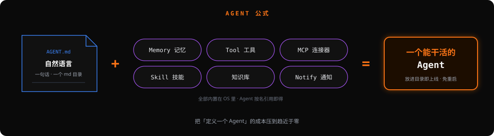
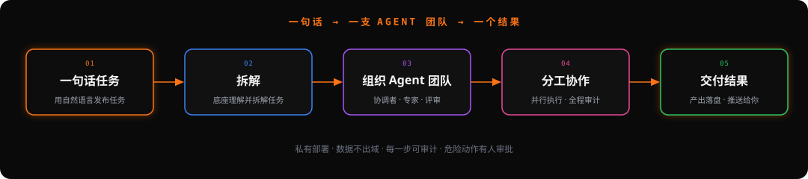
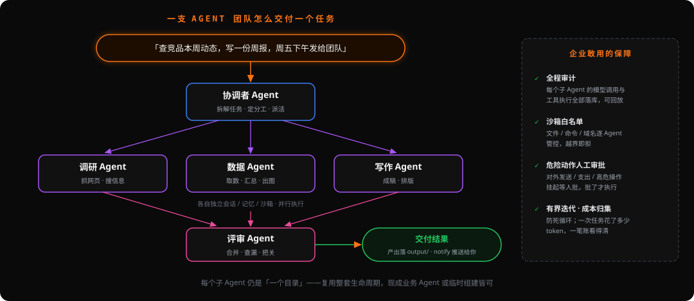

# OryxOS：第一阶段总结与未来规划

> 本文讲清楚三件事：**我们想做什么、目标是什么；第一阶段做成了什么；接下来想做什么、想办成什么样子。**
> 相关背景见 `docs/oryxos.md`（项目定位）、`docs/DemandAnalysis.md`（需求）、`docs/TechnicalSolution.md`（技术方案）、`docs/IndustryResearch.md`（业界调研）。

---

## 一、我们想做什么

OryxOS 是**企业自己的 Agent 运行底座（Agent Harness OS）**。

它不是「又一个更强的 Agent」，也不是「又一个可视化编排画布」。它是套在模型外面、把模型变成能干活的 Agent 的那层**运行骨架**：驱动 reason → act → observe 的循环、组装上下文、调用工具、积累记忆、约束沙箱、记录审计。裸模型只会生成文本，**harness 才让它可靠、安全地「做事」**。

一句话概括我们要做的事：

> **用「自然语言 + 内置能力」把「定义一个 Agent」的成本压到最低。**

我们把这件事拆成一个北极星公式：

- **自然语言(md)**：一个目录 = 一个 Agent。`AGENT.md` 前言即配置、正文即指令，尽量只写 md，不写代码。
- **Memory / Tool / MCP / Skill / 知识库 / Notify**：这些能力**内置在底座里**，Agent 按需引用即可拥有，而不是每造一个 Agent 都从零攒一遍。

把这些内置能力做厚、做稳、做到「引用即得」，就是 OryxOS 的价值所在——**让一般人也能低成本地定义出一个够用、可靠、可审计的 Agent。**

### 我们在业界的坐标

同类产品不少，我们既借鉴、也有自己的判断：

- **单体强 Agent**（Manus / Devin）：卷单个 Agent 的能力上限。我们不卷这个。
- **可视化低代码**（Dify / Coze / n8n）：卷编排画布。我们走「md 声明式」，更轻、更 GitOps、更适合工程团队。
- **自托管个人 Agent**（Nous Research 的 [Hermes Agent](https://hermes-agent.nousresearch.com)）：定位「装在你自己机器上、越用越聪明的个人 Agent」——持久记忆、从经验里自动沉淀 Skill、全渠道触达、隔离子 Agent 委托、容器级沙箱。它的很多能力值得借鉴（见第四部分），但它是**面向个人的单体 Agent**。

**OryxOS 的差异化**：面向**企业**的**分布式底座**，一个底座跑一群业务 Agent；数据留在自己基础设施、全链路可审计、不锁云生态；对接 MCP / A2A 开放标准。我们对 AI 的态度和 Linux 一样——**AI 只是工具，关键是能为结果负责**。

---

## 二、我们的目标

我们最终要做成的那件事，一句话：

> **你用一句自然语言发布一个任务 → 底座把它拆解 → 组织一支 Agent 团队 → 多个 Agent 分工协作 → 交付一个结果。**

从「定义一个 Agent」到「**指挥一支 Agent 团队交付一个任务**」——这是 OryxOS 的终局形态，也是「底座」二字真正的分量所在（详见方向 I）。

围绕这个终局，分三步走：

- **近期**：把单机运行时内核做到「真正可用、有人用」，而不是停在原型。✅ 第一阶段已达成。
- **中期**：补齐能力版图（知识库、语义记忆、Flow 编排、自我进化、全渠道），并把单机底座升级成**企业级分布式底座**。
- **长期愿景**：成为 **Agent 时代的运行底座**——让企业内的各类业务 Agent、跨团队协作的 Agent、跨节点分布的 Agent，都运行、被管理、被协同在同一套底座上；**能用一句话调动一支 Agent 团队交付复杂任务**。最终**走进 Apache 基金会，成为 Apache 顶级项目**。

开发理念始终是：**慢就是快，克制且聚焦**。先把内核做扎实、每一步走实，再在其上生长高级能力与分布式，不一开始就堆一个无法落地的大型架构。

---

## 三、第一阶段做成了什么

北极星公式的 **7 个要素，已经交付 6 个**；底座跑通了「业务系统通过 API / 一句话 / 直接丢目录动态管理一个 Agent 并让它定时自动运行」的完整闭环。

| 公式要素 | 状态 | 落地形态 |
| --- | --- | --- |
| 自然语言定义 | ✅ | 一个目录 = 一个 Agent；一句话生成 Agent（注入真实工具目录、多文件产出、通知渠道手选） |
| Memory | ✅ 基础版 | 每 Agent 独立 `MEMORY.md`，save / recall |
| Tool | ✅ | 24 个内置工具（文件 / Shell / HTTP / 时间 / JSON / notify…）+ 沙箱白名单 + 审计 |
| MCP / Connector | ✅ | MCP Client + `mcp_servers.yaml` + 精选目录 |
| Skill | ✅ | 全局 Skill 库，Agent 按名引用、`ContextLoader` 注入约束 |
| Notify | ✅ | 飞书 / 企业微信 / 钉钉 / webhook |
| **知识库** | ❌ | 仅占位——这是公式里唯一还缺的一块（见方向 B） |

底座本身的成熟度：

- **运行时内核**：自实现 ReAct Loop、显式 Provider 映射、同步 + Java 21 虚拟线程。
- **动态生命周期**：REST 增删改查、一句话生成、**上传即上线 / 丢目录即上线 / 免重启**（`WorkspaceWatcher` 实时监听）；删除走「注销定时 → 移出索引 → 归档」。
- **多 Agent 并存** + **按 Agent 定时任务**（cron，含执行历史）。
- **持久化 + 全链路审计**：SQLite，`sessions / tool_invocations / llm_calls / scheduled_tasks / agent_executions / sandbox_whitelist`，审计**第一天就落库**。
- **安全地基**：路径 / 命令 / 域名白名单沙箱（不用 SecurityManager），DB 持久化 + 管理台 CRUD。
- **Web 管理台**（Vue）：Agent 管理、创建即生成、文件浏览器、Markdown 渲染、Skill 详情、沙箱管理。
- **工程化**：Makefile / `oryx-server` 启停脚本 / GitHub 自动发版（`release:` PR 触发）/ VitePress 双语文档站。

**一句话总结**：公式 6/7 跑通，底座从「能启动」走到了「能被动态管理、定时自跑」的完整闭环。下一阶段 = **补齐知识库 + 把单机底座升级成企业级分布式底座 + 让 Agent 越用越聪明**。

---

## 四、接下来想做什么

从这里开始，我们**并行铺开多个方向**。顺序不是关键——每条都是可独立认领、独立推进的工作流，欢迎任何人动起来（见 `website` 的贡献指南）。

### 方向 A · 状态外置 → 分布式底座

> 核心不是秒级切换，而是**稳定、简单、功能齐全**。参考 **xxl-job**，基于 DB，不用 etcd。

- 存储层可插拔：**SQLite（单机零依赖默认）→ MySQL / PostgreSQL**。
- 实例无状态化，Session / 记忆 / 审计全部外置到共享 DB。
- 基于 DB 的分布式：实例注册 + 心跳 + **调度抢锁（同一 cron 全集群只触发一次）**。
- 多副本 + 负载均衡 + 去单点。

### 方向 B · 向量子系统：知识库 + 记忆升级（合并做）

> 知识库和记忆共享同一套向量基建，一次搭好，不搭两遍。

- 向量基建：embedding + 向量库（优先 **pgvector**，复用 PostgreSQL）。
- **知识库**（补齐公式第 7 块）：文档导入 / 切分 / 检索，包成内置能力 `retrieve_knowledge`；Agent 用 `knowledge: [名]` 按名引用（**与 Skill 完全同构**）。
- **Memory 升级**：`MEMORY.md` 全文注入 + 截断 → **语义检索式记忆（借鉴 mem0 / Letta）**；`MEMORY.md` 保留为人可读的审计层。
- 记忆分三层：**事实记忆 / 情景记忆（episodic）/ 主体画像**——借 Honcho 思路为每个用户 / 团队建一层「你是谁」的画像记忆（偏好、习惯、语境），跨会话累积。

### 方向 C · Flow 编排 + 多 Agent

> 用自然语言把多个 Agent 组合成一个复杂 Agent。

- **Flow = 一个目录 / 一个 md**：声明式（节点 = Agent/Tool，边 = 数据流 / 条件），延续「md 定义一切」的 DNA。
- 自然语言 → Flow 草稿（复用「一句话生成」）。
- **子 Agent 委托**：隔离会话 / 隔离上下文的子任务流水线（借鉴 Hermes「Delegate」）。
- 对接 **A2A** 开放协议：跨 Agent / 跨节点发现、委托、协同。
- **能力统一模型**：把 Memory / Tool / MCP / Skill / 知识库 在装配层统一成一致的「能力引用」，让 Flow 像搭积木一样调用。
- **`execute_code` 代码化编排（命令式，与声明式 Flow 互补）**：给 Agent 一个「写代码调工具」的能力，把多步工具流水线压成**一次推理**——大规模下实打实降本（同 Anthropic「code execution with MCP」思路）。

> Flow 是**人预先编排好的图**（确定性、可复用）；方向 I 的多 Agent 团队是**临时按任务自组织**（开放式）——两者共用底层，一静一动。

### 方向 D · 让 Agent 越用越聪明（自我进化）

> 借鉴 Hermes 最独特的能力：从经验里自动长出 Skill。

- **自动沉淀 Skill**：把成功执行的操作自动 distill 成可复用 Skill。
- 经验 → Skill / Memory 的自动学习闭环。
- Agent 评测 harness（行为回归，防「越改越差」）。
- **开放标准 Skill 生态**：让 Skill 兼容 **agentskills.io** 开放标准，可移植、可共享；建企业内部 **Skill / Agent 模板 Hub**——很多场景直接拿模板改，把定义成本进一步压低（见方向 G 能力市场）。

### 方向 E · 全渠道 + 多模态能力

> 「一个 Agent，一份记忆，触达每个界面。」

- 双向渠道扩展：CLI / Web 之外，**优先补国内企业渠道——飞书 / 企业微信 / 钉钉 / 微信 / QQ**，再接 Telegram / Slack / Discord / Teams / Email / WebSocket。
- 能力扩展：**Web 搜索 / 浏览器自动化 / 视觉 / 图像生成 / TTS / 多模型推理**。
- **实时语音模式**（语音助手 / 呼叫场景）。
- SSE 流式响应。

### 方向 F · 执行隔离升级

> 白名单沙箱之上，提供可选的容器级隔离。

- 沙箱后端从 Path / 命令白名单 → 可选 **Docker / SSH** 后端（借鉴 Hermes 五种 backend）。
- 视情况把沙箱独立成 `oryxos-sandbox` 模块。

### 方向 G · 企业化与治理（横切，贯穿所有方向）

- 认证 / SSO、**RBAC**、API Key、**多租户**。
- 可观测性：审计表 → **成本 & token 看板**、OpenTelemetry 链路追踪、完整审计 UI。
- 工具策略与权限。
- Connector / Skill / 知识库 / MCP **能力市场**（Agent / Skill 模板 Hub，见方向 D）。

### 方向 H · 企业底座独有能力 ⭐（我们走得比个人 Agent 远的地方）

> 这几件事，个人 Agent（如 Hermes）天然不碰；而它们正是 OryxOS「凭什么是企业底座」的答案。

- **人在回路 / 分级授权（HITL Approval）**：危险动作（shell / 对外发送 / 支出 / 越权改动）先**挂起 → 推人审批（飞书 / 企微一键 approve / deny）→ 批了再执行**，全程留痕。是「安全是地基」原则的自然延伸，也是 to-B 硬需求。
- **审计 → 数据飞轮**：`llm_calls` / `tool_invocations` 本质是**完整的 Agent 轨迹**。用它做离线评测、行为回归、**把贵模型的成功轨迹蒸馏成便宜模型**、乃至 RL——数据不出域，越用越省、越用越准。把 day-one 审计从「合规负担」变成「私有资产」。
- **成本与算力治理 + 弹性休眠**：一个底座跑几十上百个 Agent，**空闲休眠、按需唤醒**（借 Daytona / Modal serverless 思路，落到自己的 K8s）；成本 & token 按 Agent / 团队 / 租户维度出账。
- **智能模型路由**（在显式 Provider 映射之上）：按任务难度 / 成本选模型、失败自动 fallback、多 key 负载均衡——省钱、抗故障。

### 方向 I · 任务发布 + 多 Agent 自组织交付（压轴，即第二部分「目标」的终局）

> **你用一句自然语言发布一个任务 → 底座把它拆解 → 组织一支 Agent 团队 → 多个 Agent 分工协作 → 交付一个结果。**

从「跑一个 Agent」到「**指挥一支 Agent 团队**」——这是前面所有方向的收敛点（一个目录=一个 Agent、Flow、子 Agent 委托、A2A、审计+沙箱全部就位后的终局）。

典型形态（「协调者 + 专家 + 评审」班子）：

参照业界成熟范式：CrewAI（角色班子）、AutoGen（对话式多 Agent）、MetaGPT（按 SOP 分工）、OpenAI Swarm（handoff 交接）、Anthropic orchestrator-worker、Google A2A。**范式不用重新发明——我们要做的是「企业级、可靠、可审计」的那一版**：

- 每个子 Agent 仍是「一个目录」，复用整套生命周期（现成业务 Agent 或临时 spawn）。
- 团队里每个子 Agent 的 `llm_calls` / `tool_invocations` 全落库——多 Agent 最怕黑盒失控，我们天然能**回放「谁在第几步做了什么」**。
- 沙箱逐 Agent 生效 + **HITL 审批挂在关键节点**（方向 H）；成本按任务 / 团队归集。
- 同步 + 虚拟线程做 fan-out，不引 Reactor（守宪法七）。
- **克制**：有界迭代（防死循环）、可审计回放、可 HITL 打断、结果可追溯——不追求「最炫的自主涌现」，追求「企业敢用的可靠交付」。

### 方向总览

| 能力 | 状态 | 方向 |
| --- | --- | --- |
| 存储切 MySQL / PostgreSQL | 🔜 规划中 | A |
| 基于 DB 的分布式（xxl-job 式） | 🔜 规划中 | A |
| 知识库 + 向量检索 | 🔜 规划中 | B |
| 语义记忆（mem0 / Letta 式） | 🔜 规划中 | B |
| 主体画像记忆（Honcho 式用户 / 团队建模） | 🔜 规划中 | B |
| Flow 声明式编排 | 🔜 规划中 | C |
| 子 Agent 委托 / A2A | 🔜 规划中 | C |
| `execute_code` 代码化编排（降本） | 🔜 规划中 | C |
| 自动沉淀 Skill（自我进化） | 🔜 规划中 | D |
| 开放标准 Skill 生态（agentskills.io / Hub） | 🔜 规划中 | D / G |
| 多渠道（国内优先：飞书 / 企微 / 钉钉 / 微信 / QQ …） | 🔜 规划中 | E |
| 多模态（浏览器 / 视觉 / 图像 / TTS） | 🔜 规划中 | E |
| 实时语音模式 | 🔜 规划中 | E |
| SSE 流式响应 | 🔜 规划中 | E |
| 容器级沙箱（Docker / SSH） | 🔜 规划中 | F |
| 多租户 / SSO / RBAC | 🔜 规划中 | G |
| 可观测性（成本看板 / tracing / 审计 UI） | 🔜 规划中 | G |
| 能力市场（Connector / Skill / KB） | 🔜 规划中 | G |
| **人在回路 / 分级授权（HITL 审批）** | 🔜 规划中 | **H** |
| **审计 → 数据飞轮（评测 / 蒸馏 / RL）** | 🔜 规划中 | **H** |
| **成本治理 + 弹性休眠** | 🔜 规划中 | **H** |
| **智能模型路由（选型 / fallback / 负载均衡）** | 🔜 规划中 | **H** |
| **任务发布 + 多 Agent 自组织交付（Agent 团队）** | 🔜 规划中 | **I** |

---

## 五、想办成什么样子

我们希望 OryxOS 最终长成这个样子：

- **对定义 Agent 的人**：说一句话或写一个 md 目录，就能得到一个带记忆、会用工具、懂业务知识、到点自动跑、出事有审计的 Agent——**定义成本趋近于零**。
- **对发布任务的人**：说一句话，底座就**组织一支 Agent 团队分工协作、交付结果**——从「用一个 Agent」升级到「**指挥一群 Agent**」。
- **对运维 / 平台方**：装在企业自己的 K8s 或服务器上，多副本、稳定、可扩展；一个底座管一群 Agent，像操作系统管一群进程一样；数据不出域、权限可控、成本可见、危险动作有人审批。
- **对开发者社区**：一个刚起步、低门槛、极度欢迎新人的开源项目——欢迎用 AI 来贡献、来评审、来成为 maintainer；在这里学会 AI 编程、走进开源、把这段经历写进简历。
- **对行业**：成为 **Agent 时代的运行底座**，对接 MCP / A2A 开放生态，走进 Apache，成为顶级项目。

> 一句话：**让一群 Agent 像一群进程跑在操作系统上一样，可靠地运行、协同、并听从一句自然语言的调度去交付结果。**
