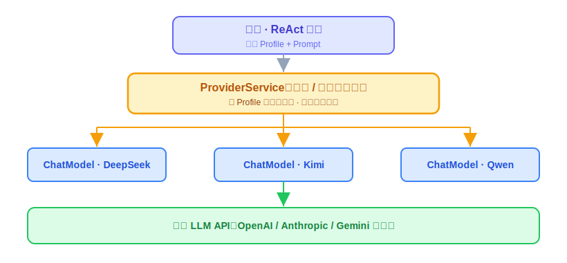
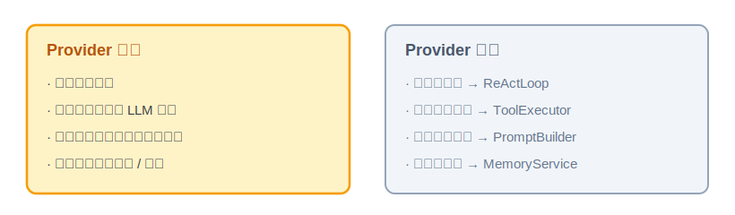
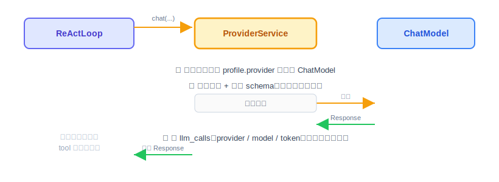

# Agent Provider：原理解析、实现与代码讲解

OryxOS 的第一块核心能力是 Provider，也就是对接大模型（LLM）的那一层。这节讲四件事：Provider 是什么、动手前该想清楚什么、代码怎么写、做完怎么验。

技术栈是 JDK 21 + Spring Boot 3.x + Spring AI Alibaba。下面的代码是示意，`ChatModel` 的确切 API 以你用的 Spring AI 版本为准。

---

## 一、Provider 是什么，干嘛用的

一句话：**Provider 就是 Agent 和大模型之间的一个前台。**

上层要跟大模型说话，但它不想操心"这次到底是调 DeepSeek 还是 Kimi、每家的接口格式还不一样"。于是这些事全交给 Provider：上层把要说的话递进去，Provider 负责挑对模型、用对方听得懂的格式发出去、再把回话拿回来。

放到 Agent 的整体里看会更清楚。我们说 Agent = LLM + Tools + Memory + Loop + Environment，其中 **LLM 是那个做决策的大脑**。Provider 就是把这个大脑接进系统的工程封装——ReAct 循环每转一圈，都要通过 Provider 调一次大模型。

具体怎么工作：上层传两样东西进来，一个 **Profile**（一份配置，写了这次用哪个 provider、哪个 model），一段 **Prompt**（要发给模型的内容）。Provider 按 Profile 挑出对应的模型，调用，把结果原样返回。好处是：以后想换模型，只改配置，ReAct 那边一行都不用动。



图里 `ChatModel` 是 Spring AI 里代表"一个具体大模型"的对象，一个 provider 对应一个。Provider 干的事，就是从上往下选一条路走通。

这里还有一个容易搞混的点：**工具（Tool）这件事，Provider 只做翻译，不做执行。**

大模型能"调用工具"（业界叫 Function Calling），意思是：我们在发请求时，顺带告诉模型"你手上有哪些工具能用、每个工具要传什么参数"——这份工具说明叫 **schema**。模型看完可能回一句："我想调 `http_get`，参数是这些。" 注意，模型只是**说它想调**，并不会真去调。Provider 拿到这个请求后，原样交回给上层的循环，真正去执行 `http_get` 的是后面的 ToolExecutor。Provider 全程只负责把工具翻译成模型看得懂的格式，不碰执行。

---

## 二、动手前先想清楚几件事

写这种适配层，别急着敲代码。先把下面几件事定下来，代码基本就顺着出来了。

**第一，把职责划窄。** Provider 要做的事其实很少：挑对模型、发起一次调用、把结果拿回来。就这些。循环怎么转、工具怎么执行、上下文怎么拼，都不归它管。这个边界不划清楚，Provider 会越写越胖，最后和 ReActLoop 缠在一起分不开。



**第二，哪些不自己造。** 各家大模型的协议不一样，OpenAI、Anthropic、Gemini 的工具格式各写各的。这些转换 Spring AI Alibaba 已经做好了，我们直接用，不重复造。我们要写的只是薄薄一层 `ProviderService`，套在它上面。

**第三，三个坑——这几个直接决定了架构长什么样。**

*坑一：多个 provider 时，怎么区分谁是谁。* 你同时配了 DeepSeek 和 Kimi，它们在 Spring 容器里都是 `ChatModel` 类型，光靠"把容器里所有 ChatModel 扫出来"根本分不清哪个是哪个（类型一样，名字也未必对得上）。所以从一开始就得自己维护一张表：**provider 的名字 → 对应的 ChatModel**，一一显式对应。

*坑二：Spring AI 会"自作主张"帮你执行工具。* Spring AI 自带一套自动执行工具的机制——模型说想调 `http_get`，它会自己跑个小循环，直接把工具执行了，再把结果喂回模型。听起来省事，但我们自己写了 ReActLoop 和 ToolExecutor 来管这件事。两套一起跑，工具会被调两次，而且执行绕过了我们的沙箱检查，出了事都不知道谁干的。所以**必须把 Spring AI 的自动执行关掉**，只留它的协议转换和 schema 生成，执行权攥在自己手里。

*坑三：教程里的 provider 名字只是示意，那家模型接不接得进来得先验证。* 下面举例的 `deepseek`、`kimi`、`qwen` 都只是"provider 名字"的示意，不代表随手配一下就能用。Spring AI 生态里每家模型背后都是一个独立的 starter 依赖（比如阿里的通义千问走的是 `spring-ai-alibaba-starter`），这些依赖是否在你项目锁定的 Spring AI BOM 版本里存在、版本号对不对，动手前先跑一遍 `mvn dependency:tree` 确认。**真实踩过的坑**：某些 milestone 版本的 Spring AI BOM 里未必包含每一家的独立 starter——想接哪家，先确认依赖能下载、能解析，再当作示例往下写，不要照着教程的名字就假设一定能用。

这三个坑想清楚，Provider 长什么样就定了：一个薄薄的抽象层，只管一次调用，靠一张表显式选模型，关掉自动执行，接哪家提前验证过依赖能用。

---

## 三、代码怎么写

核心就一个类 `ProviderService`，外加两个配角：一个把工具转成 Spring AI 格式的适配器，一个写审计日志的。对外只露一个方法：`chat(sessionId, Profile, Prompt)`。

一次调用从头到尾是这样走的：



对着这个流程，先补一个前置，再分四步写。

**第零步（前置）：Profile 的解析加载，这节一并交付。** Provider 是整个系统里第一个消费 Profile 的模块（要从里面读 provider 名、model、温度），所以 Profile 从 YAML 变成 Java 对象这件事归这节负责，包含三样：

- **`Profile`**：一个承载全部字段的记录类——`name`、`description`、`identity`、`provider`（name/model/temperature）、`tools`、`skills`、`mcp_servers`、`channels`、`notify_channels`、`schedules`、`bootstrap`、`settings`。后面每节用到哪个字段就取哪个字段，类本身这节就建全。
- **`ProfileLoader`**：启动时扫 `.oryxos/profiles/` 下所有 YAML，用 SnakeYAML 解析成 `Profile`，逐个做合法性校验（本节先校验"provider 名能在全局层找到"这一条，后面各节的字段各自补自己的校验规则）。坏的 Profile 记错误日志、不阻断启动。
- **`ProfileRegistry`**：解析好的 Profile 放进内存索引（`Map<String, Profile>`），按 name 查找。29 节会给它补运行时 `register()` 方法，现在只有启动扫描这一条注册路径。

**第一步：配置分两层，别搞混。** Provider 相关的配置其实分两层，职责不一样：

- **全局层**（`application.yaml`）：声明这个实例上到底接了哪些 provider、每家的凭证从哪个环境变量读。解决的是"连不连得上"的问题。
- **Profile 层**（每个 Agent 自己的 YAML）：声明这个 Agent 具体用哪个 provider、哪个 model、什么温度。解决的是"这个 Agent 怎么用"的问题。

```yaml
# application.yaml —— 全局层：声明有哪些 provider、凭证从哪来
oryxos:
  providers:
    - name: deepseek
      api-key: ${DEEPSEEK_API_KEY}
    - name: kimi
      api-key: ${KIMI_API_KEY}
```

```yaml
# .oryxos/profiles/ops-agent.yaml —— Profile 层：这个 Agent 具体怎么用
provider:
  name: deepseek        # 必须能在全局层的 providers 列表里找到同名项
  model: deepseek-chat  # 用哪个模型，Profile 自己定
  temperature: 0.7
```

两层各管一段：全局层只管"连接"（provider 存不存在、key 有没有），Profile 层管"调用参数"（用哪个 model、什么温度）。Profile 引用的 `provider.name` 如果在全局层找不到同名项，必须直接报错，不能悄悄用错或者留空跑过去。

`${DEEPSEEK_API_KEY}` 表示运行时从环境变量取，代码和配置文件里都不会出现真实 key。

**第二步：建映射表。** 启动时，按 `application.yaml` 里 `providers` 列表逐条创建对应的 `ChatModel`，把 name 和 `ChatModel` 存进一个 `Map<String, ChatModel>`。这就是前面说的坑一的解法——**显式建表，不靠类型扫描**。用 Spring 的 `@Qualifier` 也行、自己手动 put 进 Map 也行，原则就一条：谁对谁必须写死、看得见。

**第三步：写 chat 方法。** 这是整个 Provider 的核心，骨架长这样：

```java
public Response chat(String sessionId, Profile profile, Prompt prompt) {
    ChatModel model = providerMap.get(profile.getProvider());   // 按名字取模型
    if (model == null) {
        throw new ProviderNotFoundException(profile.getProvider());
    }
    var tools = adapter.toSpringAiTools(prompt.getAvailableTools());  // 只翻译，不执行
    long startedAt = System.currentTimeMillis();
    try {
        Response resp = model.call(request(prompt, tools, /* autoExecuteTools */ false));  // 关掉自动执行
        audit.record(sessionId, profile.getProvider(), profile.getModel(), resp.usage(),
                     true, null, System.currentTimeMillis() - startedAt);
        return resp;
    } catch (RuntimeException e) {
        audit.record(sessionId, profile.getProvider(), profile.getModel(), null,
                     false, e.getMessage(), System.currentTimeMillis() - startedAt);
        throw e;   // 调用失败也留痕，再把错误抛给上层处理
    }
}
```

一行行看它在干嘛：

- `chat(String sessionId, ...)`——多传一个 sessionId，是因为审计记录要落到 `llm_calls` 表，那张表按 session 关联，方法签名不带这个参数，审计那一步就没法写。
- `providerMap.get(profile.getProvider())`——拿着 Profile 里写的 provider 名字，去表里取对应的模型。取不到就直接抛异常，别让它悄悄用了个错的。
- `adapter.toSpringAiTools(...)`——把这次能用的工具翻译成 Spring AI 的格式（只生成 schema，也就是工具说明，不执行）。
- `model.call(request(..., false))`——发起真正的调用。最后那个 `false` 就是关掉自动执行，对应坑二。
- `audit.record(..., true, null, ...)`——调用**成功**，把用了哪个 provider、哪个 model、花了多少 token、耗时多久记一笔，`success` 记 `true`。
- `catch (RuntimeException e) { audit.record(..., false, e.getMessage(), ...); throw e; }`——调用**失败**（超时、限流、模型报错）同样要记一笔，`success` 记 `false`、把错误信息存进 `error_message`，再把异常继续往上抛。**这一步很容易漏**：只记成功不记失败，一次真实事故在系统里就完全没留下痕迹。
- 最后返回 `Response`。响应里可能带着模型"想调某个工具"的请求，但执行不在这儿——原样交回上层。

> `model.call` 和关闭自动执行的确切写法跟 Spring AI 版本有关，动手前先核一下你用的版本怎么写。

**第四步：工具适配和审计。** 适配器负责把我们自己的 `OryxTool` 的参数说明（`getInputSchema()`）转成 Spring AI 的工具描述——注意，还是只翻译、不执行。

审计要记两种情况：调用**成功**，把 provider、model、token 用量写进 `llm_calls`；调用**失败**（超时、限流、模型报错），也要写一条，`success` 记 `false`、`error_message` 记原因。所以 `llm_calls` 表本身得有 `success`/`error_message` 这两列——不然模型调用失败时，这次事故在数据库里完全没有痕迹，跟工具那边的 `tool_invocations` 表比就不对称，"可审计"这个卖点就打了折扣。这张表的 JPA 实体、Repository 和建表脚本也归这节交付；注意 SQLite 的 `ALTER TABLE` 很弱，建表用手工维护的脚本，别指望 `hibernate.ddl-auto=update` 做迁移。

**有几样先别做。** fallback（一家挂了换另一家）、hedge racing（同时发几家抢最快的）、熔断，这些都放到扩展阶段；现在故障就直接把错误抛给上层。成本看板也放后面，眼下只落 `llm_calls` 这张表，够审计用就够了。核心阶段的目标是"能稳定调通一次"，别一上来就求全。

**本节交付物**（Spec-Kit 拆解锚点）：

- 代码：`Profile`、`ProfileLoader`、`ProfileRegistry`、`ProviderService`（含 `chat(sessionId, Profile, Prompt)`）、工具格式适配器、`LlmCall` 实体 + `LlmCallRepository`
- 配置：`application.yaml` 的 `oryxos.providers` 全局层；Profile YAML 的 `provider` 段
- 表：`llm_calls`（含 `success`/`error_message` 列，手工建表脚本）

---

## 四、做完怎么验

对着下面几条打勾就行：

- 用到的 provider，对应的 Spring AI（Alibaba）starter 依赖已确认在项目锁定的 BOM 里能下载、能解析——不是照着教程的名字就假设一定能用。
- 配一个 provider，能跑通一次真实调用、拿到响应。
- 同时配两个 provider，按 Profile 里的名字路由，不串台；Profile 引用了全局层没有的 provider 名字时，有清晰报错，不是静默失败。
- 传了工具 schema，模型能返回"想调某工具"的请求，而 Provider 不去执行它（执行留给 ToolExecutor）。
- 每次**成功**调用都写进了 `llm_calls`，`success` 为 `true`。
- 故意让一次调用失败（比如断网、给个假 key），确认 `llm_calls` 里多了一条 `success=false`、带 `error_message` 的记录，而不是什么都没留下。
- 区分 provider 用的是显式映射表，不是类型扫描；Spring AI 的自动执行确认关掉了（拿一个会触发工具的请求验一下，工具只被调一次就对了）。
- key 走环境变量，配置和代码里都没有明文。

Provider 自己没有独立入口，它要和下一节的 ReAct 一起，才能撑起 Demo 一（每日天气）的对话版（问天气、给穿搭建议）。所以这块跑通的标准很直接：能撑住 Demo 一里的那次大模型调用。
