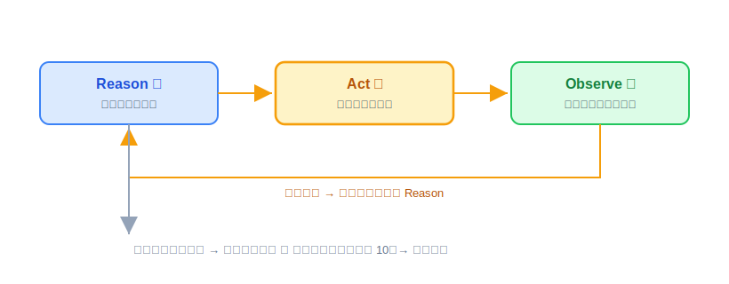
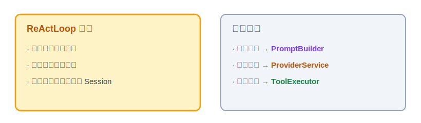
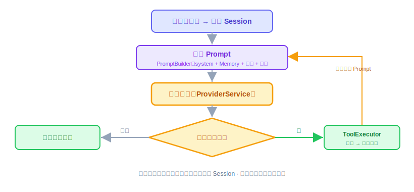

# ReAct：原理解析、实现与代码讲解

ReAct 是 OryxOS 的第二块核心能力，也是整个 Agent 最关键的一段代码。这节讲四件事：ReAct 是什么、动手前该想清楚什么、代码怎么写、做完怎么验。

它依赖上一节的 Provider——每转一圈都要通过 Provider 调一次大模型。技术栈还是 JDK 21 + Spring Boot 3.x。

---

## 一、ReAct 是什么，干嘛用的

一句话：**ReAct 就是让大模型像人做事一样，在一个循环里反复"想一步、做一步、看结果"，直到把事办成。**

单独调一次大模型，就是个 chatbot——你问一句、它答一句，完事。但很多事一句话答不了，比如"看看今天天气，帮我决定穿什么"，模型得先去查天气、拿到结果、再根据结果给建议。**ReAct 干的就是把"想—做—看"串成一个循环**：模型想下一步该干嘛、调个工具去做、拿到结果看一眼，不够就再来一轮，够了就给最终答复。这个模式叫 ReAct（Reasoning + Acting），2022 年提出来，现在是事实标准，Claude Code、Cursor、LangChain 跑的都是它。

一轮里的动作是固定的三步：



什么时候停？看模型这一轮的反应：**它没提出要调工具，就说明它觉得能给最终答复了**，循环返回结果；万一它一直要调工具停不下来，就靠"最大轮数"兜底，转够了强制收尾。

放回 Agent 整体：ReAct 是那个"大脑循环"，它自己不调模型、也不执行工具，而是指挥——想的时候通过上一节的 Provider 调一次大模型，做的时候把工具交给后面会讲的 ToolExecutor。

---

## 二、动手前先想清楚几件事

ReAct 有个反直觉的地方：它是 Agent 的灵魂，但主循环的代码其实很短，就几十行。难的不是"写个 while 循环"，而是循环里要照顾的那些边界。所以动手前先把两件事定下来：职责怎么拆、有哪些坑。

**第一，把职责拆干净。** 循环本身只该做一件事——**调度**。它负责转圈、判断该不该停、把每轮的结果攒起来。至于每轮要拼的 prompt、要调的模型、要执行的工具，全都交出去，让专门的模块干。循环里塞的东西越少，它越好读、越不容易出 bug。



**第二，为什么自己写，不用框架现成的循环。** Spring AI 这类框架都带现成的 Agent / 循环封装，拿来就能跑。但循环恰恰是 Agent 最需要自己掌控的地方——什么时候停、工具失败了怎么办、上下文太长了怎么压、哪几步想换个模型，这些都得能自己调。用框架的黑盒，这些就动不了。所以核心阶段我们自己写这几十行，把控制权攥在手里。

**第三，几个坑，提前想到。** 这块最容易出事的就那么几处：

- 不设轮数上限，模型可能反复要调工具，**陷进死循环**下不来。
- 不管上下文长度，转几轮 context 就**撑爆**了（每次调模型都把全部历史带上，越滚越大）。
- 每轮不把模型响应和工具结果**累积回 Session**，事后就没法审计，下一轮也接不上前一轮。

这三条不是写完再补，是设计时就得定死的。想清楚了其实就几句话：循环短、职责拆出去、自己掌控、边界（停止 / 错误 / 上下文）提前定。

---

## 三、代码怎么写

拆成三个模块，各干各的：`ReActLoop` 管调度，`PromptBuilder` 管拼上下文，`ToolExecutor` 管执行工具。调大模型用的是上一节的 `ProviderService`。

一轮的流转是这样：



**先看主角 ReActLoop。** 输入是一个 Session（存着这次对话的全部状态）加上用户这句话，输出是最终响应。骨架长这样：

```java
public String run(Session session, String userMessage, Profile profile) {
    session.append(userMessage);
    for (int i = 0; i < profile.maxIterations(); i++) {   // 默认 10，防死循环
        Prompt prompt = promptBuilder.build(session, profile);
        Response resp = providerService.chat(session.id(), profile, prompt);  // 带上 sessionId，供审计关联
        session.append(resp);                              // 累积，可审计
        if (!resp.hasToolCalls()) {
            return resp.text();                            // 没有工具调用，收尾
        }
        for (ToolCall call : resp.toolCalls()) {
            ToolResult result = toolExecutor.execute(session.id(), call); // 执行权在这，同样带上 sessionId
            session.appendToolResult(result);
        }
    }
    return "达到最大轮数，已停止";
}
```

一行行看它在干嘛：

- `for (i < profile.maxIterations())`——这就是那个"最大轮数"的兜底，默认 10。循环不是无限转的，转够就退出，坑一（死循环）在这拦住。
- `promptBuilder.build(...)`——把这一轮要发给模型的内容拼好（下面细讲）。
- `providerService.chat(session.id(), profile, prompt)`——通过上一节的 Provider 调一次大模型，拿回响应。这里要传 `session.id()`：上一节 Provider 的 `chat` 方法签名带了 `sessionId`，是因为 `llm_calls` 审计表按 session 关联，这里不传，Provider 那边就没法写这一列。
- `session.append(resp)`——**先把响应存回 Session 再说**，这样每一轮都留了痕迹，事后能审计，对应坑三。
- `if (!resp.hasToolCalls()) return`——模型这轮没要调工具，说明它能给答复了，直接返回，循环结束。这就是前面说的"停止条件"。
- `for (ToolCall call : ...)`——模型要调工具，就逐个交给 `toolExecutor` 执行（同样带上 `session.id()`，理由跟上面一样：`tool_invocations` 表也要关联 session），结果再存回 Session，然后进下一轮。注意执行是 ToolExecutor 干的，不是这里，也不是 Provider 自动干的。

**配角一：PromptBuilder。** 每轮开始，它把四部分按顺序拼成一段 Prompt：system prompt（角色设定 + 启动信息 + Skill，末尾附上当前日期时间——模型自己不知道今天几号，后面定时场景里的"今天"全靠这一行）、**长期记忆**（Memory 模块提供的跨会话记忆，没开就跳过）、**会话历史**（只留最近 N 轮，默认 20，超了就截断——这是坑二的解法）、当前可用的工具列表。注意"长期记忆"和"会话历史"是两码事，别混在一起说：长期记忆是跨会话都在的东西，会话历史只是这一次对话到目前为止的往来记录。拼 prompt 的逻辑全在这，循环那边不用操心。

**配角二：ToolExecutor。** 从工具表里找到模型要调的那个工具，**先过一道沙箱 / 白名单检查**（这道检查具体怎么设计，23、24 节 Sandbox 模块细讲），再执行，把结果包成 ToolResult 返回，同时记一条调用日志——**成功要记、失败也要记**，`tool_invocations` 表本来就有 `success`/`error_message` 两列，跟上一节 Provider 的审计是同一个口径：一次工具调用不管成没成，事后都得能查到。工具执行只在这一个地方发生——这也是上一节为什么要关掉 Spring AI 自动执行的原因：执行权必须收在这里，不能有第二条路。`tool_invocations` 这张表的实体、Repository、建表脚本也归这节交付（口径跟上一节 `llm_calls` 一致，SQLite 同样用手工建表脚本）。

**编排者 AgentService，这节一并交付。** 循环之上还差薄薄一层：三种触发源（CLI、Web、定时）最终都调同一个 `AgentService.process`，它是一次处理的编排者。骨架很短，但有一个非讲不可的机制——`ProfileContext`：

```java
public String process(Session session, String userMessage) {
    Profile profile = profileRegistry.get(session.profileName());
    ProfileContext.set(profile);          // 工具执行时靠它知道"当前是哪个 Agent"
    try {
        String reply = reActLoop.run(session, userMessage, profile);
        sessionManager.save(session);     // 把累积完的历史持久化
        return reply;
    } finally {
        ProfileContext.clear();           // 虚拟线程每请求独立，用完必须清
    }
}
```

为什么需要 `ProfileContext`（一个 ThreadLocal）：`OryxTool.execute` 的签名不带 Profile，但有些工具执行时需要知道当前 Agent 的配置——比如 19 节的 `notify` 要读当前 Profile 的 `notify_channels`。改工具接口签名代价太大，让 `AgentService` 在入口处把 Profile 放进 ThreadLocal、出口处清掉，工具想用就取——虚拟线程下每个请求独占一个线程，天然不串。

**供给者 ContextLoader，也归这节。** `PromptBuilder` 的第一部分（Bootstrap 三件套 + SKILL.md）由它提供：按 Profile 的 `bootstrap` 和 `skills` 字段读 `.oryxos/` 下对应文件、拼成文本。两条铁律：**每次组装 prompt 都重新读文件、不缓存**（用户改完立即生效）；**Profile 里显式引用的文件缺失要报错、Bootstrap 缺失至少 WARN**——静默跳过会造成"人格悄悄丢了"这种最难查的软故障。

**有几样先别做。** 工具并行调用、Agent 之间互相委托、流式输出、上下文压缩，这些核心阶段都先不做。上下文先用"只留最近 N 轮"这种简单办法顶着，够用就行，压缩留到扩展阶段。

**本节交付物**（Spec-Kit 拆解锚点）：

- 代码：`ReActLoop`、`PromptBuilder`、`ToolExecutor`、`AgentService`、`ProfileContext`、`ContextLoader`、`ToolInvocation` 实体 + `ToolInvocationRepository`
- 表：`tool_invocations`（含 `success`/`error_message` 列，手工建表脚本）
- 约定：最大轮数默认 10；历史截断默认 20 轮；prompt 末尾附当前日期时间

---

## 四、做完怎么验

对着下面几条打勾：

- Demo 一（每日天气）的对话版（问天气、给穿搭建议）能跑通：多轮对话里，Agent 调了 http_get 工具、拿到数据、给出建议。
- 死循环防住了：故意构造一个模型反复要调工具的场景，转到第 10 轮会强制停。
- Session 里能看到完整一条链：每轮的模型响应和工具结果都累积在里面。
- 上下文按最近 N 轮截断，转很多轮也不会把 context 撑爆。
- 工具是走 ToolExecutor 加沙箱执行的，不是 Provider 自动执行；同一个工具不会被调两次。
- 故意让一次工具调用失败，确认 `tool_invocations` 里多了一条 `success=false` 的记录，不是什么都没留下。
- 循环是自己实现的，没用框架现成的 Agent 封装。

ReAct 要和上一节的 Provider 一起，才撑得起 Demo 一。所以这块跑通的标准很直接：Demo 一能从头到尾完整走下来。
