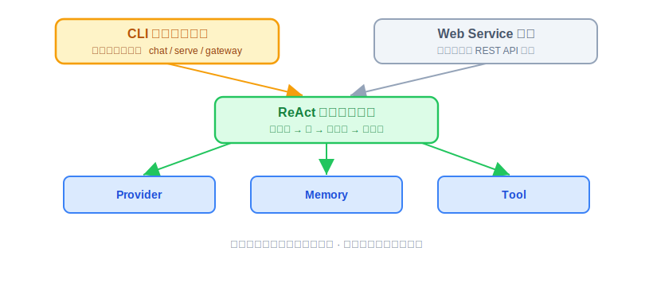
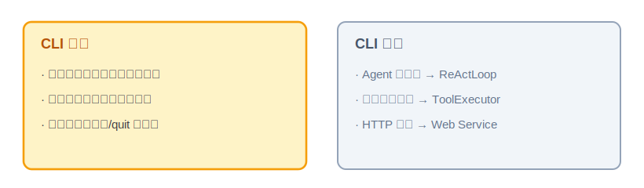
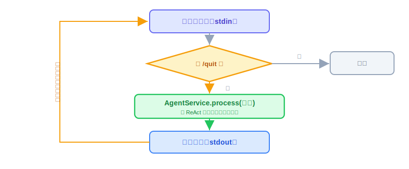

# CLI：功能概述、实现思路与代码讲解

有了 Provider（会调模型）和 ReAct（会思考的循环），OryxOS 的"大脑"已经能转了，但还缺一个能亲手操作它的入口。这节讲四件事：CLI 是什么、动手前该想清楚什么、代码怎么写、怎么用和怎么验。

技术栈还是 JDK 21 + Spring Boot 3.x，命令行部分用 Picocli。下面的代码是示意。

---

## 一、CLI 是什么，干嘛用的

一句话：**CLI 就是 OryxOS 的命令行入口——你在终端里敲命令，跟 Agent 对话、把服务跑起来、查配置和状态。**

OryxOS 打包出来是一个可执行 JAR，`OryxOsCli` 就是整个程序的 `main` 入口。所有操作都通过子命令来做，核心阶段有 12 个：

- **跑 Agent**：`chat`（在终端里交互式对话）、`serve`（启动 Web Service）、`gateway`（守护进程，同时挂多个通道）。
- **看情况**：`status`、`profile list/create/show/delete`、`provider list`、`tool list`、`session list`。
- **起项目**：`init`（初始化一个 OryxOS 工程）。

其中三个是**运行模式**，区别只在"消息从哪进来"：`chat` 走终端，`serve` 走 HTTP，`gateway` 同时挂多个通道。三种模式共享同一份 Profile 配置和同一套 Session 存储，底下的引擎是同一个。

放到整体架构里看，OryxOS 有两个"人推"入口：**CLI 管本地交互和调试，Web Service 管业务系统通过 REST API 集成**（后面 25 节还会加上第三种触发源——定时任务的"钟推"）。所有入口的消息最后都汇进同一个 ReAct 引擎。



所以 CLI 在这一层的角色很清楚：**它是消息进出的门，不是干活的人。** 干活的是引擎和下面三块能力。

---

## 二、动手前先想清楚几件事

CLI 看着杂（12 个命令），但每个命令要做的事都很浅。动手前先把四件事定下来。

**第一，CLI 只做"入口"，不碰 Agent 逻辑。** 一个 `chat` 命令的活其实就三步：读用户输入 → 交给引擎处理 → 把结果打印出来。它自己不想、不调模型、不执行工具，这些全在引擎里。想清楚这个边界，CLI 的代码就薄得下来。



**第二，命令分两类，为的是启动够快。** Spring Boot 在 JDK 21 下启动要 2~4 秒。对 `serve` 这种常驻服务无所谓，但对 `oryxos profile list` 这种"看一眼就退"的命令，等 4 秒才出结果太难受。所以命令分两类：

- **轻命令**（如 `init`、`profile list`）：不需要调模型，直接用标准 API 读写文件，**不启动 Spring 上下文**，秒回。
- **重命令**（如 `chat`、`serve`、`gateway`）：要调模型、要跑引擎，**才启动 Spring 上下文**。

这个分流是一开始就要定的，不然要么全都慢，要么后面改起来伤筋动骨。

**第三，别自己解析命令行参数，用 Picocli。** 子命令、参数、帮助信息、报错提示，这些 Picocli 都帮你做好了，一个命令写一个 `@Command` 类就行。自己撸 `args[]` 解析既费劲又容易出 bug，没必要。

**第四，重命令启动 Spring 后，模块扫描范围容易埋雷。** `chat` 这种重命令一旦决定启动 Spring 上下文，`@SpringBootApplication(scanBasePackages = "...")` 只管普通 Bean 的组件扫描，**不会**带动自动配置的 `@EnableJpaRepositories`、`@EntityScan` 跟着扫到别的模块——这两个默认只按"主类自己所在的包"扫描，跟 `scanBasePackages` 是两套独立的逻辑。CLI 模块和存 Session/审计数据的模块通常是分开的 Maven 模块（不同 Java 包），不显式声明 `@EnableJpaRepositories(basePackages=...)`、`@EntityScan(basePackages=...)`，启动时会得到"Found 0 JPA repository interfaces"，审计写不进去、直接报错退出。**这是真实踩过的坑**：照着"轻重命令分流、重命令才启动 Spring"这个思路走，几乎绕不开，得提前想到。

想清楚就这几句：CLI 是薄薄的入口层，只管进出不管干活；命令按轻重分流保证启动速度；参数解析交给 Picocli；重命令启动 Spring 时，模块扫描范围要显式声明，别指望一个 `scanBasePackages` 全包圆。

---

## 三、代码怎么写

入口是 `OryxOsCli`，它是 `main` 函数，底下挂 12 个 `@Command` 子命令类。每个子命令各写各的，互不干扰。

先看最典型、也最能说明问题的 `chat` 命令。它的交互流程是这样：



**chat 命令（CliChannel）。** 它读 stdin、写 stdout，维护一个当前 Session，每收到一行就交给引擎处理，直到用户输入 `/quit`。骨架大概长这样：

```java
@Command(name = "chat", description = "在终端里和 Agent 交互式对话")
public class ChatCommand implements Runnable {

    @Option(names = "--profile", defaultValue = "default")
    String profileName;

    @Override
    public void run() {
        Session session = sessionManager.getOrCreate("cli", currentUser(), profileName);
        Scanner in = new Scanner(System.in);
        while (true) {
            System.out.print("> ");
            String line = in.nextLine();
            if ("/quit".equals(line.trim())) break;        // 退出
            String reply = agentService.process(session, line);  // 交给引擎
            System.out.println(reply);                     // 打印结果
        }
    }
}
```

一行行看它在干嘛：

- `@Command(name = "chat")`——Picocli 的注解，声明这是 `chat` 子命令。参数、帮助都由它管。
- `sessionManager.getOrCreate("cli", currentUser(), profileName)`——拿到（或新建）这次对话的 Session，参数就是 `session_id` 公式的三元组：channel + user + profile。**id 的拼接只发生在 `SessionManager` 内部这一处**，所有入口（CLI 传 `"cli"`、Web 传 `"web"`、定时传 `"scheduler"`）只提供三元组、不自己拼字符串——两处各拼一遍、格式差一个分隔符，同一个人就会出现两条互不相认的历史。
- `while (true)` + `in.nextLine()`——不断读用户输入的每一行。
- `if ("/quit"...) break`——用户想走了，跳出循环、命令结束。这就是 CLI 唯一"自己判断"的逻辑。
- `agentService.process(session, line)`——**关键的一步**：把这句话连同 Session 交给引擎，里面跑的就是上一节的 ReAct 循环。CLI 到这儿就撒手了，等结果。
- `System.out.println(reply)`——把引擎给的最终回复打到屏幕上，然后回到循环读下一句。

看得出来，`chat` 命令通篇没有任何"Agent 智能"，它就是个读—转交—打印的壳。这正是我们要的。

**SessionManager 和 sessions 表，这节一并交付。** CLI 是第一个真正"用起来" Session 的入口，所以会话的持久化归这节负责：`Session` JPA 实体（字段照技术方案 9.2：`session_id` 主键、`profile_name`、`channel`、`user_id`、`messages_json`、`status`、三个时间戳）、`SessionRepository`、手工建表脚本（SQLite 别依赖 `ddl-auto=update` 迁移），以及 `SessionManager` 本身——对外三个方法：`getOrCreate(channel, user, profileName)`、`get(sessionId)`、`save(session)`。对话历史整体序列化成 JSON 存 `messages_json` 一列，核心阶段不做按条拆表。

**轻命令怎么分流。** 像 `profile list` 这种，压根不进 Spring：

```java
@Command(name = "list")
public class ProfileListCommand implements Runnable {
    @Override
    public void run() {
        // 直接读 .oryxos/profiles/ 目录下的 YAML，列出来就行
        Files.list(profilesDir()).forEach(p -> System.out.println(p.getFileName()));
    }
}
```

它只是列个目录，没必要为这点事等 Spring 启动 4 秒。**判断标准很简单：这个命令要不要调模型 / 跑引擎？要，就启动 Spring；不要，就直接干文件操作。**

**其余命令。** `serve` 启动 Web Service（26 节细讲）、`gateway` 起守护进程挂多个通道、`status` / `session list` / `tool list` 这些都是查一下状态或列个表，各自一个 `@Command` 类，逻辑都很直。

**本节交付物**（Spec-Kit 拆解锚点）：

- 代码：`OryxOsCli` 主入口、12 个 `@Command` 子命令类、`CliChannel`（chat 交互）、`Session` 实体 + `SessionRepository`、`SessionManager`
- 测试：`SessionManagerTest`、`SessionRepositoryTest`（见验收 harness）
- 表：`sessions`（`session_id` 由 SessionManager 按 channel+user+profile 唯一拼接，手工建表脚本）
- 约定：轻命令不启动 Spring；重命令启动类显式声明 `@EnableJpaRepositories`/`@EntityScan` 的 `basePackages`

---

## 四、验收 harness：把验收标准变成可执行的测试

CLI 本身是薄壳，值得自动化的是这节交付的**会话层**——它是后面所有入口共用的地基，出口径问题最难查（27 节的缝隙③），所以在这就钉死：

| 测试类 | 覆盖的验收点 |
|---|---|
| `SessionManagerTest` | 同一三元组两次 `getOrCreate` 返回**同一个** Session（幂等）；channel/user/profile 任一不同则是不同 Session；id 生成只此一处 |
| `SessionRepositoryTest` | 手工建表脚本建出的 `sessions` 表能存能读；`messages_json` 序列化回读后消息完整；模拟"重启"（新建 context 重查）历史还在 |

关键的一个：

```java
@Test
void 同一三元组_历次getOrCreate都是同一个Session() {
    var first  = sessionManager.getOrCreate("cli", "wang", "default");
    var second = sessionManager.getOrCreate("cli", "wang", "default");
    assertEquals(first.id(), second.id());          // 幂等：多轮对话靠它串起来

    var other = sessionManager.getOrCreate("web", "wang", "default");
    assertNotEquals(first.id(), other.id());        // channel 不同就是不同会话
}
```

命令分流（轻命令不起 Spring）和 12 个命令的 `--help` 属于进程级行为，写自动化测试的成本大于收益，留在人工清单里。

---

## 五、怎么用，做完怎么验

装好之后，常用的几条命令：

```bash
oryxos init                 # 初始化一个 OryxOS 工程
oryxos profile list         # 看有哪些 Agent（Profile）
oryxos chat                 # 在终端里和默认 Agent 对话
oryxos chat --profile weather   # 和指定的 Agent 对话
oryxos serve                # 启动 HTTP 服务，供业务系统调
oryxos status               # 看当前状态
```

`chat` 进去后就是一问一答，输入 `/quit` 退出。

harness 全绿后，剩下的人工确认：

- `oryxos chat` 能进入交互，完成一次多轮对话，`/quit` 正常退出；Demo 一的对话版能从头走通。
- 轻命令（`init`、`profile list`）秒回；重命令（`chat`、`serve`）才启动 Spring。
- `chat` 启动日志里 "Found N JPA repository interfaces" 的 N > 0。
- 三种运行模式共享同一份 Profile 和 Session 存储，切换模式数据不丢。
- 12 个子命令都能跑、`--help` 正常（Picocli 自带）。
- 会话幂等、隔离、持久化——已由 harness 覆盖，`mvn test` 绿即打勾。

CLI 是 Provider、ReAct 之后第一个"看得见摸得着"的东西——到这一步，你能在终端里真正跟自己搭的 Agent 说上话了。它和 Provider、ReAct 一起，撑起 Demo 一的完整体验。
