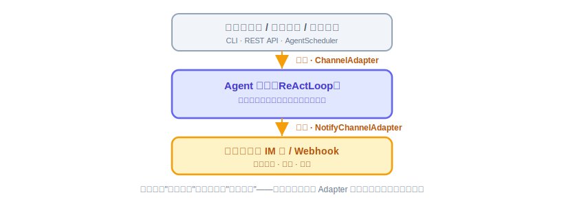
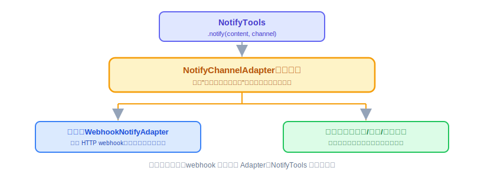

# Notify：原理解析、实现与代码讲解

CLI（18 节）给了 Agent 一个能亲手操作的入口，但目前这个入口只会"同步回话"——你问一句它答一句，答完就完了。定时模块（25 节）和日报 Agent 这类场景不一样：到点自动触发，没有人在等着看响应，Agent 必须**主动**把结果送到人能看到的地方。这节讲四件事：Notify 是什么、动手前该想清楚什么、代码怎么写、怎么用和怎么验。

---

## 一、Notify 是什么，干嘛用的

一句话：**入站有 Channel 负责"消息怎么进来"，Notify 补的是对称的另一半——"结果怎么主动送出去"。**

CLI 和 Web Service 都是"人推"：有人发起一次调用，Agent 处理完直接把响应返回给发起者，走的是同一条请求-响应链路，不需要额外的推送机制。但一旦触发源变成"到点自动"（定时查天气、每天汇总科技新闻），这条链路就断了——没有人在另一端等着接收响应，Agent 必须自己决定把结果送到哪、怎么送。



**如果没有这个模块会怎样。** 每个业务方定义 Agent 时都要自己在 Skill 里手写"调 `http_post` 打这个 webhook URL"，或者自己找一个企业微信/飞书的 MCP server 配上——每个 Skill 各写一份，重复且不统一。`NotifyTools` 就是要把"往外推一条消息"这件最常见的事统一掉——这也是后面 Memory（21、22 节）、Sandbox（23、24 节）会反复用到的"接口先行"设计习惯的第一次亮相。

---

## 二、动手前先想清楚几件事

**第一，先定接口，别先定实现。** 先抽一个不携带具体渠道细节的接口，表达"把一条内容送到某个通知目标"这个意图，不出现"企业微信""飞书"这类某一档实现特有的词。核心阶段只在接口后面挂一档实现，以后加新渠道只新增实现类，不改接口、不改调用方——这个"接口先行"的思路后面讲 Sandbox（23、24 节）时还会再遇到一次，是这门课里反复出现的同一套设计习惯。

**第二，核心阶段只做通用 webhook，不逐家接专用 API。** 企业微信、飞书、钉钉的群机器人都提供 webhook 地址，核心阶段用一个通用的 `WebhookNotifyAdapter` 就能覆盖大部分场景，不用去接每家的签名算法、AccessToken 刷新这些认证细节——那些留给扩展阶段按需要再加。

**第三，安全校验先占位，具体怎么做留给 Sandbox 那节。** `notify` 发出去的是一次 HTTP 请求，理应跟 `http_post` 一样过一层域名白名单，不能因为它是"往外推"就绕过去。但白名单具体怎么校验、这道墙怎么设计，是 23、24 节 Sandbox 模块要讲的内容——这里先按接口调用的方式接进去，细节到那两节再展开，不重复讲。

**第四，具体推到哪，配置在 Profile，不暴露在对话里。** webhook 地址是运行时配置，不是模型需要知道的信息。LLM 调用时大多数情况只传 `content` 就够了，`channel` 是可选参数，对应 Profile 里配好的 `notify_channels` 字段。

想清楚就这几句：接口表达意图，不表达实现；核心阶段只填通用 webhook 这一档；安全校验和审计走后面会讲到的统一机制，这里先接进去、不重复设计；具体推到哪是配置，不是对话内容。

> **实现顺序说明（授课顺序 ≠ 构建顺序）**：本节的 `NotifyChannelAdapter`/`NotifyTarget`/`WebhookNotifyAdapter` 三样可以立即实现、独立单测；但 `NotifyTools` 的完整接线有三个依赖在后面的课——`@Tool` 注册机制和 `ToolResult` 在 20 节、`Sandbox.enforce` 在 23/24 节。所以按文档拆任务时，`NotifyTools` 这个任务的完成时点在 24 节之后，27/28 节串联时做全量验证。`ProfileContext` 是 17 节 `AgentService` 已交付的 ThreadLocal，这里直接用。

---

## 三、代码怎么写

**`NotifyChannelAdapter` 接口。** 只有一个方法：

```java
package io.oryxos.tool.notify;

public interface NotifyChannelAdapter {
    void send(NotifyTarget target, String content);
}
```

```java
package io.oryxos.tool.notify;

import java.util.Map;

public record NotifyTarget(String channelType, Map<String, String> config) {
}
```

`NotifyTarget` 只有 `channelType` 和一份 `config`，具体是 webhook 地址还是别的认证信息，由实现类自己去解释——接口签名里不出现任何一档实现特有的词。

**`WebhookNotifyAdapter`（核心阶段唯一实现）。**

```java
package io.oryxos.tool.notify;

import org.springframework.stereotype.Component;
import org.springframework.web.client.RestClient;

@Component
public class WebhookNotifyAdapter implements NotifyChannelAdapter {

    private final RestClient restClient;

    public WebhookNotifyAdapter(RestClient restClient) {
        this.restClient = restClient;
    }

    @Override
    public void send(NotifyTarget target, String content) {
        String url = target.config().get("url");
        restClient.post()
                .uri(url)
                .contentType(MediaType.APPLICATION_JSON)
                .body(Map.of("content", content))
                .retrieve()
                .toBodilessEntity();
    }
}
```

**`NotifyTools`（内置 Tool，归 `oryxos-tool`）。**

```java
package io.oryxos.tool.builtin;

import io.oryxos.tool.notify.NotifyChannelAdapter;
import io.oryxos.tool.notify.NotifyTarget;
import io.oryxos.tool.sandbox.ActionType;
import io.oryxos.tool.sandbox.Sandbox;
import io.oryxos.tool.sandbox.SandboxAction;
import org.springframework.ai.tool.annotation.Tool;
import org.springframework.stereotype.Component;

@Component
public class NotifyTools {

    private final Sandbox sandbox;
    private final NotifyChannelAdapter adapter;
    private final ProfileContext profileContext;

    public NotifyTools(Sandbox sandbox, NotifyChannelAdapter adapter, ProfileContext profileContext) {
        this.sandbox = sandbox;
        this.adapter = adapter;
        this.profileContext = profileContext;
    }

    @Tool(description = "把一条消息推送到当前 Agent 配置好的通知渠道")
    public ToolResult notify(String content, String channel) {
        NotifyTarget target = profileContext.resolveNotifyChannel(channel);
        sandbox.enforce(new SandboxAction(ActionType.HTTP_REQUEST, target.config().get("url")));
        adapter.send(target, content);
        return ToolResult.success("已推送");
    }
}
```

一行行看关键的三步：`profileContext.resolveNotifyChannel(channel)` 从当前 Profile 的 `notify_channels` 字段里找到对应配置——`ProfileContext` 就是 17 节 `AgentService` 在入口处放好的那个 ThreadLocal，工具执行时从它知道"当前是哪个 Agent"——`channel` 参数不传时用第一个/默认渠道；`sandbox.enforce(...)` 这一步先接进去，具体这道白名单怎么校验、`Sandbox` 接口怎么设计，23、24 节会专门展开，`notify` 到时候不需要自己重新实现一套；`adapter.send(...)` 才是真正发出去的地方，核心阶段这里注入的就是 `WebhookNotifyAdapter`。



**Profile 配置示例：**

```yaml
notify_channels:
  - type: webhook
    url: ${TEAM_WEBHOOK_URL}
```

**本节交付物**（Spec-Kit 拆解锚点）：

- 代码：`NotifyChannelAdapter` 接口、`NotifyTarget`、`WebhookNotifyAdapter`、`NotifyTools`（`notify` 内置 Tool，完整接线依赖 20/24 节）
- 测试：`WebhookNotifyAdapterTest`、`NotifyToolsTest`（见验收 harness，第二批依赖 20/24 节）
- 配置：Profile 新增 `notify_channels` 字段（type + 渠道特定配置如 url）

---

## 四、验收 harness：把验收标准变成可执行的测试

跟"实现顺序说明"对应，harness 也分两批：

**第一批（本节立即可跑）——`WebhookNotifyAdapterTest`。** 用 MockWebServer 在本地起一个假 webhook（不算外网依赖，仍是单测层）：发送后断言收到的 POST 请求 body 里带 `content`、URL 来自 `NotifyTarget.config` 而不是硬编码；webhook 返回 5xx 时异常向上抛、不静默吞掉。

**第二批（20/24 节接线后补跑）——`NotifyToolsTest`**，mock `Sandbox` 和 `Adapter`：

| 测试点 | 守住的验收项 |
|---|---|
| `notify_channels` 未配置 → 明确报错 | 不是静默失败，Agent 不会以为发出去了 |
| `channel` 参数缺省 → 取第一个渠道 | 大多数场景 LLM 只传 content 就够 |
| **`enforce` 先于 `send` 被调用** | 白名单不能被"往外推"绕过 |

顺序断言这条最关键，用 `InOrder` 钉死：

```java
@Test
void 发送前必须先过白名单校验() {
    notifyTools.notify("hello", "default");

    InOrder inOrder = inOrder(sandbox, adapter);
    inOrder.verify(sandbox).enforce(argThat(a -> a.type() == ActionType.HTTP_REQUEST));
    inOrder.verify(adapter).send(any(), eq("hello"));   // 校验在前，发送在后——顺序反了就是漏洞
}
```

---

## 五、怎么用，做完怎么验

配好 `notify_channels` 之后，Agent 在对话里自己决定要不要调，不需要人工干预：

```text
用户：每天早上帮我看看天气，穿搭建议直接发到我们群里
Agent：好的（之后每天到点自动查天气 → 调 notify 推送到配置好的群）
```

也可以在对话里直接测试：

```text
用户：把"测试消息"推送一下
Agent：（调用 notify(content="测试消息")）已推送
```

harness 全绿后，剩下的人工确认：

- `notify` 调用真的能把消息送到配置好的**真实** webhook，群里收到（假 webhook 测的是协议，真 webhook 验的是配置）。
- 接口中立性自查（思维练习，测不出来）：换成企业微信官方 SDK 的实现，`NotifyChannelAdapter.send(NotifyTarget, String)` 这个签名需要改吗？答案应该是不需要。
- 渠道未配置报错、白名单先行、回归不破——已由 harness 两批覆盖，`mvn test` 绿即打勾。

Notify 补上的是"Agent 说完话还能主动送出去"这个出口。有了它，25 节的定时模块和 31 节的天气、日报 Agent 才有地方把结果真正交出去，不然到点跑完一整套 ReAct 循环，结果却只能烂在 Session 里没人看到。

---

## 六、主流 Notify 渠道与对接说明

核心阶段只有 `WebhookNotifyAdapter` 一档实现，但业务方最终关心的是"消息能不能进我们的群、能不能打到值班电话"。这一节盘点企业里主流会对接的通知渠道：哪些是纯 webhook、通用档就能覆盖；哪些 payload 格式有差异、需要适配；哪些根本不是 HTTP、只能留给扩展阶段的专用 Adapter。也顺便回答第五节那道"接口中立性自查"——这些渠道无论哪一档，`NotifyChannelAdapter.send(NotifyTarget, String)` 这个签名都不需要动。

### 6.1 渠道总览

按企业里的典型场景分四类：

| 场景 | 主流渠道 | 接入形态 | 通用 webhook 档能否覆盖 |
|------|---------|---------|------|
| **团队协作群**（日报、周报、构建通知） | 企业微信群机器人、飞书/Lark 自定义机器人、钉钉自定义机器人、Slack、Discord、Microsoft Teams | HTTP webhook | ✅ 形态覆盖，payload 格式需适配（见 6.2） |
| **个人即时提醒**（个人助理类 Agent） | Telegram Bot、Bark（iOS）、Server酱（微信）、ntfy / Gotify（自托管） | HTTP POST/GET | ✅ 基本覆盖 |
| **告警值班**（生产事故、SLA 告警） | PagerDuty、Opsgenie、阿里云 ARMS / 云监控 | Events API（HTTP，带 routing key 和事件语义） | ⚠️ 能发出去，但 severity / 去重 / 升级策略等字段需专用适配 |
| **正式触达**（对外通知、审批留痕） | 邮件（SMTP）、短信（阿里云/腾讯云 SMS） | 非 HTTP 或签名认证 API | ❌ 扩展阶段专用 Adapter |

一个判断标准：**给一个 URL 发一次 POST 就能送达的，核心阶段就能接**；需要维护连接（SMTP）、需要 AccessToken 刷新（企业微信应用消息，注意区别于群机器人）、需要请求签名（云厂商短信 API）的，属于第二节说过的"认证细节"，留给扩展阶段。

### 6.2 各家 webhook 的 payload 差异

这是对接时最容易踩的坑：**"都是 webhook" 不等于 "都是同一个 JSON 格式"**。核心阶段的 `WebhookNotifyAdapter` 发的是 `{"content": "..."}`，各家约定如下：

| 渠道 | Webhook URL 形态 | 文本消息 body | 与核心阶段格式 |
|------|-----------------|--------------|----------------|
| 企业微信 | `https://qyapi.weixin.qq.com/cgi-bin/webhook/send?key=<KEY>` | `{"msgtype":"text","text":{"content":"..."}}` | 需适配 |
| 飞书 / Lark | `https://open.feishu.cn/open-apis/bot/v2/hook/<TOKEN>` | `{"msg_type":"text","content":{"text":"..."}}` | 需适配 |
| 钉钉 | `https://oapi.dingtalk.com/robot/send?access_token=<TOKEN>` | `{"msgtype":"text","text":{"content":"..."}}` | 需适配 |
| Slack | `https://hooks.slack.com/services/T../B../..` | `{"text":"..."}` | 需适配 |
| Discord | `https://discord.com/api/webhooks/<ID>/<TOKEN>` | `{"content":"..."}` | ✅ 天然兼容 |
| Telegram | `https://api.telegram.org/bot<TOKEN>/sendMessage` | `{"chat_id":"...","text":"..."}` | 需适配（多一个 chat_id） |
| ntfy | `https://ntfy.sh/<topic>` | 纯文本 body | 需适配 |

几个渠道特有的注意点：

- **钉钉**必须在机器人上启用三种安全设置之一：自定义关键词（最简单——消息里必须包含设定的词，可以把关键词写进 Skill 的输出要求里）、加签（`timestamp` + HmacSHA256 签名拼进 URL）、IP 白名单。加签属于认证细节，核心阶段用"自定义关键词"最省事。
- **飞书**的签名校验是可选的，不开启时拿到 URL 就能推，适合核心阶段验证。
- **Microsoft Teams** 经典的 Incoming Webhook（Office 365 Connector）已宣布退役，新对接应走 Power Automate 的 Workflows webhook，同样是"URL + POST"形态。
- **企业微信**要区分**群机器人**（webhook，本节这档）和**应用消息**（需要 corpid/corpsecret 换 AccessToken，属扩展阶段专用 Adapter 的活）。

### 6.3 对接一个新渠道的标准步骤

以"把日报推到飞书群"为例，对接动作只有配置、没有代码：

1. **渠道侧建机器人拿 URL**：飞书群 → 设置 → 群机器人 → 添加"自定义机器人"，复制 webhook 地址。
2. **URL 进环境变量**：webhook URL 里的 token 就是凭证本身——泄漏 URL 等于任何人都能往群里发消息。按配置加载规则走 `${ENV}` 占位，不明文写进 Profile、不进日志、不进 git。
3. **Profile 声明渠道**：

   ```yaml
   notify_channels:
     - type: webhook
       url: ${FEISHU_WEBHOOK_URL}
   ```

4. **域名进 Sandbox 白名单**：`http.allowed_domains` 加上 `open.feishu.cn`（企业微信是 `qyapi.weixin.qq.com`，钉钉是 `oapi.dingtalk.com`，Slack 是 `hooks.slack.com`）。这一步漏了，`sandbox.enforce` 会先于 `send` 把请求拦下来——这正是第四节那条顺序断言守住的行为。
5. **对话里发一条测试消息验证**（第五节的"真 webhook 验配置"）。

### 6.4 payload 格式对不上怎么办：扩展阶段的两条路

6.2 的表说明了大多数主流渠道的 body 格式跟核心阶段的 `{"content": ...}` 不一致。扩展阶段补齐的方式有两条，都不改接口、不改调用方：

**路一：按 `channelType` 新增专用 Adapter（推荐）。** `NotifyTarget` 里本来就带 `channelType`，扩展阶段为每个渠道挂一个实现类，把 `content` 包成该渠道约定的 JSON，认证细节（钉钉加签、飞书签名、企业微信 AccessToken）也收在各自 Adapter 内部：

```java
@Component
public class FeishuNotifyAdapter implements NotifyChannelAdapter {
    @Override
    public void send(NotifyTarget target, String content) {
        // 包成飞书约定格式，接口签名一个字都不用改
        Map<String, Object> body = Map.of(
                "msg_type", "text",
                "content", Map.of("text", content));
        // ... POST 到 target.config().get("url")
    }
}
```

Profile 侧只是把 `type: webhook` 换成 `type: feishu`——运营方换渠道依然是改一行配置，这就是第二节"接口表达意图，不表达实现"在扩展阶段兑现的样子。

**路二：复杂格式走 MCP（Plugin Tool 方式二）。** 如果业务方要的不是纯文本，而是飞书富文本卡片、企业微信图文消息这类结构化内容，别把这些渠道特有的复杂度塞进 `notify`——按 `TechnicalSolution.md` §6.8 划的边界，配一个该渠道的官方/社区 MCP server 走方式二。`notify` 只统一"最常见的纯文本推送"这件事，两条路并存。

选择原则跟 Plugin Tool 三档一致：纯文本进群，用 `notify` + webhook 档就够；要专用格式或专用认证，扩展阶段加 Adapter；要富文本卡片这种深度渠道能力，走 MCP。
