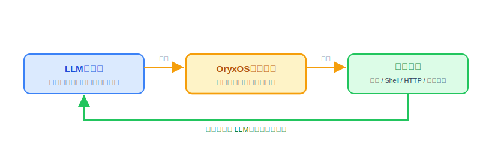
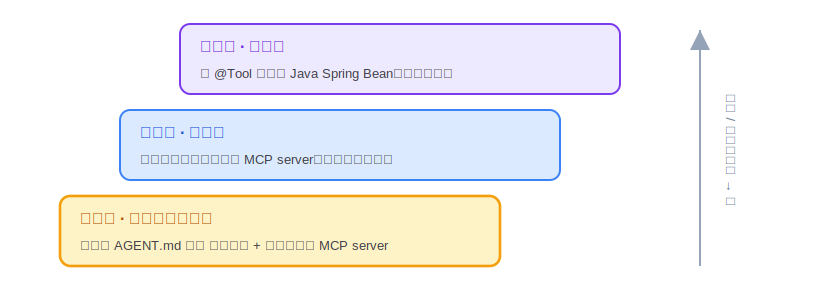
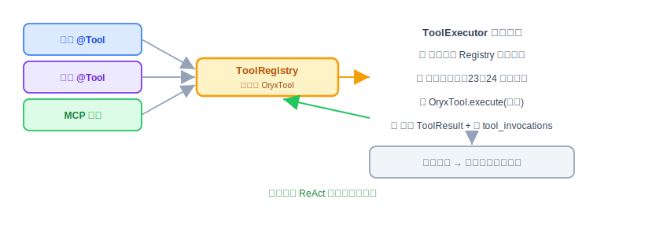

# Tool 体系：原理解析、实现与代码讲解

Provider 让 Agent 会调模型，ReAct 让它会思考，但到现在它还只会"想"和"说"。这节讲的 Tool，是让 Agent 真正能动手干事的那双手。四件事照旧：Tool 是什么、动手前该想清楚什么、代码怎么写、怎么用和怎么验。

技术栈还是 JDK 21 + Spring Boot 3.x，配合 Spring AI 的 `@Tool` 注解和 MCP 协议。下面的代码是示意。

---

## 一、Tool 是什么，干嘛用的

一句话：**Tool 就是 Agent 的手——LLM 负责想，Tool 负责真的去读文件、跑命令、调接口。**

大模型本身只会生成文字，它读不了你磁盘上的文件，也发不出一个 HTTP 请求。想让 Agent 真的干活，就得给它一批能操作外部世界的工具。**LLM 决定"调哪个工具、传什么参数"（靠 16 节说过的 Function Calling），OryxOS 负责把这个工具真正执行掉、再把结果递回给 LLM。** 这正是 ReAct 循环里 "Act" 那一步干的事。



OryxOS 的 Tool 分两类：

- **内置 Tool**：OryxOS 自带的基础工具，核心阶段一共九个——`read_file` / `write_file` / `list_dir`（文件，3 个）、`shell`（跑命令，1 个）、`http_get` / `http_post`（发请求，2 个）、Memory 用的 `save_memory` / `recall_memory`（2 个），再加上 19 节刚讲过的 `notify`（推送，1 个）。它们覆盖"读写文件、跑命令、调 API、记事、往外推通知"这条最短链路。
- **Plugin Tool**：业务方自己扩展的工具。企业要做运维助手、客服助手，靠的就是它——OryxOS 本身只给基础工具，真正的业务能力是业务方接进来的。

这一节的重点，就在 Plugin Tool 怎么设计。

---

## 二、动手前先想清楚几件事

**第一，先定一个统一的工具抽象，屏蔽掉"来源"。** 内置的、业务方用 Java 写的、通过外部服务接进来的，工具来源五花八门。如果 ReAct 循环要分来源区别对待，代码会很快乱掉。所以先定一个统一接口 `OryxTool`：不管工具从哪来，都包装成 `OryxTool` 注册进一个 `ToolRegistry`，**ReAct 循环只跟 `OryxTool` 打交道，完全不感知它背后是什么。** 这个抽象是整个 Tool 体系的地基，得第一个定下来。

> **动手前先检查一下现有代码**：如果 `OryxTool` 接口是前面几周就写好的，先确认它有没有 `getInputSchema()` 这个方法——早期版本经常只顾着 `getName`/`getDescription`/`execute` 三个"看得见"的方法，把 schema 这块漏掉。这个方法不补上，Provider 那边想把工具翻译成 Function Calling 格式时，根本没地方拿参数说明，这一步会直接卡住。

**第二，Plugin Tool 给三档接入方式，门槛从低到高。** 不同的人扩展能力的水平不一样，所以给三条路，让业务方按需选：



选择标准就一句话：**能用方式一就不用方式二，能用方式二就不用方式三。** 因为方式一最优雅——业务方只描述"想干什么"，具体调哪个工具、怎么组合，交给 LLM 自己想。比如"每天早上把昨天的 GitHub PR 进度推到 Slack"，写一份 markdown、复用现成的 github-mcp 和 slack-mcp，一行代码都不用写。

**第三，所有工具执行前都要过安全校验。** 工具能读文件、跑命令、发请求，一旦被乱调就是事故。核心阶段的办法是应用层白名单：文件操作查路径白名单、Shell 查命令白名单、HTTP 查域名白名单，执行前统一过一层校验，校验不过直接拦下——这层校验具体怎么设计是 23、24 节 Sandbox 模块的内容，这里先知道执行链路里有这一步。这是核心阶段唯一的 Tool 治理手段，得在设计时就串进执行链路里。

想清楚就这几句：先立 `OryxTool` 统一抽象、Plugin 给三档接入、执行前一律过白名单。

---

## 三、代码怎么写

Tool 相关的东西核心阶段合成一个模块（内置 Tool、MCP Client、ToolRegistry、安全校验都在里面，具体实现见 23、24 节），因为它们共享同一个 `OryxTool` 抽象，没必要拆细。

**先看统一抽象 OryxTool。** 它约定四个方法，任何来源的工具都得实现：

```java
public interface OryxTool {
    String getName();            // 工具名，LLM 靠它点名要调谁
    String getDescription();     // 干什么用的，给 LLM 看
    JsonSchema getInputSchema(); // 参数长什么样（就是 16 节说的 schema）
    ToolResult execute(JsonNode input);  // 真正执行，输入 JSON，返回结果
}
```

`ToolResult` 里带四样东西：成功标识、结果内容、错误信息、是否可重试。为什么要"是否可重试"？因为 ReAct 循环拿到失败结果时，得知道这错值不值得再调一次。

有了这个接口，三种来源的工具就有了统一的样子：

- **内置 Tool 和方式三（Java @Tool）**：用 Spring AI 的 `@Tool` 注解标在 Java 方法上，启动时自动扫描、生成 schema、包装成 `OryxTool`。
- **方式二（MCP）**：`McpClientService` 连上外部 MCP server，把它暴露的工具也包装成 `OryxTool`。这两个类的实现规格如下（31 节的日报 Agent 硬依赖它，不能只停在概念）：

```java
@Component
public class McpClientService {

    @PostConstruct
    public void connectAll() {
        for (McpServerConfig cfg : loadConfigs()) {     // 读 .oryxos/mcp_servers.yaml
            try {
                McpClient client = McpClient.connect(cfg);      // stdio 或 SSE
                for (McpToolSpec spec : client.listTools()) {   // 调 tools/list
                    toolRegistry.register(new McpToolAdapter(client, spec)); // 包装注册
                }
            } catch (Exception e) {
                log.warn("MCP server {} 连接失败，跳过它的工具", cfg.name(), e);
                // 外部依赖失联不拖垮自身启动——只 WARN，OryxOS 照常起
            }
        }
    }
}
```

```java
public class McpToolAdapter implements OryxTool {
    // getName/getDescription/getInputSchema 直接映射 MCP 的 tools/list 返回
    @Override
    public ToolResult execute(JsonNode input) {
        return client.callTool(spec.name(), input)      // JSON-RPC 转发给 MCP server
                .map(ToolResult::success)
                .orElseGet(() -> ToolResult.failure("MCP 调用失败", true));  // 可重试
    }
}
```

关键就两条：**注册时**把每个 MCP 工具包装成 `OryxTool` 塞进同一个 `ToolRegistry`（ReAct 循环由此对来源无感知）；**执行时**通过 MCP 协议原样转发、结果包成 `ToolResult`。失联的 server 记 WARN 跳过，不能变成自己的启动故障。

**一个内置 Tool 长什么样。** 拿 `http_get` 举例：

```java
@Tool(name = "http_get", description = "发起一个 HTTP GET 请求，返回响应体")
public String httpGet(@ToolParam("要请求的完整 URL") String url) {
    sandbox.enforce(new SandboxAction(ActionType.HTTP_REQUEST, url));  // 先过域名白名单，不过就抛异常拦下
    return httpClient.get(url);              // 通过校验才真正发请求
}
```

看它在干嘛：`@Tool` 注解让 Spring AI 自动把这个方法注册成工具、并根据参数生成 schema；方法体里**第一件事就是过安全校验**，域名不在白名单里直接抛异常、请求根本发不出去；过了校验才真正去请求。安全校验写在执行的第一步，这是硬规矩——这里先用一下这个校验，具体 `Sandbox`/`SandboxAction` 怎么设计，23、24 节详细展开。

**工具怎么汇总、怎么被调。** 启动时 `ToolRegistry` 把三种来源的工具全扫进来、统一成 `OryxTool`；每个 Agent 启动时再按 Profile 的 `tools` 字段，过滤出自己能用的那批。真正执行时，走的是 17 节讲过的 `ToolExecutor`，流程是这样：



**看测试用例。** Plugin Tool 写完得能验。一个 Java Plugin Tool 的测试其实很朴素——给输入、调 execute、断言结果，顺便验一下白名单会拦：

```java
@Test
void http_get_应能取回响应() {
    var result = httpTool.execute(json("{\"url\":\"https://api.weather.com/beijing\"}"));
    assertTrue(result.success());
    assertNotNull(result.content());
}

@Test
void http_get_命中白名单外域名应被拦下() {
    assertThrows(RuntimeException.class,   // 23、24 节会讲清楚这里具体抛的是 SandboxViolationException
        () -> httpTool.execute(json("{\"url\":\"https://evil.example.com\"}")));
}
```

第一个用例验"正常能跑通"，第二个验"越界会被拦"。对工具来说，这两条是最该先写的：功能对、且踩不出边界。

**有几样先别做。** Tool Policy（哪个 Agent 能用哪些工具的 allow/deny 规则）、工具太多时的按需加载、把 OryxOS 自己变成 MCP server 对外暴露、完整的容器级沙箱、一次响应里多个工具并行调，这些都放扩展阶段。核心阶段先用"白名单 + Profile 的 tools 字段限定"顶住。

**本节交付物**（Spec-Kit 拆解锚点）：

- 代码：`OryxTool` 接口（含 `getInputSchema`）、`ToolResult`、`ToolRegistry`、`FileTools`（3 个）、`ShellTools`、`HttpTools`（2 个）、`McpClientService`、`McpToolAdapter`；`NotifyTools`（19 节）在此完成 `@Tool` 注册
- 配置：`.oryxos/mcp_servers.yaml`（name/transport/command/env）；Profile 的 `tools` 字段过滤
- 说明：白名单校验先以接口调用形式接入，`Sandbox` 本体 23/24 节交付

---

## 四、怎么用，做完怎么验

给 Agent 加工具，对着三档来：

```text
方式一（零代码）：在 .oryxos/skills/ 写一份 SKILL.md，Profile 里 skills 引用它、
                  mcp_servers 引用要复用的 MCP server。
方式二（轻代码）：在 .oryxos/mcp_servers.yaml 声明你自己的 MCP server，OryxOS 启动时连上。
方式三（重代码）：写一个带 @Tool 注解的 Spring Bean，放进工程，启动自动注册。
```

用 `oryxos tool list` 能看到当前注册了哪些工具。

做完对着下面几条验：

- 九个内置 Tool（文件三个、Shell 一个、HTTP 两个、save_memory、recall_memory、notify）都能被 Agent 正常调到。
- 方式三：写一个 `@Tool` 注解的示例工具，启动后能在 `tool list` 里看到、Agent 能调通。
- 方式一：写一份 SKILL.md + 复用一个现成 MCP server，Agent 能读懂意图并调用外部工具完成任务。
- 三种来源的工具，ReAct 循环调起来一视同仁，感知不到区别（说明 `OryxTool` 抽象立住了）。
- 白名单生效：故意用一个白名单外的路径 / 命令 / 域名，工具会被拦下、不执行——具体这道白名单怎么设计，23、24 节 Sandbox 模块会详细展开，这里先知道"会被拦"就够。
- 每次工具调用都写进了 `tool_invocations`，可查可审计。

Tool 是 Agent"能干事"的关键。到这一步，配合 Provider、ReAct、CLI，Demo 一（每日天气）的对话版（问天气、给穿搭建议）里那个"真的去查天气"的动作，就落地了。
