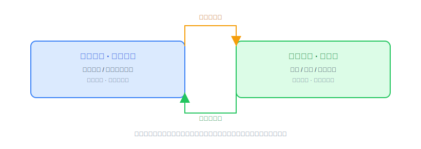
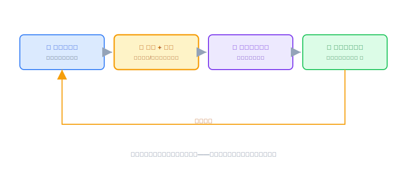
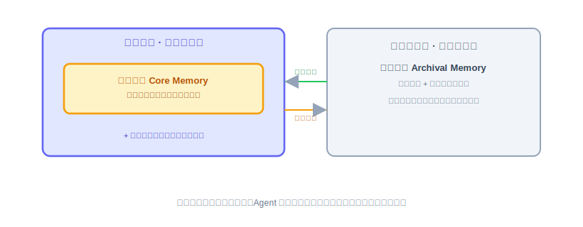
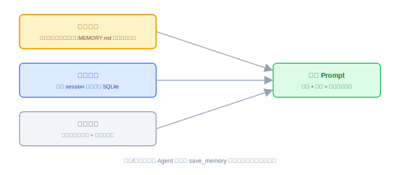
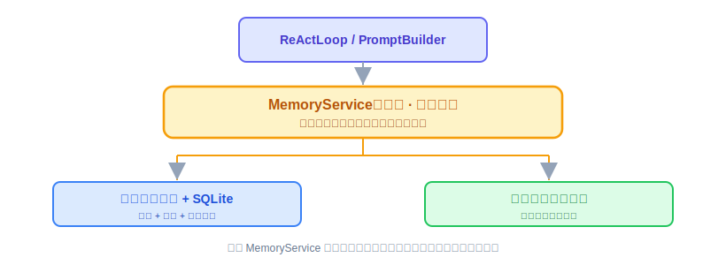

# Memory：原理解析、业界方案与 OryxOS 设计评审

Provider、ReAct、CLI、Notify、Tool 都讲完了，Agent 能被喂话、会想、会动手、会往外推消息。这节讲 Memory，解决的是另一个缺口：Agent 记不记得住事。这节不写代码（代码实现是下一节的事），是一次技术评审：把 Memory 是什么、业界怎么做讲清楚，再给出 OryxOS 的设计结论。

---

## 第一部分：Memory 是什么，业界怎么做

### 一、为什么 Agent 需要 Memory

**大模型本身不记事，但 Agent 要干活必须记事，这个矛盾逼出了 Memory。**

大语言模型每一次调用都是无状态的——它不记得上一次说过什么，全靠调用方把历史塞进上下文窗口。但 Agent 要多轮对话、要跨会话记住用户、要执行长任务，就必须记得住东西。而上下文窗口有限且昂贵，token 越多越慢越贵，还有硬上限。所以 Agent Memory 的本质是：**在有限的上下文窗口之外，管理一套让 Agent 记得住东西的机制。**

这件事在 2026 年被推到台前，原因很直接：它是 Agent 从 Demo 到生产要跨的头号坎之一。一个 Agent 周一能通过全部评测，周三却忘了用户的名字——这不是模型问题，是记忆问题。Demo 能跑，是因为整段对话塞得进一个上下文窗口；生产会崩，是因为真实用户会跨会话、跨天、跨话题地回来。

### 二、短期记忆与长期记忆

**短期记忆是这一次对话的"工作台"，长期记忆是跨会话的"仓库"。**

**短期记忆**（也叫工作记忆）就是当前这次对话或任务的上下文，对应的其实就是当前塞在上下文窗口里的内容：本轮对话历史、刚调用工具的结果、当前任务的中间状态。特点是容量有限、生命周期短、访问快。对话结束或窗口满了，它就没了。

**长期记忆**是跨会话、跨时间持久保存的东西。用户上周说过喜欢用某种语言、项目叫什么，这次对话还记得，这就是长期记忆。它不在上下文窗口里，而是存在外部，需要用的时候再检索出来、拼回上下文。长期记忆内部通常还会借用认知科学的说法再细分三类：**情景记忆**（具体发生过的事，比如上次讨论过什么、结论是什么）、**语义记忆**（抽象的事实和知识，比如用户偏好、项目背景）、**程序记忆**（怎么做某件事的流程，有时沉淀成技能或规则）。

两者之间有一个核心循环：短期记忆里重要的东西，会被固化成长期记忆写出去；长期记忆里相关的东西，用时被检索回短期记忆拼进上下文。

### 三、两个容易混的概念：上下文压缩 vs 记忆压缩

**上下文压缩管"当下这轮说的话"，记忆压缩管"存下来的仓库"，作用的层面完全不同。**

**上下文压缩**，解决的是当前对话太长、窗口快塞满的问题。手段是把已有上下文变短，比如把前面很多轮对话总结成一段摘要，或者把不重要的部分裁掉。它作用在**当前这次交互**的层面，目的是让对话能继续下去不爆窗口。

**记忆压缩**，解决的是长期记忆越存越多、检索越来越低效的问题。手段是把积累的大量记忆做归并、去重、抽象，把多条相关的记忆合并成一条更概括的，把过时的淘汰掉。它作用在**长期记忆库**的层面，目的是让记忆库保持精炼、可用。

一句话区分：上下文压缩是把现在说的话压短，管的是当下的窗口；记忆压缩是把存下来的东西整理精简，管的是长期的仓库。

### 四、记忆提炼：长期记忆能用起来的关键一步

**原始对话是啰嗦的，不提炼直接存，长期记忆库就是垃圾堆。**

原始对话啰嗦、口语化、含大量无关信息，不可能原样存进长期记忆——占空间、检索还不准。所以需要**提炼**：从一段对话或一次任务里，抽取出值得长期记住的东西，加工成结构化、精炼的记忆条目。比如从一段含糊的表达里，提炼出一条干净的记忆："用户在性能敏感场景偏好某种技术选型"。

提炼通常靠模型自己来做，让它读完对话输出哪些该记，也可以配合规则。**提炼的质量直接决定长期记忆的质量**：提炼得准，检索才有用；提炼得烂，记忆库就是垃圾堆。

### 五、把这些概念串成一个完整循环

**对话累积、压缩提炼、写入归档、定期精简、检索拼回——这是一个闭环，转起来才是一个活的记忆系统。**

### 六、业界怎么做：开源方案盘点

这块在 2026 年已经形成了一个成熟且专业化的开源生态。按定位分类，主流项目如下：

| 项目 | 定位 | 特点 |
|---|---|---|
| Mem0 | 即插即用的记忆层 | 最流行，GitHub 47K+ star；提供 user/session/agent 三层作用域，底层是向量加图加键值的混合存储，自动记忆抽取；是库不是运行时 |
| Zep / Graphiti | 时序知识图谱记忆 | 最擅长随时间变化的事实；在 LongMemEval 时序基准上明显领先，Graphiti 用 GPT-4o 得分约 63.8%，而 Mem0 约 49% |
| Letta（前身 MemGPT） | 记忆即操作系统的有状态 Agent | 把记忆当 OS 管：主上下文是 RAM，归档记忆是磁盘，Agent 自己管理内存分配；影响了整个领域 |
| Cognee | 图原生、自改进的记忆管线 | 混合图-向量-关系存储，自动化的 ECL（Extract-Cognify-Load）提炼管线，14 种检索模式 |
| LangMem | LangGraph 生态的官方记忆 | 已在用 LangGraph 就用它 |
| ReMe | 透明的文件式记忆 | 基于文件，透明可控 |

几个概念在这些项目里的落地对应关系：**记忆提炼**对应各家的自动抽取能力，Cognee 的 cognify 管线就是干这个；**记忆压缩与自改进**对应 Cognee 的 memify、Letta 的自主管理；**上下文压缩**更多在 Agent 框架层，记忆框架反而管得少，因为它们的思路是"与其压上下文，不如把该外置的外置出去"。

一个重要判断：**LongMemEval** 已经成为这个领域的事实标准压力测试，不同架构在时序检索上可以差到 15 分。这说明记忆不是有没有的问题，而是**架构选型**的问题。

### 七、重点解剖：MemGPT 的"记忆即 OS"

**LLM 的上下文窗口像内存，外部存储像磁盘，MemGPT 借操作系统的虚拟内存管理来管 Agent 的记忆。**

Letta 的前身 MemGPT 值得单独讲，因为它的思想和 OryxOS 做 Agent OS 最同源。核心洞察来自一个类比：LLM 的上下文窗口就像计算机的内存，快、贵、但小；外部存储就像磁盘，慢、便宜、但几乎无限。操作系统当年用虚拟内存解决过一模一样的问题——用分页机制在内存和磁盘之间自动换入换出，让程序感觉自己有无限内存。MemGPT 说，那我们能不能像操作系统管理虚拟内存那样，来管理 LLM 的上下文。

它把记忆明确分成两层：**主上下文**相当于内存，是当前塞进窗口的内容，其中有一块**核心记忆**，是最重要、要一直带在身上的信息，小而精，永远在场不换出；**外部上下文**相当于磁盘，放归档记忆和完整历史，放不进或不常用的东西存到外面，用时检索。区别在于主上下文里的东西模型直接看得见，外部的看不见，必须调回来才能用。

MemGPT 最精妙的一步，是**把记忆管理的控制权交给 Agent 自己**。它给 Agent 提供一组操作自己记忆的工具，比如把重要信息写进核心记忆、把过时的改掉、把当前上下文归档、从归档检索。当上下文快满了，系统给 Agent 一个类似"内存压力"的信号，Agent 收到后自己决定哪些该总结、哪些该写进核心记忆、哪些该归档、哪些可以丢。用操作系统的话说，MemGPT 让 Agent 扮演了"管理自己虚拟内存的进程"这个角色。

这套思想里，有两个点对 OryxOS 直接有用：一是**核心记忆**这个分层概念，二是**上下文压力触发记忆整理**这个机制——前者成本低、阶段一就直接用；后者留作扩展阶段的候选设想，等出现真实信号再考虑要不要上（下文第十三小节会讲这个"信号驱动"的判断方法）。

### 八、重点解剖：Mem0——最流行的即插即用记忆层

**Mem0 把"自动抽取 + 冲突消解 + 混合存储 + 多层作用域"打包成一个库，你几乎不用懂内部就能给 Agent 接上记忆——但正因为它是库不是运行时，它是 OryxOS 该学、可能集成、但绝不会被它取代的东西。**

MemGPT 是"把记忆当 OS 自己管"，Mem0 走的是另一条路：**把记忆做成一层薄薄的、即插即用的中间件**。你的 Agent 每轮对话把消息丢给它的 `add`，检索时调 `search`，剩下的抽取、存储、更新它全包了。GitHub 47K+ star，是目前最流行的记忆层，值得单独解剖三点：

**第一，它的核心不是"存"，是"抽取与更新"。** 简单方案是把对话原样 append 进记忆库，Mem0 不这么干——`add` 进来时它用模型从对话里**提炼**出该记的事实（记忆提炼落地），更关键的是它会拿新事实和已有记忆比对：矛盾就更新、重复就合并、无关才新增。用户三月说"我用 Python"、七月说"改用 Go 了"，Mem0 倾向把旧记忆更新掉而不是让两条并存打架。这一步——**add 即消解，而非纯堆叠**——正是它区别于"往文件里追加"的分水岭，也是"记忆压缩"最实际的一种落地。

**第二，它的分层是按"作用域"切的：user / session / agent 三层。** 同一条信息属于这个用户、这次会话、还是这个 Agent，检索时按作用域圈定范围。注意这跟 OryxOS 的核心/会话/归档是**不同的切法**——OryxOS 按"重要性与生命周期"切，Mem0 按"归属谁"切，两套维度可以对照但不冲突。

**第三，它的底层是向量 + 图 + 键值的混合存储**，这也是它比纯向量方案在关系型记忆上更强的原因（图那一半的价值下一节展开）。

**对 OryxOS 的评审意义有两条**：其一，Mem0 的"add 即去重更新"点破了 OryxOS 核心阶段 `MEMORY.md` 纯 append 模式的软肋——记忆量一大，同一件事的新旧说法会在文件里并存、互相矛盾，这是将来记忆压缩要正面解决的问题，Mem0 的做法是现成参照。其二，Mem0 是**可自托管的库、不是运行时**，这一点直接对应第十四节那个"要不要集成"的锚点：如果记忆最终被判定为"必要但非核心差异化能力"，Mem0 是集成的首选——它不会像 Letta 那样跟 OryxOS 的运行时定位打架。

**但要看清它的成本与边界**：自动抽取每次 `add` 都要额外一次模型调用（成本、延迟、以及一次把对话交给它管线的数据流转）；冲突消解逻辑是它的黑盒，出了错不好审计；对"数据不出域"的严监管私有部署，任何经过外部管线的记忆处理都要单独评估。这些正是核心阶段选择"自己用文件做、Agent 手动 `save_memory`"的理由——把复杂度和数据都先攥在自己手里。

### 九、重点解剖：知识图谱记忆——当"事实会随时间变化"时

**向量检索擅长"意思相近"，但不擅长"关系"和"时间"；当记忆是一张随时间演变、彼此关联的事实网时，知识图谱是这类问题的专门解法——也是 OryxOS 大概率不自造、真要用宁可集成的一层。**

前面第六节盘点里，Zep / Graphiti 在 LongMemEval 时序基准上明显领先（Graphiti≈63.8% vs Mem0≈49%），这个分差不是调参调出来的，是**架构差异**。把它讲透，要先看清向量检索的盲区：

**向量检索的两个盲区是"关系"和"时序"。** 举个评审里最常用的例子：用户三月说"我在 A 公司"，七月说"跳槽去了 B 公司"。向量库里这两条记忆都在，你问"用户现在在哪工作"，语义匹配可能把过时的 A 那条也召回甚至排在前面——因为它只会算"哪条跟问题最像"，不知道 B 比 A **更新**、也不知道"就职于"是一条会被后续事实**推翻**的关系。

**Graphiti / Zep 的解法是时序知识图谱（temporal KG）：** 实体是节点（用户、A 公司、B 公司），关系是**带时间戳的边**（"就职于"，valid_from / valid_to）。新事实进来时不是覆盖旧边，而是给旧边打上"失效时间"——既保留了"曾经在 A"的历史，又明确了"当前在 B"。检索时结合图遍历和语义匹配，就能准确答出"当前"与"历史"。这就是它在时序基准上领先的根源。

**三种存储不是替代，是各有所长**：文件/键值擅长简单的"是什么"，向量擅长"意思相近"，知识图谱擅长"谁和谁什么关系、什么时候变的"。真正强的记忆层（如上一节的 Mem0）往往是三者混合。

**对 OryxOS 的评审意义有三条**：

- **它点破了核心记忆的一个长期隐患**：第十二节讲核心记忆装"用户是谁、项目背景、关键偏好"，但这些恰恰是**会变**的——用户换了项目、改了技术偏好，旧的核心记忆不失效就会持续误导。OryxOS 核心阶段怎么解决？靠 **Agent 主动判断并调 `save_memory` 更新** `MEMORY.md`，把时序一致性的责任交给 Agent 的判断，而不是引入图引擎——这是克制原则的又一次体现：能力上确实弱于时序 KG，但换来零依赖、可控、私有可托管。
- **它的上马门槛比向量更高**：知识图谱要一套图存储与图查询，是比向量库更重的依赖。按第十三节的信号驱动原则，向量的三个信号之上，知识图谱还要再叠一个——**"时序/关系型的精准召回"成为真实且高频的需求**。没到这一步，图记忆就是过度设计里最贵的那种。
- **一个明确的选型判断**：OryxOS 的目标场景（运维助手、每日日报这类）以"用户偏好 + 事实陈述"为主，关系密度和时序复杂度都不高，所以图记忆的优先级**低于**向量。真到了非上不可的那天，时序 KG 的工程复杂度远超一个薄向量层，届时集成 Graphiti 这类**可自托管**方案，比自造更理性——这跟第十四节"向量层倾向自造、图这种重能力宁可集成"是同一个判断。

---

## 第二部分：OryxOS 准备怎么实现 Memory

### 十、设计原则：想清楚演进，只实现当下

**不做最强的记忆系统，做一个够用、可控、能平滑长大的记忆系统。**

OryxOS 记忆模块的第一性原则不是做一个最强的记忆系统，而是做一个够用、可控、能平滑长大的记忆系统。这和整个项目"分阶段克制、不为未来过度设计"的调性一致。业界那些强框架是很好的参照系和后备选项，但我们不该一上来就把它们的复杂度背进来。落到设计上，是三句话：**方向要想清楚，接口要设计对，实现只做当下。** 这三者的分界线，是接口这道墙——墙之上现在就设计好，墙之下只做当下需要的。

### 十一、贯穿始终的接口原则

**先把 Memory 焊成一个稳定接口，比选文件还是选向量都重要。**

OryxOS 的 `MemoryService` 就是这个门面。引擎（ReAct 循环）永远只调用抽象的记忆方法，比如"回忆"和"记住"，至于背后是文件、SQLite、向量库还是接了外部框架，引擎完全不知道也不需要知道。这么做的回报是巨大的：后面无论怎么升级存储，上层一行代码都不用改，这是平滑长大的技术前提。

所以第一件事不是选存储，是把接口焊死。这也正好呼应 MemGPT 的思想——它对 Agent 暴露的也是一组稳定的记忆操作，底层怎么换入换出是它自己的事。

### 十二、阶段一（核心阶段）：文件式，但结构要对

**文件式没错，但借 MemGPT 的思路切三层，别糊成一坨。**

核心阶段就用文件式的 `MEMORY.md`，这是对的。但借 MemGPT 的启发，把它切出层次，我们切三块：

**核心记忆**，始终在场。借 MemGPT 的 core memory，这是一小块永远拼进每次上下文的东西：用户是谁、项目背景、关键约束偏好。小而恒定，不检索、不换出，一直带着，放在 `MEMORY.md` 顶部一个固定区块。它解决的是"Agent 每次对话都记得你是谁"这个最基本、也最影响体感的需求，实现成本几乎为零。**这一层跟"要不要自动提炼"是两件独立的事**——它纯粹是数据怎么摆的问题，不需要任何自动化机制来支撑，本质上是对同一个 `MEMORY.md` 文件的一个轻量结构约定，不是新开一套子系统。

**会话记忆**，对应当前对话。就是当前 session 的往来，存 SQLite，不需要额外处理。

**归档记忆**，按需检索。长期积累的、量大的事实和历史。核心阶段先用文件加关键词检索，比如按 topic 分文件、或简单的全文匹配。这个检索是弱的，但核心阶段够用，因为此时记忆量不大。

**核心记忆和归档记忆怎么写进去？—— 靠 Agent 自己判断，主动调用 `save_memory` 这个 Tool，不是系统自动提炼。** 这是刻意的选择：

MemGPT 那种"会话结束/上下文快满就自动触发一次提炼"的机制很有吸引力，但仔细想想，它解决的问题——"重要信息容易漏记"——在核心阶段还只是个推测，没有真实信号支撑（呼应下文第十三小节讲的"不拍脑袋，用信号判断"，这条原则用在这里同样成立）。而且 ReAct 循环里 Agent 本来就能在对话过程中随时判断"这句话该记"、主动调工具，这条路径已经有了，工程量接近零；自动提炼要多一套"什么算会话结束、什么算上下文快满"的判断逻辑，还要多一次模型调用，核心阶段没必要为一个还没验证过的需求先把复杂度背上。等真出现"手动记忆明显漏东西、用户反馈 Agent 经常忘事"这类真实反馈，再考虑要不要上自动提炼，那时候它是扩展阶段的一个候选项，不是核心阶段的必需品。

这一阶段的完整闭环：核心记忆每次都带上，会话记忆累积，Agent 在对话过程中主动判断该不该记、调 `save_memory` 写进核心区或归档区，下次需要时关键词检索归档、拼回上下文。全部用文件加 SQLite 实现，**零外部依赖**，符合单二进制、无重型依赖的核心阶段目标。

### 十三、阶段二（扩展阶段）：什么信号出现时才上向量检索

**关键不是要不要上向量，而是什么时候上——不拍脑袋，用信号判断。**

出现下面任一个信号，才是该上向量检索的时候：

- **信号一，关键词检索开始找不准了。** 当归档记忆多到用户问起某个用词不同但意思相近的旧事、关键词匹配返回一堆无关的或漏掉相关的，检索准确率明显下降。语义检索就是为解决这个而生的。
- **信号二，记忆量级跨过一个坎。** 当单用户或单 Agent 的归档记忆到了几百上千条，文件加线性关键词扫描无论性能还是准确率都撑不住。
- **信号三，出现跨会话精准召回的真实需求。** 核心阶段可能大量场景只需要核心记忆就够了，当业务真的需要精准翻出很久之前某次对话的某个结论，才值得上向量。

没有这些信号之前，不要上向量。过早上向量库等于多一个重型依赖、多一层复杂度，换来的是当前根本用不上的能力，这是典型的过度设计。这里要顶住"业界都上向量了我是不是也该上"的焦虑，用真实信号说话。

升级时的做法：在 `MemoryService` 门面背后换上向量检索实现，接口不变、上层无感。这就是第十一节那道墙的价值兑现。

### 十四、关键决策：自己造，还是集成 Mem0 或 Letta

**Letta 是同层竞品只做参照绝不集成；Mem0 能不能接，取决于记忆是不是 OryxOS 想要的核心差异化能力。**

到了要上向量或图这些重能力时，面临真正的选择。先分清两类东西：

**Mem0 是记忆层**，是库，设计上就是被集成的；

**Letta 是有状态 Agent 运行时**，某种程度上和 OryxOS 是同一层的东西，都是 Agent 运行底座。

这个区别决定了策略。**Letta 不该被集成**，它是参照和竞品，不是组件——把 Letta 集成进来，等于在一个 Agent OS 里塞进另一个 Agent OS，定位就乱了。Letta 对我们的价值是思想参照，MemGPT 的核心记忆、压力触发这些设计学过来自己实现，而不是依赖。

**Mem0 可以考虑集成**，但要看 OryxOS 的自我定位，这里有个张力需要拍板。如果记忆是 OryxOS 的核心差异化能力、要完全掌控，那就自己造，理由和"自实现 ReAct 不套外部框架"是同一个——核心机制要握在自己手里，尤其面向私有部署、数据不出域的严监管企业，把记忆这种敏感数据的处理交给外部框架可能与定位冲突。如果记忆只是必要但非差异化的能力，那没必要重造轮子，集成一个可自托管的成熟记忆层，把精力省下来投到真正差异化的地方，比如 Agent 运行时、沙箱、多 Agent 协作。

**当前倾向**：核心阶段的文件式记忆自己做，简单、可控、契合私有部署；扩展阶段真需要向量检索时，优先考虑自己实现一个薄的向量检索层，而不是集成外部框架。原因是定位是私有可控、数据不出域，记忆数据是最敏感的那部分，自己掌控的价值大于省事的价值。但如果发现自造的记忆层明显追不上成熟框架、而记忆又不是想重点投入的方向，那时集成一个可自托管的方案也是理性选择。这个决策的锚点始终是：**记忆是不是 OryxOS 想要的核心差异化能力**。

### 十五、分阶段路线总览

| 层次 | 内容 |
|---|---|
| 接口层（第一天就做，永不变） | `MemoryService` 门面，上层只依赖它 |
| 阶段一（核心） | 核心记忆始终在场，加会话记忆用 SQLite，加归档记忆用文件加关键词；核心/归档记忆靠 Agent 主动调 `save_memory` 写入，不做自动提炼；零外部依赖 |
| 阶段二触发条件（信号驱动） | 关键词检索找不准，或记忆量过千，或出现跨会话精准召回的真实需求 |
| 阶段二（扩展） | 门面背后换上向量检索，语义召回，接口不变、上层无感 |
| 自造还是集成 | Letta 只做思想参照不集成；向量层倾向自造以契合私有可控定位，除非记忆明显非重点且自造追不上，才集成可自托管方案 |

### 十六、这节评审想清楚了吗

评审课没有代码要验收，但有几件事得自查一遍，确认想透了再往下走：

- 能不能用一句话讲清楚短期记忆和长期记忆的区别？能不能讲清楚上下文压缩和记忆压缩不是一回事？
- `MemoryService` 这道接口墙的位置定了吗——上层（ReActLoop）除了"回忆"和"记住"，还能不能再多知道一点点背后的实现细节？如果能，说明墙没焊死。
- 阶段一的三层（核心/会话/归档）分别落在什么存储上？为什么核心阶段选择"Agent 手动调 `save_memory`"而不是"系统自动提炼"，这个决策的依据是什么（能不能不看文档自己说出来）？
- 阶段二要上向量的三个信号，能不能不看着文档、自己复述出来？如果只能说"业界都在用"，说明还没真正想清楚。
- 自造 vs 集成 Mem0 的决策锚点是什么？如果说不出"记忆是不是核心差异化能力"这句话，说明这一步还是拍脑袋。

这几条都能答上来，评审就算过了，下一节可以放心动手实现。

## 结语

OryxOS 记忆模块的设计，本质是把项目一贯的原则用在记忆这件事上：接口稳定、实现分阶段、信号驱动升级、核心机制尽量自己掌控。我们不需要新原则，只需要把老原则用在这里。

把接口焊死，让实现可以从文件平滑长到向量，用真实信号而不是行业焦虑决定何时升级，核心机制尽量自己掌控——这样既不会掉进"现在就写用不上的复杂代码"的过度设计坑，又保证了将来平滑长大时上层无感。这就是 OryxOS 记忆模块的设计心法。
