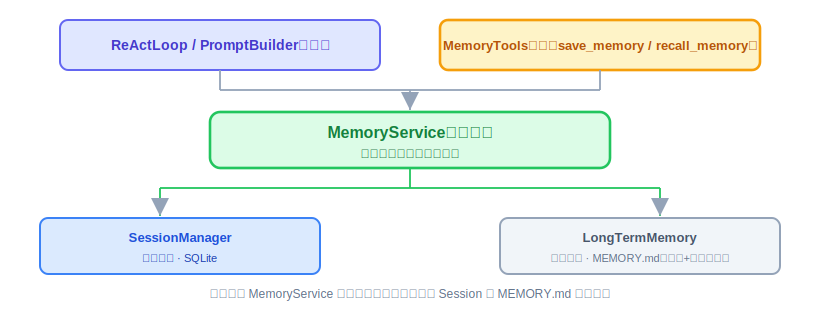
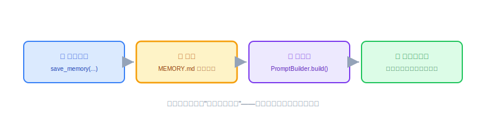

# Memory：实现与代码讲解

上一节评审定了方向——接口先行、那道墙焊死、实现分阶段长大。这节把它变成能跑的代码，而且把"墙之下可以随时换实现"这句话**当场兑现**：一次实现三档长期记忆后端（Markdown 文件、SQLite、Mem0），靠配置切换、上层一行不改。照旧四件事：这节要实现什么、动手前该想清楚什么、代码怎么写、做完怎么验。

技术栈还是 JDK 21 + Spring Boot 3.x + Spring AI 的 `@Tool` 注解。下面的代码是示意，具体 API 以你用的 Spring AI / Mem0 版本为准。

---

## 一、这节要实现什么

一句话：**一个 `MemoryService` 门面，背后一个可插拔的长期记忆后端接口 `LongTermMemoryStore`，核心阶段一次给出三档实现——Markdown 文件、SQLite、Mem0——用配置选一个；再加会话记忆走 SQLite、两个内置 Tool 让 Agent 自己读写长期记忆。**

对照上一节的结论，这节要把三句话变成真实存在的类：

- **接口墙焊死**（第 21 节第十一节）——`MemoryService` 对上层的方法签名现在定死，`ReActLoop` / `PromptBuilder` 只认它。
- **墙之下可插拔**（第 21 节第十节"实现只做当下、但方向想清楚"）——长期记忆抽成 `LongTermMemoryStore` 后端接口，三档实现刚好对应上一节讲的三级演进：Markdown 是阶段一默认，SQLite 是记忆量变大后的结构化升级，Mem0 是"真需要自动抽取/语义检索"时的自托管外部集成档。
- **写入靠 Agent 主动调 `save_memory`**（第 21 节第十二节，不做自动提炼）——三档后端都遵守这条，写入时机永远由 Agent 判断。



一次实现三档，不是为了炫技，而是这节最该讲清楚的东西就是**那道墙到底值多少钱**——同一套上层代码、同一套测试，背后从"一个 Markdown 文件"平滑换到"一个外部记忆框架"，中间那层 SQLite 作过渡，你会亲眼看到"接口不变、实现随便换"不是一句口号。

---

## 二、动手前先想清楚几件事

**第一，分两层：门面 + 后端接口。** `MemoryService` 是对上的门面，方法签名现在定死——给 `PromptBuilder` 用的"要拼进 Prompt 的记忆内容"、给 `MemoryTools` 用的"记一条"和"查一下"。`LongTermMemoryStore` 是对下的后端接口，三档实现各写各的。上层只认 `MemoryService`，`MemoryService` 只认 `LongTermMemoryStore`——两道解耦，换后端时上层零感知、`MemoryService` 也只是换一个注入的实现。

**第二，三档后端的定位要拎清，别糊在一起。**

| 后端 | 定位 | 什么时候用 | 依赖 |
|---|---|---|---|
| **Markdown** | 阶段一默认：一个分区的 `MEMORY.md` | 记忆量不大、要人可读、git 可跟踪、零依赖 | 无（文件系统） |
| **SQLite** | 结构化升级：记忆按条入库 | 记忆量上千、要按 scope/时间结构化查询、截断变成 `LIMIT` | 无外部依赖（复用已有 SQLite） |
| **Mem0** | 外部集成档：自托管 Mem0 记忆层 | 真需要自动抽取、冲突消解、语义检索（第 21 节第八节讲的那些能力） | 需部署 Mem0 server（自托管，数据不出域） |

三档是**递进**关系，正好把第 21 节的演进路线走了一遍：文件顶着 → 量大了上 SQLite 仍零依赖 → 真要智能记忆才集成 Mem0。默认用 Markdown，`application.yml` 里一个 `memory.backend` 配置项决定装配哪一个。

**第三，把"行为契约"定死，三个实现都得守。** 上一节讲的那几个坑，本质是所有后端都必须遵守的**同一套契约**——这样一套契约测试能对三个实现统一跑，谁破了谁红：

- **契约一：不缓存。** 长期记忆每次重新读（读文件 / 查库 / 调 API），不做进程内缓存。这样 Agent 调完 `save_memory` 下一轮立刻能看到。这条最容易被后来者手滑加个缓存"优化性能"，一旦加了"记完立刻生效"就没了。
- **契约二：核心记忆永不被截断。** 长期记忆分**核心**和**归档**两类（借 MemGPT 的 core memory），核心记忆"始终在场、完整拼进每次上下文"，截断只能作用在归档区。任何后端的截断逻辑都不许连累核心区。
- **契约三：写核心还是写归档，由 Agent 显式指定。** 系统不猜——`save_memory` 带一个 `scope` 参数（`core` / `archival`，缺省 `archival`），Agent 调用时自己说清楚。
- **契约四：`recall` 是关键词检索，别做复杂。** 核心阶段就是简单的包含匹配（Markdown 按行扫、SQLite 用 `LIKE`、Mem0 用它自带的 search），别一上来上正则或分词。


想清楚这三点，代码结构就出来了：一个门面、一个后端接口、三个实现、一套契约。

---

## 三、代码怎么写

分四步：门面接口 → 后端接口 → 三个实现 → 装配和暴露给 Agent。

**第一步：`MemoryService` 门面 + `LongTermMemoryStore` 后端接口。** 门面对上不变，后端接口对下可插拔：

```java
// 门面：上层（PromptBuilder / MemoryTools）只认这个
public interface MemoryService {
    String buildContext(Session session);             // 核心记忆 + 会话历史，拼进 Prompt
    void remember(String content, MemoryScope scope);  // save_memory 调这个
    List<String> recall(String keyword);               // recall_memory 调这个
}

public enum MemoryScope { CORE, ARCHIVAL }

// 后端接口：长期记忆的可插拔实现点（三档实现各写各的）
public interface LongTermMemoryStore {
    void append(String content, MemoryScope scope);  // 写入，按 scope 分区
    String load();                                    // 核心区完整 + 归档区（截断后）
    List<String> recallByKeyword(String keyword);     // 只在归档区做关键词检索
}
```

`MemoryService` 的实现很薄——`buildContext` 把 `LongTermMemoryStore.load()` 的核心记忆和 `SessionManager` 的会话历史拼一起，`remember` / `recall` 直接转发给 store。**真正可换的是 `LongTermMemoryStore` 这一层**，下面三个实现都实现它。

**第二步，实现一：`MarkdownMemoryStore`（阶段一默认）。** 就是上一节说的分区 `MEMORY.md`，一个文件两个区块：

```java
public class MarkdownMemoryStore implements LongTermMemoryStore {

    private static final String CORE_HEADER = "## 核心记忆";
    private static final String ARCHIVE_HEADER = "## 归档记忆";
    private static final int MAX_ARCHIVE_CHARS = 4000;   // 阈值只管归档区

    @Override
    public void append(String content, MemoryScope scope) {
        String header = scope == MemoryScope.CORE ? CORE_HEADER : ARCHIVE_HEADER;
        writeIntoSection(header, "\n- [" + LocalDate.now() + "] " + content);
    }

    @Override
    public String load() {
        String raw = Files.readString(memoryFilePath());        // 每次重新读——契约一
        String core = extractSection(raw, CORE_HEADER);          // 核心区：完整返回
        String archive = truncateIfNeeded(extractSection(raw, ARCHIVE_HEADER));
        return core + "\n" + archive;
    }

    @Override
    public List<String> recallByKeyword(String keyword) {
        String archive = extractSection(Files.readString(memoryFilePath()), ARCHIVE_HEADER);
        return archive.lines().filter(line -> line.contains(keyword)).toList();  // 契约四
    }

    private String truncateIfNeeded(String archive) {
        if (archive.length() <= MAX_ARCHIVE_CHARS) return archive;
        return archive.substring(archive.length() - MAX_ARCHIVE_CHARS);   // 只裁归档段——契约二
    }
}
```

关键：`load()` 每次 `Files.readString` 不缓存（契约一）；`truncateIfNeeded` 只接收归档区那段文本，物理上碰不到核心区（契约二）；`recallByKeyword` 只搜归档区，核心记忆本来就永远在场不需要"检索"。

**第三步，实现二：`SqliteMemoryStore`（结构化升级）。** 记忆量变大后，字符串扫描不划算，换成一张表按条存。复用项目已有的 SQLite，手工建表脚本（宪法：不依赖 `ddl-auto`）：

```sql
-- memory_entries：长期记忆条目（手工建表，与 sessions/llm_calls 同口径）
CREATE TABLE IF NOT EXISTS memory_entries (
    id INTEGER PRIMARY KEY AUTOINCREMENT,
    scope VARCHAR(16) NOT NULL,          -- CORE / ARCHIVAL
    content TEXT NOT NULL,
    created_at TIMESTAMP NOT NULL
);
CREATE INDEX IF NOT EXISTS idx_memory_scope ON memory_entries (scope);
```

```java
public class SqliteMemoryStore implements LongTermMemoryStore {

    private static final int MAX_ARCHIVE_ROWS = 100;   // 归档区只带最近 N 条

    @Override
    public void append(String content, MemoryScope scope) {
        repository.insert(scope.name(), content, Instant.now());   // 每次直插——契约一天然满足
    }

    @Override
    public String load() {
        String core = render(repository.findByScope("CORE"));              // 核心区：全量
        String archive = render(repository.findRecentArchival(MAX_ARCHIVE_ROWS)); // 归档区：LIMIT N
        return core + "\n" + archive;   // 截断变成 SQL 的 LIMIT，核心区不受影响——契约二
    }

    @Override
    public List<String> recallByKeyword(String keyword) {
        return repository.searchArchival("%" + keyword + "%");   // SQL LIKE——契约四
    }
}
```

同样一套契约，落地方式完全不同：截断从"字符串掐头"变成 `LIMIT 100`，检索从 `String.contains` 变成 `LIKE`，不缓存则天然成立（每次查库）。核心区用 `WHERE scope='CORE'` 全量取，`LIMIT` 只加在归档查询上——契约二靠 SQL 结构保证。

**第四步，实现三：`Mem0MemoryStore`（外部集成档）。** 真需要自动抽取、冲突消解、语义检索时，接一个**自托管的 Mem0 server**（第 21 节第八节讲的那些能力它现成）。Java 侧走 REST 集成，凭证和地址走环境变量（宪法：不落明文）：

```java
public class Mem0MemoryStore implements LongTermMemoryStore {

    private final RestClient restClient;   // baseUrl = ${MEM0_BASE_URL}，走自托管实例
    private final String userId;           // Mem0 按作用域组织，这里用当前 Agent/用户标识

    @Override
    public void append(String content, MemoryScope scope) {
        // Mem0 的 add：它自己做提炼与冲突消解，scope 落进 metadata 供检索区分
        restClient.post().uri("/v1/memories/")
                .body(Map.of(
                    "messages", List.of(Map.of("role", "user", "content", content)),
                    "user_id", userId,
                    "metadata", Map.of("scope", scope.name())))
                .retrieve().toBodilessEntity();
    }

    @Override
    public String load() {
        // 核心记忆用 metadata 过滤全量取，归档区取最近若干——具体分页参数以部署的 mem0 版本为准
        String core = render(getByScope("CORE"));
        String archive = render(getByScope("ARCHIVAL"));
        return core + "\n" + archive;
    }

    @Override
    public List<String> recallByKeyword(String keyword) {
        // Mem0 的 search 是语义检索，比关键词强——契约四的"加强版实现"
        return search(keyword);
    }
}
```

这一档跟前两档最大的不同：**截断、提炼、冲突消解都交给 Mem0 自己管了**，`Mem0MemoryStore` 只做协议转换（把 `append/load/recall` 翻译成 Mem0 的 REST 调用）。契约二在这一档变成"信任 Mem0 的作用域机制"，契约四则被"升级"成语义检索。这正是第 21 节第十四节说的——记忆若非核心差异化能力、又真需要智能记忆，集成一个可自托管的成熟方案是理性选择；而它是**库/服务不是运行时**，不会跟 OryxOS 的定位打架。

> 诚实提示：Mem0 是外部服务，需单独部署，且记忆数据会流经它的管线——对"数据不出域"的严监管场景，必须用**自托管**版本、部署在企业内网。这也是为什么默认后端是 Markdown 而不是 Mem0：能力更强，但代价（一个额外服务 + 数据流转评估）也更重。

**第五步：配置选后端 + 装配。** 一个配置项决定装配哪个实现，`MemoryService` 注入选中的那个：

```yaml
# application.yml —— 默认 markdown；量大了改 sqlite；要智能记忆改 mem0
memory:
  backend: markdown        # markdown | sqlite | mem0
```

装配处按 `memory.backend` 造对应的 `LongTermMemoryStore`，注入给同一个 `MemoryService`——换后端就是改这一行配置，`MemoryService` 以上的代码（`PromptBuilder`、`MemoryTools`、`ReActLoop`）一个字都不用动。这就是那道墙的价值，看得见摸得着。

**第六步：`MemoryTools`，把长期记忆暴露给 Agent（三档后端共用，零改动）。**

```java
public class MemoryTools {

    private final MemoryService memoryService;

    @Tool(name = "save_memory", description = "记住一件值得长期记住的事")
    public String saveMemory(
            @ToolParam("要记住的内容") String content,
            @ToolParam("core 或 archival，不确定就填 archival") String scope) {
        memoryService.remember(content, MemoryScope.valueOf(scope.toUpperCase()));  // 契约三
        return "已记住";
    }

    @Tool(name = "recall_memory", description = "按关键词检索长期记忆")
    public String recallMemory(@ToolParam("检索关键词") String keyword) {
        List<String> hits = memoryService.recall(keyword);
        return hits.isEmpty() ? "没有找到相关记忆" : String.join("\n", hits);
    }
}
```

`MemoryTools` 只认 `MemoryService`，所以它对"底下是哪档后端"完全无感——这正是分两层解耦的回报：换后端不碰工具、不碰 `PromptBuilder`、不碰测试里对工具的断言。

**集成点：`PromptBuilder` 怎么用它。** 组装 Prompt 时多一步 `memoryService.buildContext(session)`，把返回内容拼进 system prompt，跟会话历史、工具列表放一起——对上 17 节讲的"四部分"里那个"长期记忆"部分。这一步同样与后端无关。

**有几样先别做。** `save_memory` 的自动触发（上一节定了：核心阶段不做）、Memory Wiki 式结构化矛盾检测、记忆压缩、知识图谱后端（第 21 节第九节：门槛比向量更高，先不做）——这些放扩展阶段。三档后端已经把"接口墙 + 可插拔"证明清楚，够了。



**本节交付物**（Spec-Kit 拆解锚点）：

- 代码：`MemoryService` 接口 + 实现、`MemoryScope` 枚举、`LongTermMemoryStore` 后端接口、三个实现（`MarkdownMemoryStore` / `SqliteMemoryStore` / `Mem0MemoryStore`）、`MemoryTools`（save_memory / recall_memory）
- 测试：`MemoryStoreContractTest`（对三个实现参数化跑同一套契约）、各实现专属测试（`MarkdownMemoryStoreTest` / `SqliteMemoryStoreTest` / `Mem0MemoryStoreTest`）、`MemoryToolsTest`、`MemoryServiceTest`（见验收 harness）
- 表：`memory_entries`（SQLite 后端，手工建表脚本）
- 文件：`.oryxos/memory/MEMORY.md`（Markdown 后端的 `## 核心记忆` / `## 归档记忆` 两区块约定）
- 配置：`memory.backend`（markdown | sqlite | mem0）；Mem0 的 `${MEM0_BASE_URL}` 等走环境变量
- 集成点：`PromptBuilder` 组装时调 `memoryService.buildContext(session)`

---

## 四、验收 harness：把验收标准变成可执行的测试

Memory 全是文件、内存和（mock 掉的）HTTP 操作，用 `@TempDir` 和 mock 就能测干净，harness 全单测。这节 harness 的设计核心是——**契约测试对三个实现统一跑**：

| 测试类 | 覆盖的验收点 |
|---|---|
| `MemoryStoreContractTest` | **参数化遍历三个 `LongTermMemoryStore` 实现**，同一套断言全过：写后立读（契约一）、截断只裁归档核心区一字不动（契约二）、scope 路由到正确区块（契约三）、recall 只搜归档区（契约四）。任何一档破契约，这里立刻红 |
| `MarkdownMemoryStoreTest` | Markdown 特有：字符串截断的边界、区块 header 解析 |
| `SqliteMemoryStoreTest` | SQLite 特有：手工建表脚本能建能读、归档 `LIMIT` 生效、`LIKE` 检索 |
| `Mem0MemoryStoreTest` | mock RestClient：`append` 发出的请求体带 scope、`recall` 转发查询——不碰真 server |
| `MemoryToolsTest` | scope 缺省写归档；关键词未命中返回"没有找到相关记忆"而不抛异常 |
| `MemoryServiceImplTest` | `buildContext` 返回长期记忆（核心区全量 + 归档区截断后），核心记忆完整在内；会话历史由 PromptBuilder 的会话历史段独立负责，两者一起注入 system prompt |

契约测试是这节最值钱的设计：**同一套断言，三个后端都得过**，这才叫"接口不变、实现随便换"有了自动化保障。

```java
@ParameterizedTest
@MethodSource("allStores")   // markdown / sqlite / mem0 三个实现都过一遍
void 截断只裁归档区_核心记忆一字不能少(LongTermMemoryStore memory) {
    memory.append("用户叫小王，偏好用 Java", MemoryScope.CORE);
    for (int i = 0; i < 500; i++) {
        memory.append("归档流水 " + i, MemoryScope.ARCHIVAL);   // 灌到远超阈值
    }

    String loaded = memory.load();

    assertTrue(loaded.contains("用户叫小王，偏好用 Java"));   // 核心区完整——"始终在场"的底线
    assertFalse(loaded.contains("归档流水 0"));               // 归档区最早的被裁掉
    assertTrue(loaded.contains("归档流水 499"));              // 保留的是最近的
}

@ParameterizedTest
@MethodSource("allStores")
void 写入后立刻可读_不允许有缓存(LongTermMemoryStore memory) {
    memory.append("刚记的事", MemoryScope.ARCHIVAL);
    assertTrue(memory.load().contains("刚记的事"));           // 下一次 load 立即可见
    assertFalse(memory.recallByKeyword("刚记的事").isEmpty()); // 检索同样立即命中
}
```

> Mem0 实现在契约测试里怎么跑？用一个"内存假 Mem0"替身（记在 Map 里、行为满足契约）替掉真 REST 调用——契约测的是"这一档有没有守规矩"，真实 REST 交互由 `Mem0MemoryStoreTest` 单独 mock 验证。

这两个参数化测试是这节最重要的保险：将来任何一档后端的截断或缓存逻辑被"优化"坏了，对应那一行参数立刻红——而且你一眼能看出是哪一档破的规矩。

---

## 五、做完怎么验

harness 全绿后，剩下的人工确认：

- **三档切换验证**：`memory.backend` 分别设成 `markdown` / `sqlite`，各跑一次对话，`save_memory` 写入、下一轮 `buildContext` 带上——同一段对话、同一个体感，只是底下换了后端。这是"墙"最直观的人工证据。
- **Mem0 档真连一次**（可选）：部署一个自托管 Mem0，`memory.backend: mem0`，验证 `save_memory` 真的进了 Mem0、`recall` 能语义召回（依赖真 server，测不了，人工过）。
- 用真模型完整走一遍：对话里说一句值得记的话，Agent 主动调 `save_memory`；开新会话，系统提示里带着核心记忆——"始终在场"在真实链路里的体感。
- `MEMORY.md` 和 `USER.md` 的角色分清：`USER.md` 全程只读、`MEMORY.md`（或 SQLite/Mem0）能被 Agent 写入（code review 确认没有写 `USER.md` 的代码路径）。
- 无缓存、截断保核心、scope 路由、未命中不报错——已由契约测试对三档统一覆盖，`mvn test` 绿即打勾。

到这一步，Agent 不但会想（ReAct）、会动手（Tool），还记得住事（Memory）——三大能力凑齐了。而且记忆这一层从第一天起就是"接口不变、后端随便换"：核心阶段用 Markdown 零依赖跑起来，量大了换 SQLite 仍零外部依赖，真要智能记忆再接 Mem0，全程上层无感。Demo 二（每日科技日报）里"日报要体现用户之前说过的偏好"这一环，靠的就是这节的 `save_memory` 写入、下次组装 Prompt 时自动带上，具备了跑通的条件。
