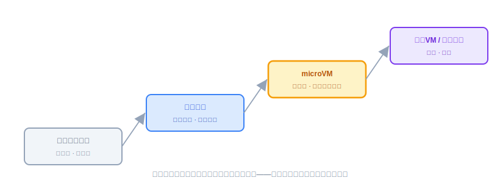
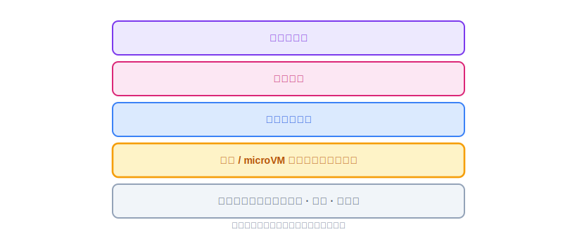
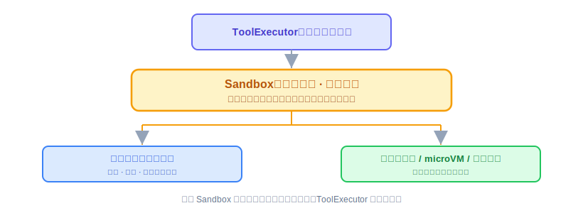
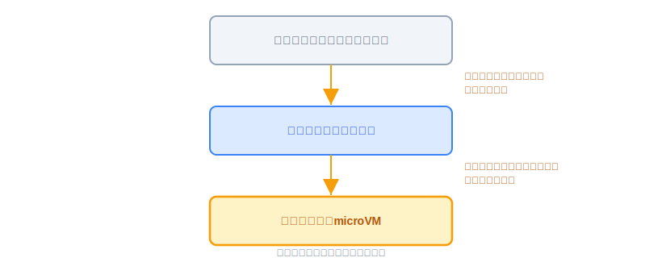

# Sandbox：原理解析、业界方案与 OryxOS 设计评审

Memory 让 Agent 记得住事，这节讲的 Sandbox，解决的是另一件事：**Agent 动手干活的时候，怎么保证它不闯祸。** 这节不写代码（代码实现是下一节的事），是一次技术评审：先把 Sandbox 是什么、业界怎么做讲通，再讲 OryxOS 准备怎么做，以及为什么这么做。

---

## 第一部分：Sandbox 是什么，业界怎么做

### 一、为什么 Agent 突然需要 Sandbox

**Agent 会自己决定干什么，这件事本身就是风险源。**

传统软件里，你自己写的代码你信任它，不太需要沙箱。但 Agent 场景变了两件事，让隔离从可选变成刚需。

第一，**Agent 会执行不是你写的代码和命令**。ReAct 循环里，模型会生成命令、生成代码、调用工具去操作真实系统，读写文件、跑 shell、发网络请求——这些动作是模型在运行时决定的，不是你事先审过的。等于你把一个"会自己决定干什么"的东西放进了系统。它可能被 prompt injection 骗着去执行危险操作，可能被诱导去读密钥文件、把数据发到外部，也可能就是模型犯傻生成了破坏性命令。

第二，**多租户和多 Agent 共处**。一个底座上跑一群 Agent，OryxOS 正是如此——A 租户的 Agent 绝不能读到 B 租户的数据、不能影响 B 的运行。

所以对 Agent 来说，沙箱不是锦上添花，而是让 Agent 能真正上生产、能对外提供服务的前提。没有隔离，你不敢让 Agent 执行任何有副作用的操作，它就只能是个聊天玩具。

### 二、沙箱到底在隔离什么：四个维度

**无论用什么方案，隔离的本质都是这四类东西，理解了它们就能看懂后面所有方案在做什么。**

- **文件系统**：不能乱读乱写宿主文件，尤其不能碰密钥、配置、其他租户的数据。
- **网络**：不能随便对外连接，防止数据外泄，也防止 Agent 被当成跳板去攻击别处。
- **进程和系统调用**：不能执行危险的系统操作，不能提权，不能影响宿主和其他沙箱。
- **资源**：不能吃光 CPU、内存、磁盘把宿主拖垮——也就是要防资源炸弹。

后面讲的每一档方案，都是在用不同的代价去覆盖这四个维度，差别只在于覆盖得多全、隔离得多强、代价多大。

### 三、核心思路：隔离强度和开销是一个跷跷板

**隔离越强，开销越大、启动越慢；隔离越轻，越快越省但越不安全——所有方案都是在这条线上选一个点。**

还有一条规律：**隔离边界越往底层走，越安全**。从上到下依次是：应用层校验最弱，进程和操作系统级隔离（容器）居中，内核级隔离（microVM）更强，物理隔离最强。

所以选沙箱方案的本质，是回答一个问题：**你要跑的东西有多不可信，你愿意为隔离付多大代价。** 下面从轻到重讲四档，这也正好对应分阶段的思路，核心阶段用轻的，扩展阶段上重的。

### 四、第一档：应用层白名单校验

思路是不真正做系统隔离，而是在 Agent 执行动作之前，用代码拦一道：检查这个文件路径在不在允许范围、这个 shell 命令在不在黑名单、这个域名允不允许访问。

优点是**零额外基础设施、零性能开销、实现简单**，单二进制就能做。

致命弱点是**它只是劝阻，不是关押**。它拦的是你想到要拦的东西，一旦有你没覆盖到的绕过方式——比如命令拼接、软链接、编码绕过、你没列进黑名单的危险命令——它就破了。它防的是模型犯傻误操作，防不住蓄意攻击。

结论是它适合**早期、可信环境、演示**。作为唯一防线上生产是不够的，但作为纵深防御的第一层是有价值的，可以和后面更重的层叠加使用。

### 五、第二档：容器隔离

思路是用 Linux 内核的 namespace 做视图隔离，让文件系统、网络、进程都各看各的，用 cgroups 做资源限制，用 seccomp 限制能调哪些系统调用。每个 Agent 或每次代码执行，跑在一个独立容器里，它看到的是一个被裁剪过的、隔离的小世界。

优点是**隔离维度全**，文件、网络、进程、资源都覆盖，生态成熟，大家都会用。这是目前绝大多数需要跑不可信代码的 Agent 系统的主力方案，比如各种代码解释器、代码执行 Agent。

弱点是**容器共享宿主内核**，这是它的安全天花板——容器隔离本质是共享一个内核但互相看不见，如果攻击者能通过内核漏洞逃逸，就能突破隔离。所以在跑完全不可信的代码时，纯容器被认为隔离强度不够。另外启动比进程慢，有一定开销。

结论是它适合**可信到半可信场景**，是主力方案。

### 六、第三档：microVM，Agent 时代的关键词

思路是既然容器共享内核是软肋，那就给每个沙箱配一个自己的轻量级内核，用虚拟机的边界来隔离，但又不能像传统虚拟机那么重那么慢——这就是 **microVM**，微虚拟机。代表是 AWS 的 **Firecracker**，以及用起来像容器、底层是轻量虚拟机的 **Kata Containers**，还有 Google 的 **gVisor**（用户态内核，介于容器和虚拟机之间）。

它在 Agent 时代特别火的原因是，Agent 要大规模跑不可信代码——比如代码解释器要同时跑成千上万用户生成的代码——需要一个既有虚拟机级的强隔离、又有接近容器的启动速度和密度的东西。Firecracker 就是为这个而生的，启动通常在百毫秒级，内存开销极小，一台机器能塞很多个。它给每个沙箱一个独立内核，即使里面的代码把那个内核搞崩了，也逃不到宿主和别的沙箱。

思路的精妙处在于，它不是把传统虚拟机变小，而是**重新设计一个极简的虚拟机监视器**，砍掉所有 Agent 场景用不到的设备模拟，只留最小集合，从而同时拿到虚拟机的安全和接近容器的轻量。

结论是**跑完全不可信代码、多租户、要规模化，这是当前的黄金标准**。很多严肃的 Agent 平台，沙箱那层最终都指向"容器 → Kata → Firecracker"这条演进线。

### 七、第四档：完整虚拟机与物理隔离

传统虚拟机，甚至独立物理机、独立网络。隔离最强但最重最贵。一般只在极高合规要求下（比如金融核心、涉密场景）才会用这一层给 Agent。**大多数 Agent 系统不会走到这里**。

### 八、业界的整体思路：分层纵深防御

把四档收成一条演进线，隔离强度递增：应用层白名单校验 → 容器 → microVM → 完整虚拟机与物理隔离。

但要强调的是，**成熟系统往往不是只选一个，而是多层叠加做纵深防御**。应用层先拦明显的，容器或 microVM 做强隔离兜底，再加网络出口控制防数据外泄，加资源配额防炸弹，加审计记录 Agent 到底干了什么——没有任何一层是万能的，安全靠的是层层设防。

这个纵深防御的观念很重要，它意味着**沙箱不是一个开关，而是一套组合**。即使上了 microVM，网络出口控制、资源配额、审计这些配套也一样不能少。

---

## 第二部分：OryxOS 准备怎么实现 Sandbox

### 九、设计原则：从第一天就按多阶段演进来设计

**沙箱这东西如果一开始架构没留好路，后期加强隔离等于重构——所以必须从第一天就按多阶段演进来设计，即使当前只实现第一档。**

但这里有个致命的陷阱要先说清楚：**想清楚方向不等于现在就为未来写代码**。正确的拆解是三句话，缺一不可：

- **方向要想清楚**，这是认知层面，现在就做。要清楚沙箱会走"应用层校验→容器→microVM"这条线，清楚每一档解决什么、什么信号触发升级。这个想清楚是免费的、必须的，它保证现在写的东西不会把未来的路堵死。
- **接口要设计对**，这是设计层面，现在就做，且最重要。要定义一个抽象的沙箱接口，让上层只依赖接口、不依赖任何具体实现。这样将来从白名单校验换成容器再换成 microVM，上层一行都不用改。
- **实现只做第一档**，这是实现层面，要克制。现在就只写应用层白名单校验这一个实现，不要现在就去写容器管理、microVM 启动的代码，那些是还用不上的复杂度。

这三句话的分界线，是接口这道墙。墙之上现在就设计好，墙之下只做当下需要的。

### 十、怎么设计这道墙：一个 Sandbox 抽象

**接口该抽象的是意图，不是实现。**

上层要表达的是"我要在受控环境里执行这个动作"，而不是"我要在容器里执行"。所以接口方法的语义应该是：在受约束的环境里执行一个动作（动作可以是跑命令、读写文件、发请求），同时传入一个**策略**描述允许什么。

关键是，这个接口的签名里**绝不能出现任何一档实现特有的概念**——不能有容器镜像、不能有虚拟机配置这种。一旦接口里出现了容器的概念，就把接口和某个实现绑死了，未来换 microVM 就得改接口，墙就破了。

用**策略对象**承载隔离要求，而不是硬编码。上层传一个策略进来：允许访问哪些路径、哪些域名、资源上限多少、需要多强的隔离等级。隔离等级可以是策略的一部分，比如"基础、容器、microVM"三级——核心阶段只有基础一个实现，但接口和策略里预留了这个维度。将来加容器实现时，是**新增一个实现类**去响应容器级别，而不是改接口，这就是开闭原则：对扩展开放、对修改关闭。

每一档是接口的一个独立实现，可插拔。核心阶段有应用层校验这一个实现；扩展阶段新增容器沙箱、microVM 沙箱，各自实现同一个接口，上层通过配置或策略选择用哪个，代码零改动。

这样现在的代码量，和不考虑未来几乎一样多，只多做了一件事：把校验逻辑放在一个实现了抽象接口的类里，而不是散在工具执行器里。多花的成本极小，换来的是未来平滑升级的能力——这就是"设计好"的正确含义，不是多写代码，是把当下这点代码放在对的抽象后面。

### 十一、一个要警惕的坑：别让接口被第一档带偏

**只有一档实现时，最容易不自觉地把接口设计成为它量身定制的样子。**

比如接口方法叫"检查路径"、"检查命令"——这些是白名单校验这一档特有的动作，一旦这么设计，将来上容器时会发现接口根本套不上，因为容器不是"检查路径"，是"提供一个隔离的文件系统"。

破解办法是，设计接口时脑子里要同时想着最重的那一档 microVM，问自己："这个接口，microVM 实现能不能干净地套进去？" 如果 microVM 套不进去，说明接口被第一档带偏了。**用最重的实现来校验接口的抽象度**，这是保证接口真正中立的技巧。

### 十二、分阶段实现路线

**核心阶段**用应用层白名单校验，文件、命令、域名三类校验，零依赖、单二进制。但文档里要诚实标注：这是第一层劝阻，不是强隔离，此阶段不建议跑完全不可信代码，也不建议对外提供多租户。

**扩展阶段第一步**上容器隔离，用 namespace 加 cgroups 加 seccomp，覆盖文件、网络、进程、资源四维度。这时才敢说能跑半可信代码、能多租户。

**扩展阶段进阶**，需要跑完全不可信代码、要规模化多租户时，上 microVM，比如 Kata 或 Firecracker。这是给严监管企业、给"公开让别人上传 Agent 或代码来跑"这种场景准备的。

贯穿所有阶段的配套：网络出口控制防数据外泄（尤其面向数据不出域的企业）、资源配额防炸弹、全链路审计让 Agent 干了什么可追溯。这几样不随隔离档次变化，是每一档都要有的纵深防御配套。

### 十三、什么信号触发升级

**和 Memory 一样，不拍脑袋，用真实的信任等级和需求驱动隔离强度。**

**从应用层校验升到容器**的信号是：开始要跑不是企业自己配置的、相对不可信的代码或命令，或者开始要做多租户、需要租户间强隔离。

**从容器升到 microVM** 的信号是：要跑完全不可信的代码（比如公开让外部用户上传 Agent 或代码来执行），或者要在一台机器上规模化地跑大量互不信任的沙箱，对隔离强度和密度同时有高要求。

没有这些信号之前，不必上更重的隔离。用真实的信任等级驱动隔离强度，这跟 Memory 那块的"分阶段克制"是同一个原则，后面 25 节的定时模块也会再用一次。

### 十四、分阶段路线总览

| 层次 | 内容 |
|---|---|
| 接口层（第一天就做，永不变） | Sandbox 抽象接口加策略模型，接口表达意图不表达实现，策略预留隔离等级维度，用 microVM 反向校验接口中立性 |
| 核心阶段 | 应用层白名单校验，文件、命令、域名，零依赖单二进制，诚实标注非强隔离 |
| 升级信号一 | 要跑相对不可信代码，或要做多租户 |
| 扩展阶段第一步 | 容器隔离，namespace 加 cgroups 加 seccomp，覆盖四维度 |
| 升级信号二 | 要跑完全不可信代码，或要规模化多租户 |
| 扩展阶段进阶 | microVM，Kata 或 Firecracker |
| 贯穿所有阶段 | 网络出口控制、资源配额、全链路审计 |

### 十五、这节评审想清楚了吗

评审课没有代码要验收，但有几件事得自查一遍：

- 能不能用一句话讲清楚"隔离强度和开销是跷跷板"，以及"隔离边界越往底层走越安全"这条规律？
- Sandbox 接口的方法签名里，有没有不小心混进"路径""命令"这类第一档专属的词？拿 microVM 在脑子里套一遍，套得进去吗？
- 核心阶段选应用层白名单，诚实标注了它"只是劝阻不是关押"这个局限吗？还是包装成了看起来很安全的样子？
- 两个升级信号能不能不看文档自己复述出来？如果只能说"业界都上容器/microVM 了"，说明还没真正想清楚。
- "纵深防御"这个观念是不是真的理解了——上了 microVM 是不是就可以不要网络出口控制和审计了？（不是。）

这几条都能答上来，评审就算过了，下一节可以放心动手实现。

## 结语

OryxOS 沙箱模块的设计，本质是把项目一贯的原则用在隔离这件事上：接口稳定、实现分阶段、信号驱动升级。

沙箱不是一次性做到最强，而是按你要跑多不可信的东西来选隔离强度。核心阶段跑的是企业自己配的、相对可信的 Agent，应用层校验够用；等到要跑不可信代码、要对外多租户，才值得上容器乃至 microVM 的重型隔离。用真实的信任等级驱动隔离强度，而不是一上来就上最重的。

用接口这道墙把长期规划和当下实现干净地隔开，墙之上想清楚、设计好，墙之下只做当下这一档。这样既不会掉进"现在就写用不上的容器代码"的过度设计坑，又保证了将来从校验平滑长到 microVM 时上层无感、只需新增实现。这就是 OryxOS 沙箱模块的设计心法，也是它和 Notify、Memory 模块共享的同一套设计母题——后面 25 节的定时模块还会再见到它。
