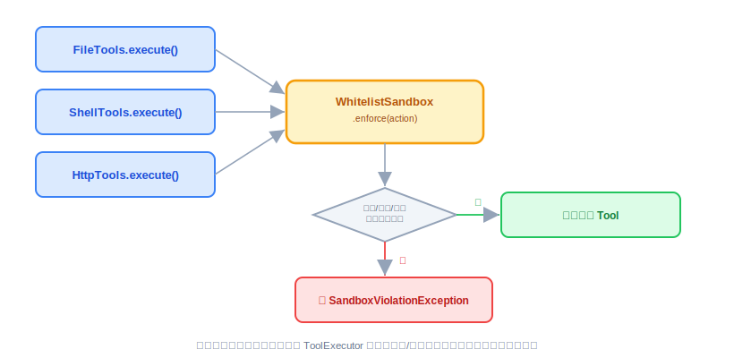
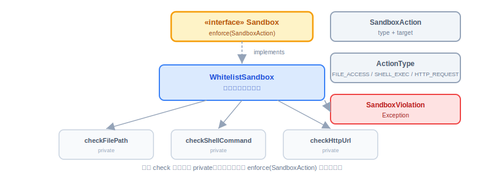
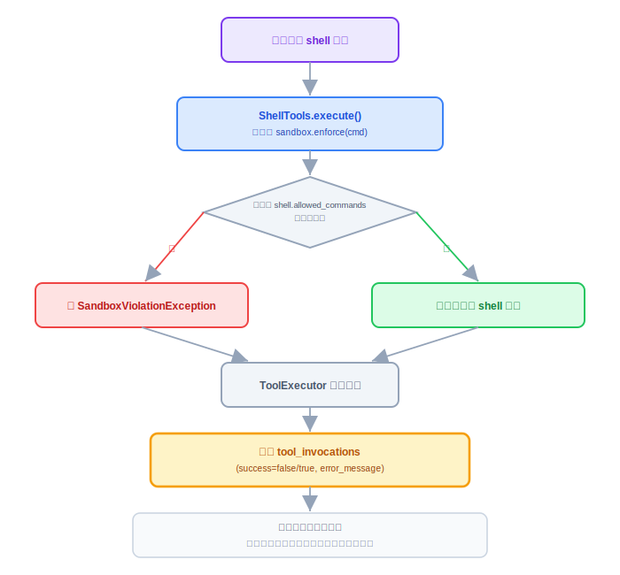

# Sandbox：实现与代码讲解

上一节把 Sandbox 的账算清楚了：核心阶段做应用层白名单校验，接口要设计得能撑住未来的容器和 microVM。这节把它变成代码——按 23 节定的思路拆任务、写实现、接进已有的 Tool 体系。

---

## 一、这一节要做什么

一句话：**把 23 节那道"墙"砌出来，墙后面填上白名单校验这一档实现，再把它接进 `read_file`/`write_file`/`shell`/`http_get`/`http_post` 这几个已经存在的 Tool。**

不做的事：不写容器实现、不写 microVM 实现、不改 `ToolExecutor` 的审计逻辑（它已经有失败路径，Sandbox 拒绝就是一次普通的工具执行失败，直接复用）。

## 二、动手前先拆任务

按 23 节的顺序拆，不是想到哪写到哪：

1. **先定接口和值对象**——`Sandbox` 接口、`SandboxAction`、`ActionType`、`SandboxViolationException`。这是墙，必须先定死，定完之后不管后面加多少档实现都不再改它。
2. **写唯一的实现** `WhitelistSandbox`，对应文件路径、shell 命令、HTTP 域名三类校验，读 `file.allowed_paths`、`shell.allowed_commands`、`http.allowed_domains` 三块配置。
3. **接进已有的 Tool**——`FileTools`、`ShellTools`、`HttpTools` 在各自 `execute` 方法一开始调用 `sandbox.enforce(...)`，校验不过直接抛异常，后面真正的 IO 代码一行都不用改。
4. **确认失败路径不用新写代码**——`SandboxViolationException` 从 Tool 里抛出来，会被 `ToolExecutor` 已有的 try/catch 接住，按普通工具失败记进 `tool_invocations`（`success=false`，`error_message` 是校验失败的原因）。
5. **自查接口中立性**——套 23 节教的办法，脑子里换成 microVM 实现问一遍："`Sandbox.enforce(SandboxAction)` 这个签名，microVM 套得进去吗？" 套得进去才算这道墙立住了。

全部放在 `oryxos-tool` 模块，和 `FileTools`/`ShellTools`/`HttpTools` 挨在一起——它们本来就是一伙的，不需要往 `oryxos-core` 塞新概念。



## 三、代码怎么写

### 3.1 接口和值对象——这是墙，先定死

```java
package io.oryxos.tool.sandbox;

/**
 * 表达"在受控环境里执行一个动作"的意图，不表达任何一档具体实现。
 * 核心阶段只有 WhitelistSandbox 一个实现；未来加容器、microVM 实现时，
 * 这个接口签名不应该发生变化。
 */
public interface Sandbox {
    void enforce(SandboxAction action);
}
```

```java
package io.oryxos.tool.sandbox;

public record SandboxAction(ActionType type, String target) {
}
```

```java
package io.oryxos.tool.sandbox;

public enum ActionType {
    FILE_READ,
    FILE_WRITE,
    SHELL_COMMAND,
    HTTP_REQUEST
}
```

> 说明：`ActionType` 取四值——文件读 / 文件写 / Shell 命令 / HTTP 请求。文件读写分开，便于未来按读 / 写分权限；本节 `WhitelistSandbox` 的 `enforce` 把 `FILE_READ`、`FILE_WRITE` 两个 case 同路由到 `checkFilePath`（读写共用同一份路径白名单）。这四值在第 20 节接线时已定死，本节沿用。

```java
package io.oryxos.tool.sandbox;

public class SandboxViolationException extends RuntimeException {
    public SandboxViolationException(String message) {
        super(message);
    }
}
```

注意 `SandboxAction` 只有 `type` 和 `target` 两个字段，没有任何"白名单""容器""镜像"字样——这就是 23 节说的"接口表达意图，不表达实现"。`target` 是一个纯字符串，具体是路径、命令还是 URL，由 `type` 决定，实现类自己去解释。

### 3.2 唯一实现：WhitelistSandbox

先绑三块配置，对应文档里一直说的三个 key：

```java
package io.oryxos.tool.sandbox;

import org.springframework.boot.context.properties.ConfigurationProperties;
import java.util.List;

@ConfigurationProperties(prefix = "file")
public record FileSandboxProperties(List<String> allowedPaths) {
}
```

```java
@ConfigurationProperties(prefix = "shell")
public record ShellSandboxProperties(List<String> allowedCommands) {
}
```

```java
@ConfigurationProperties(prefix = "http")
public record HttpSandboxProperties(List<String> allowedDomains) {
}
```

再写实现本身：

```java
package io.oryxos.tool.sandbox;

import org.springframework.stereotype.Component;

import java.net.URI;
import java.nio.file.Path;
import java.util.List;
import java.util.Set;

@Component
public class WhitelistSandbox implements Sandbox {

    private final List<Path> allowedRoots;
    private final Set<String> allowedCommands;
    private final List<String> allowedDomainPatterns;

    public WhitelistSandbox(FileSandboxProperties fileProps,
                             ShellSandboxProperties shellProps,
                             HttpSandboxProperties httpProps) {
        this.allowedRoots = fileProps.allowedPaths().stream()
                .map(Path::of)
                .map(Path::normalize)
                .toList();
        this.allowedCommands = Set.copyOf(shellProps.allowedCommands());
        this.allowedDomainPatterns = List.copyOf(httpProps.allowedDomains());
    }

    @Override
    public void enforce(SandboxAction action) {
        switch (action.type()) {
            case FILE_READ, FILE_WRITE -> checkFilePath(action.target());
            case SHELL_COMMAND -> checkShellCommand(action.target());
            case HTTP_REQUEST -> checkHttpUrl(action.target());
        }
    }

    private void checkFilePath(String rawPath) {
        Path target = Path.of(rawPath).normalize().toAbsolutePath();
        boolean allowed = allowedRoots.stream().anyMatch(target::startsWith);
        if (!allowed) {
            throw new SandboxViolationException("路径不在白名单内: " + rawPath);
        }
    }

    private void checkShellCommand(String command) {
        String firstToken = command.trim().split("\\s+")[0];
        if (!allowedCommands.contains(firstToken)) {
            throw new SandboxViolationException("命令不在白名单内: " + firstToken);
        }
    }

    private void checkHttpUrl(String url) {
        String host = URI.create(url).getHost();
        boolean allowed = allowedDomainPatterns.stream()
                .anyMatch(pattern -> matchesDomain(host, pattern));
        if (!allowed) {
            throw new SandboxViolationException("域名不在白名单内: " + host);
        }
    }

    private boolean matchesDomain(String host, String pattern) {
        if (pattern.startsWith("*.")) {
            return host.endsWith(pattern.substring(1));
        }
        return host.equals(pattern);
    }
}
```

三个校验方法都是 `private`，外部只看得到 `enforce(SandboxAction)` 这一个入口——这一点很重要：**如果三个方法是 `public` 并且直接暴露在接口上，接口就又被这一档实现带偏了**。它们是 `WhitelistSandbox` 自己内部怎么组织代码的自由，不是接口契约的一部分。

`checkFilePath` 用 `Path.normalize().toAbsolutePath()` 再 `startsWith` 判断，是为了防止 `../../etc/passwd` 这类路径穿越绕过白名单——这是应用层校验最容易漏的一个点，之前提过第一档"防的是犯傻不是攻击"，这里至少把最常见的穿越手法堵上。`checkShellCommand` 只取命令的第一个 token 比对，和文档里"命令首 token 白名单"的说法一致。

### 3.3 接进已有的三个 Tool

以 `ShellTools` 为例，`FileTools`、`HttpTools` 是同样的改法——在 `execute` 方法最开头调用 `sandbox.enforce(...)`，校验通过才往下走：

```java
package io.oryxos.tool.builtin;

import io.oryxos.tool.sandbox.ActionType;
import io.oryxos.tool.sandbox.Sandbox;
import io.oryxos.tool.sandbox.SandboxAction;
import org.springframework.ai.tool.annotation.Tool;
import org.springframework.stereotype.Component;

@Component
public class ShellTools {

    private final Sandbox sandbox;

    public ShellTools(Sandbox sandbox) {
        this.sandbox = sandbox;
    }

    @Tool(description = "执行一条 shell 命令")
    public ToolResult shell(String command) {
        sandbox.enforce(new SandboxAction(ActionType.SHELL_COMMAND, command));
        return doExecute(command);
    }

    private ToolResult doExecute(String command) {
        // 真正的进程执行逻辑，这一段完全没变
        ...
    }
}
```

`FileTools` 的改法：

```java
@Tool(description = "读文件")
public ToolResult readFile(String path) {
    sandbox.enforce(new SandboxAction(ActionType.FILE_READ, path));
    return doRead(path);
}

@Tool(description = "写文件")
public ToolResult writeFile(String path, String content) {
    sandbox.enforce(new SandboxAction(ActionType.FILE_WRITE, path));
    return doWrite(path, content);
}
```

`HttpTools` 的改法：

```java
@Tool(description = "发起 GET 请求")
public ToolResult httpGet(String url) {
    sandbox.enforce(new SandboxAction(ActionType.HTTP_REQUEST, url));
    return doGet(url);
}
```

三处改动的模式完全一样：**先 `enforce`，通过了才做原来的事**。真正的文件 IO、进程调用、HTTP 调用代码一行没动——这正是接口设计对了的直接体现，如果当初接口设计跟白名单校验绑死，现在接这三个 Tool 的代码肯定不会这么干净。

### 3.4 失败路径复用 ToolExecutor 已有的审计逻辑

`SandboxViolationException` 是一个普通的 `RuntimeException`，从 Tool 的 `execute` 里抛出来，会被 `ToolExecutor` 里已经写好的 try/catch 接住——17 节讲过，工具执行失败也要记进 `tool_invocations`，`success=false`，`error_message` 存异常信息。这里不需要为 Sandbox 单独写一条审计路径，`SandboxViolationException` 的 `message`（比如"命令不在白名单内: rm"）会原样存进 `error_message`，模型在下一轮对话里能看到这条失败原因，从而知道这条路走不通。



完整的一次失败调用，串起来是这样的：



这张图想说明的是：**Sandbox 拒绝和 Sandbox 放行，走的是完全同一条后续路径**，唯一的差别就是 `success` 是 `true` 还是 `false`。这也从侧面验证了当初的设计是对的——如果 Sandbox 违规需要一条专门的处理逻辑，说明它没有被自然地融进已有的工具执行框架。

## 四、验收 harness：把验收标准变成可执行的测试

安全模块的 harness 有个特殊性：**测的重点不是"放行对不对"，是"绕得过绕不过"**。`WhitelistSandboxTest` 按三类校验组织，每类"允许 + 拒绝"成对，再加绕过场景：

| 测试组 | 用例 |
|---|---|
| 文件路径 | 白名单内放行 / 白名单外拒绝 / **相对路径穿越（`..` 爬出白名单目录）被拦**（normalize 回归） |
| Shell 命令 | 白名单内放行 / 白名单外拒绝 / 首 token 带前导空格、大小写变体的处理 |
| HTTP 域名 | 精确匹配放行 / 白名单外拒绝 / **通配符 `*.example.com` 命中 `api.example.com` 但不命中 `evil-example.com`** |
| 接线回归 | `FileTools`/`ShellTools`/`HttpTools`/`NotifyTools` 各一条：白名单外的输入被拦、真正的 IO **没有发生** |

两个最容易翻车的绕过场景写出来：

```java
@Test
void 相对路径穿越必须被拦() {
    // 白名单只有 /workspace，构造 .. 序列爬到白名单之外
    assertThrows(SandboxViolationException.class,
        () -> sandbox.enforce(new SandboxAction(FILE_READ, "/workspace/../../outside/secret.txt")));
}

@Test
void 通配符域名_不能被形似域名绕过() {
    // 白名单：*.example.com
    assertDoesNotThrow(() -> sandbox.enforce(new SandboxAction(HTTP_REQUEST, "https://api.example.com/x")));
    assertThrows(SandboxViolationException.class,   // evil-example.com 以 "example.com" 结尾但不是子域！
        () -> sandbox.enforce(new SandboxAction(HTTP_REQUEST, "https://evil-example.com/x")));
}
```

第二个用例点的是 `endsWith` 实现的经典漏洞：`"evil-example.com".endsWith("example.com")` 为真——匹配逻辑必须带上点号边界（`.example.com`）。这类测试写在实现之前最划算：它直接决定 `matchesDomain` 该怎么写。

接线回归里"IO 没有发生"的断言方式：mock 底层执行器（进程/HTTP client），`verify(executor, never())`——只断言抛了异常不够，得证明危险动作真的没跑。

## 五、做完怎么验

原"做完怎么验"里的单测要求（三类各两条 + 穿越）已全部落进上面的 harness；剩下的人工项：

- **集成验证**（真实链路）：配一个只允许 `ls` 的白名单，真跑一次白名单外的命令，确认链路上抛了 `SandboxViolationException`、`tool_invocations` 有 `success=false` 记录、`error_message` 人能读懂。
- **接口中立性自查**（思维练习）：`Sandbox.enforce(SandboxAction)` 这个签名，换成 `KataMicroVmSandbox` 实现需要加方法吗？不需要才算墙立住了。
- **配置边界写进文档**：白名单配置项为空 = "什么都不允许"而非"不校验"，在配置说明里写明。
- 回归：改造后的四个 Tool 原有测试全绿。

**本节交付物**（Spec-Kit 拆解锚点）：

- 代码：`Sandbox` 接口、`SandboxAction`、`ActionType`、`SandboxViolationException`、`WhitelistSandbox`、三个 `@ConfigurationProperties`（file/shell/http）
- 测试：`WhitelistSandboxTest`、四个 Tool 的拦截回归用例（见验收 harness）
- 配置：`application.yaml` 的 `file.allowed_paths`、`shell.allowed_commands`、`http.allowed_domains`
- 改造点：`FileTools`/`ShellTools`/`HttpTools`/`NotifyTools` 各在执行首行加 `sandbox.enforce(...)`

## 结语

这一节做的事情量不大：一个接口、三个值对象、一个实现类、三处一行的改动。但它验证了 23 节的核心判断——**当接口设计对了，接入成本会小到不成比例**。三个已经写好的 Tool，接入 Sandbox 只多了一行代码，审计不用碰，`ToolExecutor` 不用碰。这也是为什么"接口先行"值得在核心阶段就花时间想清楚：现在多花的这一点设计成本，换来的是以后升级到容器、升级到 microVM 时，`FileTools`/`ShellTools`/`HttpTools` 这几处调用代码大概率一行都不用再改。

最后留一个往前看的坐标。23 节业界评审里，Hermes Agent 那个坑值得记住：**只把 shell 和文件工具关进沙箱，不等于关住了整个 Agent**——代码执行、MCP 子进程、进程内直调的工具，都是 `enforce` 现在还没覆盖到的暴露面。业界成熟系统最终会走向"whole-process 隔离"，把整个进程树塞进容器或 microVM，让每一条路径都受同一套策略约束。这节我们只在"工具执行"这一条路径上砌墙，是核心阶段的克制；但 `enforce(SandboxAction)` 这个抽象已经为更大的覆盖面留好了位——将来把 MCP 调用、代码执行也纳进来，或整体升级到 whole-process 隔离，都是"加实现、扩调用点"，而不是推倒这道墙重来。这就是把接口设计对了、又想清楚了演进方向，才敢在当下只做一档的底气。
