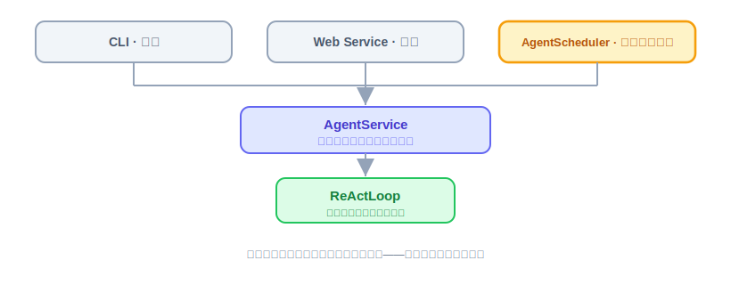
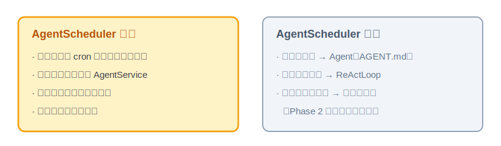
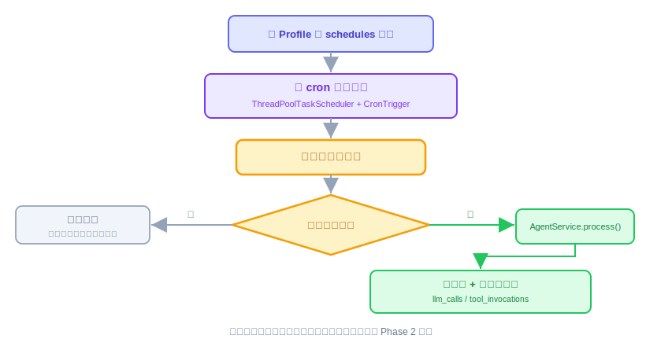

# 定时任务模块：原理解析、实现与代码讲解

Provider、ReAct、CLI、Notify、Tool、Memory、Sandbox 都讲完了——Agent 能被喂话、会想、会动手、会往外推消息、记得住事、干活有安全边界。这节讲的定时任务，补的是基础能力的最后一个缺口：**Agent 能不能不用人喂话，自己到点干活。** 照旧四件事：定时任务是什么、动手前该想清楚什么、代码怎么写、做完怎么验。

技术栈还是 JDK 21 + Spring Boot 3.x，定时机制用 Spring 自带的 `TaskScheduler`。下面的代码是示意，具体 API 以你用的 Spring 版本为准。

---

## 一、定时任务是什么，干嘛用的

一句话：**定时任务就是让 Agent 不用人推一把，到点自己说话。**

前面几节讲的触发方式，不管是 `oryxos chat`（CLI）还是 Web Service 的接口调用，本质都是"人推"——有个外部实体（用户、业务系统）主动发一条消息进来，Agent 才会动。但很多场景不是这样的：一个每天早上推送 PR 评审进度的 Agent，没人会天天早上手动去问它"帮我看看昨天的 PR"——它得自己知道"到点了，该干活了"。

**定时任务不是一种新能力，是第三种触发源。** CLI 是人推、Web 是人推（换了个入口）、定时任务是**钟推**——到点了，系统自己拼一条消息，喂给跟 CLI/Web 完全一样的处理入口。ReActLoop 怎么想、Tool 怎么执行、Provider 怎么调模型，这些一个字都不用改。



呼应最终要交付的两个验收 Demo——每日天气、每日科技日报（31 节）：它们都是"到点自动跑"的 Agent，Skill 定义了"做什么"，缺的就是这节要补的"到点了谁来喊它一声"。

---

## 二、动手前先想清楚几件事

**第一，把职责划窄，别让它膨胀成一个小型工作流引擎。** 这个模块只干一件事——**到点了，拼一条消息，交给 `AgentService`**。消息里具体说什么话，是 Profile / SKILL.md 的事；消息交上去之后怎么处理，是 ReActLoop 的事。这两件事都不归定时任务模块管。



**第二，别自己写调度器。** Spring 自带 `TaskScheduler`，支持标准 cron 表达式、支持动态注册任务，够用了。这跟 Provider 那节"协议转换不自己造"是同一个原则的延伸：能用现成的就不重复造轮子，我们要写的只是薄薄一层，把"Profile 里配的定时规则"接到 Spring 的调度能力上。

**第三，几个坑，提前想到。**

- **坑一：配置从哪来。** cron 表达式、到点要说什么话，必须能在 Profile（或它引用的 SKILL.md）里声明，不能写死在 Java 代码里。这是"配置即 Agent"原则的延伸——给一个 Agent 加个定时任务，不该要求改代码、重新编译。
- **坑二：重叠执行。** 如果一次 ReAct 循环跑的时间比调度间隔还长（比如每分钟触发一次，但上一次还没跑完），会不会同一个任务被并发触发两次？核心阶段是单实例，用一把**进程内的本地锁**防重叠就够，**不需要分布式锁**——多实例下"这个定时任务归哪个实例执行"是扩展阶段分布式协调要解决的问题，这节明确不做，别提前引入复杂度。
- **坑三：失败隔离。** 一次定时任务跑挂了，不能把整个调度器带崩，也不能悄悄失败什么都不留。得跟其他调用一样走审计——`llm_calls`、`tool_invocations` 该怎么写还怎么写，失败了照样记一笔。
- **坑四：时区。** cron 表达式默认按服务器系统时区跑，容易跟"用户以为的早上 9 点"对不上。配置里要能显式指定时区，不能全靠约定俗成。

这几个坑想清楚，模块该长什么样就清楚了：一个薄薄的调度层，配置驱动、本地锁防重叠、失败照样审计、时区显式声明。

---

## 三、代码怎么写

核心一个类 `AgentScheduler`：启动时读所有 Profile 的定时配置，逐条注册进 Spring 的 `TaskScheduler`；到点触发时，拿锁、拼消息、交给 `AgentService`、写审计、放锁。

一次触发从头到尾是这样走的：



**先看骨架。** 启动时注册所有定时任务：

```java
@Component
public class AgentScheduler {

    private final ThreadPoolTaskScheduler taskScheduler;
    private final ProfileRegistry profileRegistry;
    private final AgentService agentService;
    private final ConcurrentMap<String, Lock> taskLocks = new ConcurrentHashMap<>();

    @PostConstruct
    public void registerAll() {
        for (Profile profile : profileRegistry.all()) {
            for (ScheduleConfig sc : profile.getSchedules()) {  // Profile 新增字段
                taskScheduler.schedule(
                    () -> runOnce(profile, sc),
                    new CronTrigger(sc.getCron(), sc.getZoneId())   // cron + 时区，坑四的解法
                );
            }
        }
    }

    private void runOnce(Profile profile, ScheduleConfig sc) {
        Lock lock = taskLocks.computeIfAbsent(sc.getId(), id -> new ReentrantLock());
        if (!lock.tryLock()) {
            log.info("task {} still running, skip this trigger", sc.getId());  // 坑二的解法
            return;
        }
        try {
            // channel 和 user 都固定为 "scheduler"：同一个 Profile 的历次定时触发
            // 复用同一个 Session，历史靠 max_history_turns 截断兜底（18 节的三元组签名）
            Session session = sessionManager.getOrCreate("scheduler", "scheduler", profile.getName());
            agentService.process(session, sc.getMessage());  // 走跟 CLI/Web 完全一样的入口
        } catch (Exception e) {
            log.error("scheduled task {} failed", sc.getId(), e);  // 坑三：失败不能悄悄没声音
        } finally {
            lock.unlock();
        }
    }
}
```

一行行看它在干嘛：

- `registerAll()`——启动时扫一遍所有 Profile，把每条 `schedules` 配置（cron 表达式、时区、要说的话）都注册进 `taskScheduler`。**注册的内容来自配置，不是编译时写死的 `@Scheduled` 注解**——`@Scheduled` 的 cron 是写死在注解里的常量，改一次触发时间就得改代码重新编译，不符合"配置即 Agent"，所以这里用 `TaskScheduler.schedule(...)` 动态注册，对应坑一的解法。
- `new CronTrigger(sc.getCron(), sc.getZoneId())`——cron 表达式加时区一起传，对应坑四。别让服务器时区替用户做主。
- `taskLocks.computeIfAbsent(...)` + `lock.tryLock()`——每个定时任务 id 一把锁，拿不到锁说明上一次还没跑完，直接跳过这次触发，不排队、不堆积。这是坑二最简单的解法：核心阶段单实例，一把内存锁足够。
- `agentService.process(session, sc.getMessage())`——**关键的一步**：走的是跟 `oryxos chat`、Web Service 完全一样的入口。定时任务模块到这一步就撒手了，剩下的 ReAct 循环、工具调用、Provider 调用，一个字都不用管。
- `catch (Exception e) { log.error(...) }`——一次任务失败，只记日志、继续往下走（`finally` 里照样放锁），不会把整个调度器搞挂，也不影响其他定时任务的下一次触发。
- `finally { lock.unlock(); }`——不管成功失败，锁必须放掉，不然这个任务就永远"卡住"了。

> `agentService.process(...)` 内部走到 `ReActLoop`/`ProviderService` 时，该怎么审计还怎么审计——`llm_calls`、`tool_invocations` 不需要为"这是定时触发的"单独开一套逻辑，跟人手动触发的一次对话完全一样记账。

**有几样先别做。** 多实例下"这个定时任务该由哪个实例执行"的分布式协调（选主、分布式锁、租约），核心阶段单实例不需要，放到扩展阶段跟"状态外置、走向分布式"一起解决。任务失败后的自动重试、失败几次自动告警，这些也先不做，核心阶段做到"失败不崩、留痕可查"就够。

**本节交付物**（Spec-Kit 拆解锚点）：

- 代码：`AgentScheduler`（`registerAll` + `runOnce` + 按任务 id 的 `ReentrantLock` 表）、`ScheduleConfig`（id/cron/zone/message）
- 测试：`AgentSchedulerTest`（见验收 harness）
- 配置：Profile 新增 `schedules` 字段
- 约定：会话身份固定 `("scheduler", "scheduler", profileName)`；失败只记日志不崩调度器

---

## 四、验收 harness：把验收标准变成可执行的测试

定时模块的测试诀窍是**别真等时间**：`runOnce` 拆成了独立方法，直接调它就能测全部行为逻辑；cron 触发本身是 Spring 的事，我们只验"注册参数传对了"。`AgentSchedulerTest` 一个类覆盖四个坑：

| 测试点 | 守住的坑 |
|---|---|
| 注册时 `CronTrigger` 带上了配置的 cron **和时区**（ArgumentCaptor 抓注册参数） | 坑四：不让服务器时区替用户做主 |
| 锁被占时本次触发直接跳过、不排队 | 坑二：重叠执行 |
| `runOnce` 内部抛异常：不外抛、**锁在 finally 里被释放** | 坑三：失败隔离 + 不留死锁 |
| 会话三元组固定 `("scheduler", "scheduler", profileName)`，两次触发拿到同一 Session | 会话身份约定 |

两个最值钱的：

```java
@Test
void 上一次还没跑完_本次触发直接跳过() {
    Lock lock = scheduler.lockFor("task-1");
    lock.lock();                                     // 模拟上一次还占着锁
    try {
        scheduler.runOnce(profile, scheduleConfig("task-1"));
        verify(agentService, never()).process(any(), any());   // 没有叠加执行
    } finally {
        lock.unlock();
    }
}

@Test
void 任务抛异常_不外抛且锁必须被释放() {
    when(agentService.process(any(), any())).thenThrow(new RuntimeException("boom"));

    assertDoesNotThrow(() -> scheduler.runOnce(profile, scheduleConfig("task-1")));  // 调度器不死

    scheduler.runOnce(profile, scheduleConfig("task-1"));       // 再触发一次
    verify(agentService, times(2)).process(any(), any());      // 能进来——锁真的放了，没有永久卡死
}
```

第二个测试的后半段是关键：光断言"不抛异常"不够，**再跑一次证明锁放掉了**——finally 漏了 unlock 的 bug，只有这种"二进宫"式断言能抓住。

---

## 五、做完怎么验

harness 全绿后，剩下的人工确认：

- 真实到点触发一次：`schedules` 设成"每分钟"，到点看到 Agent 自动发起对话、`llm_calls`/`tool_invocations` 有账（cron 触发链路本身只能真等一次）。
- 改 cron 表达式不用重新编译、重启后按新时间跑（配置驱动的体感验证）。
- 端到端预演：完整走一遍"到点自动触发 → 跑完 ReAct 循环 → 留下审计记录"，为 31 节的两个定时 Demo 把地基踩实。
- 重叠跳过、失败隔离、锁释放、时区、会话身份——已由 harness 覆盖，`mvn test` 绿即打勾。

定时任务是"能自己按点干活"这件事的地基，很多实用场景（周报、日报、告警巡检）都靠它才成立。它跟 CLI、Web Service 是平级的三种触发源，都汇入同一个 `AgentService`——这也是这几周反复验证的一个道理：**核心引擎稳，加一个新的入口不用动它一行代码。**
