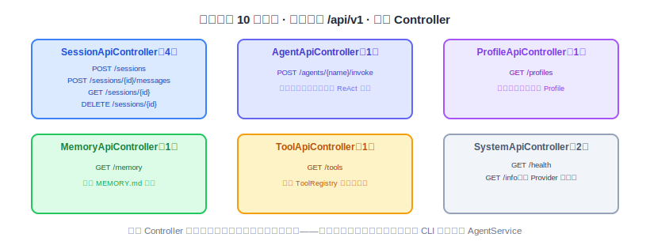
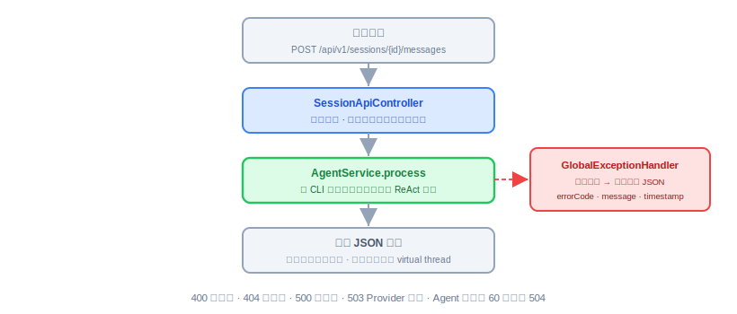
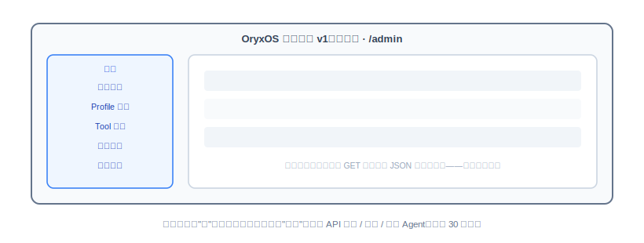

# Web Service 与第一版管理平台：实现与代码讲解

到上一节为止，底座的能力全部就位：会调模型、会思考、有入口、能推送、能干活、记得住、有安全边界、还能到点自动跑。但这些能力目前只有 CLI 一个对外出口——业务系统没法用。这节补上能力五：Web Service 把内部能力包装成 REST API，顺带做出第一版管理平台。照旧四件事：是什么、动手前想清楚什么、代码怎么写、做完怎么验。

技术栈还是 JDK 21 + Spring Boot 3.x，HTTP 层用 Spring MVC + virtual thread。下面的代码是示意。

---

## 一、Web Service 是什么，干嘛用的

一句话：**Web Service 是 OryxOS 的对外门面——没有它，OryxOS 只是一个 CLI 工具；有了它，任何能发 HTTP 请求的业务系统都能把 Agent 接进自己的流程。**

18 节讲 CLI 时埋过一句：`oryxos serve` 启动 Web Service，26 节细讲——就是现在。`serve` 起来之后，Spring MVC 监听 8080 端口，对外暴露 10 个端点，统一前缀 `/api/v1`，按资源分成六个 Controller：



这 10 个端点覆盖四类事：**会话管理**（创建、发消息、查历史、归档，4 个）、**Agent 调用**（无状态 invoke，1 个）、**信息查询**（Profile / Memory / Tool，3 个）、**系统状态**（health / info，2 个）。业务系统最常用的两条路：要连续对话就先创建 Session 再多次发消息；要一次性调用就直接 `POST /agents/{name}/invoke`。

**管理平台**是这节的第二个交付物：一个跑在 `/admin` 的静态前端，调上面这 10 个端点，把会话、Profile、Tool、记忆、状态渲染成能看的页面。它没有自己的后端——所有数据都来自这 10 个端点，这也顺带验证了"API 是完备的对外通道"这件事本身。

---

## 二、动手前先想清楚几件事

**第一，Controller 必须薄，跟 CLI 是同一个引擎。** 18 节讲过 CLI 是"读—转交—打印的壳"，Web Service 的 Controller 是一模一样的角色：参数校验、响应包装、错误处理，三件事之外一概不碰。`POST /sessions/{id}/messages` 进来后调的还是那个 `AgentService.process`——跟 `oryxos chat` 走的是同一个方法。人推的两个入口共享同一个引擎，这是架构上反复强调的点，写代码时最容易被"顺手在 Controller 里加点逻辑"破坏掉。

**第二，异常出口只有一个。** 六个 Controller 都不自己拼错误响应，所有异常统一交给 `GlobalExceptionHandler` 转成标准 JSON（`errorCode`、`message`、`timestamp`）。错误码用标准 HTTP 语义：400 参数错误、404 资源不存在、500 内部错误、503 Provider 故障；Agent 调用最长 60 秒，超时返回 504。这个口径一开始就定死，业务系统对接时才不用逐个端点猜错误格式。

**第三，核心阶段明确不做的，列出来别手痒。** 认证（假设内网部署，扩展阶段补 API Key + JWT）、SSE 流式响应、WebSocket、限流、RBAC——全部不做。请求大小限制倒是要有：单条消息最大 32KB，Session 历史返回最多最近 100 条，这两条是防呆不是治理。

**第四，管理平台的边界：这一版只读。** 能看会话、看 Profile、看 Tool、看记忆、看状态，但**不能**创建或修改 Agent——"通过 API 定义一个 Agent"需要的那套端点（29、30 节）现在还不存在，界面上也不该出现假按钮。另外这个前端本身是一次"用提示词做前端"的实战：把页面需求描述清楚交给 AI 生成静态页，我们只验收不手写。

想清楚就这几句：Controller 薄、跟 CLI 共享引擎；异常单出口、错误码定死；不做认证流式限流；管理平台这版只读。

---

## 三、代码怎么写

**第一步：把 virtual thread 打开。** `serve` 命令启动 Spring 上下文（18 节的"重命令"），`application.yaml` 里一行配置让每个请求跑在独立虚拟线程上：

```yaml
spring:
  threads:
    virtual:
      enabled: true
server:
  port: 8080
```

同步阻塞的代码直进直出，虚拟线程负责在 LLM 调用这种 IO 等待时自动让出——不引入 WebFlux、不写一行响应式代码，这是决策三、决策五定好的。

**第二步：最典型的 Controller。** 拿承载 ReAct 循环的那个端点举例：

```java
@RestController
@RequestMapping("/api/v1/sessions")
public class SessionApiController {

    private final AgentService agentService;
    private final SessionManager sessionManager;

    @PostMapping("/{id}/messages")
    public MessageResponse send(@PathVariable String id, @RequestBody MessageRequest req) {
        if (req.content() == null || req.content().length() > 32 * 1024) {
            throw new InvalidRequestException("消息为空或超过 32KB");   // → 400
        }
        Session session = sessionManager.get(id)
                .orElseThrow(() -> new SessionNotFoundException(id));   // → 404
        String reply = agentService.process(session, req.content());   // 跟 CLI 同一个入口
        return new MessageResponse(reply);
    }
}
```

一次请求从进到出的完整链路，以及异常怎么被统一接走：



**第三步：统一异常出口。**

```java
@RestControllerAdvice
public class GlobalExceptionHandler {

    @ExceptionHandler(SessionNotFoundException.class)
    public ResponseEntity<ErrorBody> notFound(SessionNotFoundException e) {
        return ResponseEntity.status(404)
                .body(new ErrorBody("SESSION_NOT_FOUND", e.getMessage(), Instant.now()));
    }

    @ExceptionHandler(ProviderUnavailableException.class)
    public ResponseEntity<ErrorBody> providerDown(ProviderUnavailableException e) {
        return ResponseEntity.status(503)
                .body(new ErrorBody("PROVIDER_UNAVAILABLE", e.getMessage(), Instant.now()));
    }

    @ExceptionHandler(Exception.class)   // 兜底
    public ResponseEntity<ErrorBody> internal(Exception e) {
        return ResponseEntity.status(500)
                .body(new ErrorBody("INTERNAL_ERROR", "内部错误", Instant.now()));
    }
}
```

注意兜底那条不把 `e.getMessage()` 原样吐给外部——内部异常细节进日志，对外只说"内部错误"，这是门面该有的分寸。

**第四步：其余端点都很直。** `POST /agents/{name}/invoke` 临时建一个一次性 Session、跑完返回；`GET /profiles`、`GET /tools` 分别列 `ProfileRegistry` 和 `ToolRegistry` 的内容；`GET /memory` 返回 `MEMORY.md` 全文；`GET /health` 回一个 ok；`GET /info` 多带一份各 Provider 的连通状态。OpenAPI 文档用 `springdoc-openapi` 自动生成，暴露在 `/swagger-ui`，不用手写接口文档。

**第五步：管理平台，用提示词做出来。** 前端不手写，给 AI 一段这样的提示词：

```text
做一个单页静态管理界面，纯 HTML + 原生 JS，不用构建工具：
左侧导航五项：会话列表、Profile 列表、Tool 列表、长期记忆、运行状态；
分别调 GET /api/v1/sessions、/profiles、/tools、/memory、/info 渲染成表格或文本；
只读，不要任何新建/编辑/删除按钮；出错时把统一错误 JSON 里的 message 显示出来。
```

产物是一个 `index.html`（可拆几个 js），放进 `oryxos-web` 模块的 `src/main/resources/static/admin/` 下，由 Spring 直接托管，`serve` 起来后访问 `http://localhost:8080/admin` 就能看：



**有几样先别做。** Profile 的增删改端点、Memory 的写入端点、Webhook 触发、Prometheus metrics——这些都在扩展阶段清单里；其中"通过 API 定义 Agent"这一块（`/api/v1/agents` 的增删改）是 29、30 节的正题，这节刻意留白。

**本节交付物**（Spec-Kit 拆解锚点）：

- 代码：六个 Controller（Session/Agent/Profile/Memory/Tool/System）、`GlobalExceptionHandler`、`ErrorBody`；`springdoc-openapi` 集成
- 配置：`spring.threads.virtual.enabled=true`、端口 8080、消息 32KB / 历史 100 条限制
- 前端：`static/admin/` 下 AI 生成的只读管理页（五个页面调五个 GET 端点）

---

## 四、怎么用，做完怎么验

```bash
oryxos serve                          # 启动，默认 8080
curl -X POST localhost:8080/api/v1/sessions          # 建会话
curl -X POST localhost:8080/api/v1/sessions/{id}/messages \
     -H 'Content-Type: application/json' -d '{"content":"今天北京天气怎么样"}'
curl localhost:8080/api/v1/tools                     # 列工具
open http://localhost:8080/admin                     # 管理平台
open http://localhost:8080/swagger-ui                # 接口文档
```

做完对着下面几条验：

- 10 个端点 curl 全部走通；`POST /sessions/{id}/messages` 触发的是完整 ReAct 循环，`llm_calls`/`tool_invocations` 有对应记录。
- CLI 里聊过的 Session，通过 `GET /sessions/{id}` 能查到同样的历史——验证两个人推入口共享同一套 Session 存储。
- 故意传超长消息、查不存在的 Session、断掉 Provider，分别拿到 400 / 404 / 503，格式都是统一的错误 JSON；构造一个超过 60 秒的调用拿到 504。
- 并发压一把（比如 200 个并发 invoke），确认虚拟线程扛得住、没有线程池打满的报错。
- 管理平台五个页面都能正常渲染真实数据；界面上没有任何写操作入口。
- `/swagger-ui` 能打开，10 个端点的文档齐全。

到这一步，底座的五大核心能力全部有了对外出口。但现在的 Agent 还是散装的——模块都在，整条链路没有从头到尾拉通过。接下来两节就干这件事：串联。
