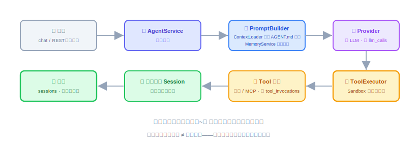
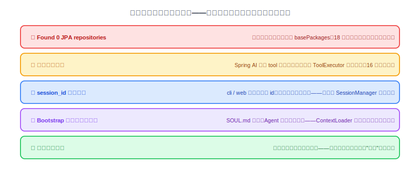

# 全流程串联（一）：让大脑跑起来、串起来

Provider、ReAct、CLI、Notify、Tool、Memory、Sandbox、定时、Web Service——零件全做完了。但"每个模块单测全绿"和"整台机器能转"是两码事，这节和下一节干的就是把零件装成机器：先打通主干，把缝隙一条条找出来补上。这节聚焦**人推链路**（chat / REST 进来的一次完整对话），钟推链路和 Demo 准备留给下一节。

这两节没有新模块、没有新概念，是纯粹的集成课。集成课的价值不在写了多少代码，在**暴露了多少"我以为它没问题"的假设**。

---

## 一、这一步要干什么

一句话：**集成不是加功能，是验证交接——缝隙从来不在模块内部，全在两个模块的交接处。**

前面十一节，每个模块都是"局部正确"的：Provider 单独调得通、Memory 单独读写正常、Sandbox 单独拦得住。但一次真实对话要连续穿过八个环节，任何一处交接口径不一致——参数没传、格式不对、假设不成立——链路就断。所以这节的方法论就一条：**拿一次真实对话，从进到出走一遍，在每一站核对它留下的痕迹。**

## 二、先对表：模块就位检查

动手串之前，先花十分钟核对每个模块的"对外承诺"还在不在——这份表就是前面各节验收清单的浓缩：

| 模块（节） | 就位标准 |
|---|---|
| Provider（16） | 显式映射路由正确；自动 tool 执行已关；`llm_calls` 成功失败都写 |
| ReAct（17） | 最大轮数兜底；每轮累积回 Session |
| CLI（18） | 轻重命令分流；`chat` 能进能出 |
| Notify（19） | `notify` 能推到 webhook；渠道未配置时明确报错 |
| Tool（20） | 九个内置 Tool 可调；三种来源统一成 `OryxTool` |
| Memory（21、22） | 核心记忆始终在场；写入即读到（无缓存） |
| Sandbox（23、24） | 三类白名单拦得住；违规写入 `tool_invocations` |
| 定时（25） | cron 到点触发；本地锁防重叠 |
| Web Service（26） | 10 端点全通；异常统一 JSON |

哪一行打不了勾，先回那一节修完再来——带着坏零件装机器，查出来的全是噪音。

## 三、把主干拉通：一次对话的"对账法"

选一条最有代表性的对话：`oryxos chat` 里问一句"今天北京天气怎么样，穿什么合适"。这一句会穿过全部八站（两轮 LLM 调用、一次工具调用）。跑完之后**逐表对账**，这次对话应该在系统里留下且只留下这些痕迹：

- `sessions` 表：1 条记录，`messages_json` 里有完整往来（用户消息、两次模型响应、一次工具结果）；
- `llm_calls` 表：2 条记录（第一轮返回 tool call、第二轮返回最终答复），`session_id` 一致、`success=true`、token 数非零；
- `tool_invocations` 表：1 条记录（`http_get`），`success=true`、`duration_ms` 合理；
- `MEMORY.md`：没动（这次对话不涉及记忆写入——如果动了，说明有地方在乱写）。

**"应该留下"和"只留下"同样重要**：多出来的记录（工具被调两次、llm_calls 出现三条）跟缺失的记录一样是 bug。再用 `GET /api/v1/sessions/{id}` 从 Web 端查同一个 Session，确认 CLI 和 REST 看到的是同一份数据。

然后换 REST 入口把同样的对话再走一遍（`POST /sessions` + `POST /sessions/{id}/messages`），对账结果应该完全一致——两个人推入口共享同一个引擎，不是口号，是可以对出来的账。

## 四、查出来的典型缝隙

按上面的方法走，大概率会撞上这几类问题——它们各自在前面某节埋过引线，串联时集中引爆：

逐条说修法：

**① Found 0 JPA repositories。** 18 节讲过：`scanBasePackages` 不带动 `@EnableJpaRepositories`/`@EntityScan`。单跑 storage 模块的测试没事，从 CLI 模块的主类启动就炸——典型的"交接处"问题。修法是在启动类上显式声明两个注解的 `basePackages`，并且验收标准写死：启动日志里 "Found N JPA repository interfaces" 的 N 必须大于 0。

**② 工具被调两次。** 16 节的坑二没关干净的全局表现：`tool_invocations` 里同一个工具同一时刻两条记录，或者天气被查了两遍。修法回 16 节——确认 Spring AI 的自动执行关闭，执行权只在 ToolExecutor 一处。

**③ session_id 口径不一。** `session_id` 的公式是 channel + user + profile 联合生成（技术方案 9.2）。如果 CLI 和 Web 的 Controller 各自拼了一遍这个 id，格式差一个分隔符，同一个用户就会出现两条互不相认的历史。修法：生成逻辑收敛进 `SessionManager` 一处，所有入口只传三元组、不碰拼接。

**④ Bootstrap 缺失被静默跳过。** `.oryxos/` 里少了 `SOUL.md`，`ContextLoader` 若选择"跳过不报"，Agent 的人格设定就悄悄丢了，症状是"回答风格不对"这种最难查的软故障。修法：缺文件至少 WARN 级日志，Profile 里显式引用了的文件缺失直接报错。

**⑤ 审计链断点。** 成功路径的审计一般没问题，**失败路径最容易漏**：Provider 超时那条、Sandbox 拦截那条、工具执行抛异常那条，是不是每条都落了 `success=false` 的记录？构造这三种失败各来一次，逐条对账。

## 五、做完怎么验

- "天气穿衣"这次对话在 CLI 和 REST 两个入口各走一遍，逐表对账结果一致且与预期完全相符——不多不少。
- 启动日志确认：JPA repositories 数量 > 0；所有 Profile 加载成功；引用的 Bootstrap / Skill 文件都存在。
- 三种失败路径（Provider 挂、Sandbox 拦、工具异常）各构造一次，审计表里都有 `success=false` 的记录，系统本身不崩、下一轮对话正常。
- 同一个工具在一次对话里只被执行一次。
- `mvn clean verify` 全绿——集成期间的所有修补没有打破任何已有单测。

到这里，人推主干是通的：一句话进来，走完想、查、答、记账的全过程，每一站的痕迹都对得上。下一节把另外半边接上：钟推链路（定时 → ReAct → notify）、跨重启恢复、多 Agent 并存——那是两个 Demo 上场前的最后一轮查缺补漏。
