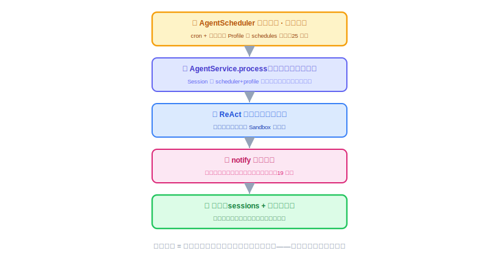
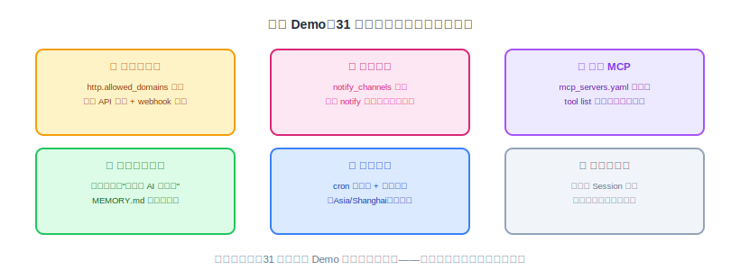

# 全流程串联（二）：让底座自己跑得稳——定时任务、重启恢复、多 Agent 并存

上一节把人推主干拉通了：一句话进来，八站走完，账全对得上，三面同源。这一节接着补另外半边——让底座在**没人看着的时候也持续正确**。

这一节和上一节略有不同：除了继续"串联对账"，它还要**把定时从 25 节的'内存里注册 cron'升级成一个完整的定时任务子系统**（能定义、能自己跑、记得住、能管理）。所以本节 = **建成定时任务子系统（建 + 验）+ 让底座跑得稳（重启不失忆、多 Agent 不打架）**。

---

## 一、本节目标：让底座自己跑得稳

先把终点说清楚，一句话：

> **上一节验证的是"有人问、答得对"；这一节要的是"没人问、也照样干活；重启了、也不失忆；多个 Agent、互不打架"。**

这三件事，正是 Agent OS 和"一个 Agent Demo"的分水岭——Demo 只要在演示那几分钟里活着就行，底座却要在没人盯着的时候也持续正确。拆成三根能验证的支柱：

- **定时任务子系统**：一份 skill 定义一个定时任务 → 到点**自己**跑完"查天气 → notify 推送" → 结果记进 SQLite（任务状态 + 执行历史，重启不丢）→ 管理台**看得到、管得了**（立即执行 / 启用停用）。可验证的终态：三张表痕迹不多不少、定时那条会话被复用、`run_count` / 执行历史落库、停用即不跑。
- **重启恢复**：`kill` 掉进程再 `serve` 起来，会话、记忆、**定时任务（状态 + 历史）**、审计记录**全部原样回来**。
- **多 Agent 并存**：两个差异明显的 Profile 跑在同一实例上，**工具、会话、定时三条隔离边界**都守得住。

三根支柱同时立住，底座才算"跑得稳"。

**为什么现在做、用什么方法。** 上一节把人推主干串通了，但那只证明"被人调用时是对的"。底座真正的价值在于**没人值守时也持续正确**——这恰恰最容易藏 bug：状态偷偷赖在内存里、某个失败拖垮整个调度器、两个 Agent 共用了同一份默认配置。方法还是上一节那套**对账法**：定时链路无非是人推链路换了个"触发头"（`AgentScheduler` 代替人发起）、多了个"推送尾"（`notify` 代替屏幕输出），中间引擎完全复用；拿一次真实触发从进到出走一遍、逐张表核对痕迹。

## 二、围绕目标要做哪些

### 2.1 定时任务子系统：从定义、执行到管理

这是本节的主线。定时不能"到点跑一下"就完了——作为 agent os 的一个能力，它要**可定义、能自己跑、记得住、可管理**。分四块建起来。

#### ① 定义：仍走 skill，不新增定义源

一个定时任务 = skill 的 `schedules` 一条（`id + cron + zone + message`）——`message` 就是"到点提示 agent 做什么"的 prompt，到点交给 `AgentService.process` 走一次真实 ReAct（智能执行）。这跟 29 节 skill-centric 一致：**skill 是定义源，本节只加"状态 + 历史 + 管理"**，不搞第二个定义源。

#### ② 执行：到点自己跑，逐表对账

配一个测试 Profile：定时每两分钟触发，消息"查一下北京天气，把穿搭建议推送出去"，通知渠道指向一个测试 webhook。让它自己跑一轮，然后对账——这次触发应该留下、而且**只**留下这些痕迹：

- **`sessions`**：渠道和用户都标着 `scheduler` 的那条会话**被复用**（第二次触发不新建，历史追加在同一条里，25 节规则）；
- **`llm_calls`**：两条（一轮决定调工具、一轮组织答复）；
- **`tool_invocations`**：两条——`http_get`（查天气）+ `notify`（推送），都成功；
- **webhook 那头**：真的收到了消息。

**重点盯两处接缝**：一是**会话复用**——连续触发两次后 `sessions` 表还是一条、只是历史变长，而不是冒出两条；二是**推送的失败路径**——故意把 webhook 域名改到白名单外，确认 Sandbox 拦下、`tool_invocations` 留一条 `success=false`、而且**调度器本身没被拖死**（下一个触发点照常来）。

#### ③ 持久化：任务状态与执行历史落 SQLite（"重启记录都在"）

25 节的定时只在内存里注册 cron，重启后靠重新扫 Profile 恢复——**定义**不丢，但"跑过几次、上次成功没、下次几点"这些**状态与历史**一重启就没了。本节加两张手工建表补上：

| 表 | 存什么 |
|---|---|
| `scheduled_tasks` | 任务登记与运行状态：`task_id / profile_name / cron / zone / message / enabled / next_run_at / last_run_at / last_status / run_count`（注册时写、每次触发更新） |
| `task_executions` | 每次执行一条历史：`task_id / session_id / started_at / success / error_message / duration_ms`（成功失败都记，跟宪法 V 审计同理） |

重启后：**定义**从 skill 重新注册（文件持久），**状态与历史**仍在这两张表（DB 持久）。

**`AgentScheduler` 改造（25 节既有类）**，经一个 core 的 `ScheduledTaskStore` 接口（storage 里 JPA 实现，依赖倒置——不把持久化写进 core）：

- `registerAll()` 注册每条 cron 的同时，把任务登记进 `scheduled_tasks`（含算出的 `next_run_at`）；
- 执行入口拆成"**看启用状态 → 真正执行**"：`enabled=false` 的任务到点直接跳过、不执行、不记历史；
- 每次真正执行**成功失败都写 `task_executions`**、并更新任务的 `last_run / last_status / run_count / next_run`；
- 新增 `runNow(taskId)`：管理台"立即执行"用（手动触发一次，不等 cron、无视启用状态）。

#### ④ 管理：四个端点 + 管理台"定时任务"页

**端点**（`oryxos-web`，统一 `ApiResponse` 信封；`AgentScheduler` 与 `ScheduledTaskStore` 都在 core，web 可注入）：

- `GET /api/v1/schedules` —— 列出所有定时任务状态（下次触发 / 上次结果 / 次数 / 启用与否）；
- `GET /api/v1/schedules/{id}/executions` —— 某任务的执行历史；
- `POST /api/v1/schedules/{id}/run` —— 立即执行一次（手动触发）；
- `PUT /api/v1/schedules/{id}` —— 启用 / 停用。

**管理台"定时任务"页**：列表（任务 / Profile / cron / 下次触发 / 上次结果 / 次数 / 状态）+ 每行"立即执行""启用·停用"按钮。这是 26 节只读管理台上第一个带**写操作**的页——定时任务的运营管理面，也是"agent os 能执行智能定时任务"这句话的落地界面。

> 这套持久化顺带把"重启后定时回来了"从翻日志变成 `GET /api/v1/schedules` 一次断言（清单非空、下次触发在未来、历史还在）——下面 2.2 重启验收直接用它。

### 2.2 跨重启恢复

底座的状态全部放在进程外面（SQLite + 文件系统），进程自己不存状态——这句架构承诺，重启一次就能验证：

1. 先跑几轮对话、攒几条记忆、让定时任务至少触发过一次，然后 `kill` 掉进程；
2. 重新 `oryxos serve`，逐项核对：
   - **会话回来了**：`GET /sessions/{id}` 查到重启前的完整历史（本就在 SQLite）；
   - **记忆回来了**：新对话里 Agent 还记得核心记忆（`MEMORY.md` 是文件，天生跨重启）；
   - **定时任务回来了**：定义从 skill 重新注册；**状态与历史**（`run_count`、上次结果、执行记录）仍在 `scheduled_tasks` / `task_executions`——`GET /api/v1/schedules` 一次查清；
   - **审计不断档**：重启前后的 `llm_calls` 连续，没丢一段。

哪一项没回来，就说明有状态偷偷留在了进程内存里——这是走向分布式前必须掐灭的隐患（"无状态实例"是技术方案定的前提）。

### 2.3 多 Agent 并存

"OS"在核心阶段最小的体现：**多个 Profile 能在同一实例上同时用**。配两个差异明显的 Profile（一个只给文件工具、一个只给 HTTP 工具），交替使用，核对三条隔离边界：

- **工具隔离**：Profile A 的对话里，模型拿到的工具清单**不该**出现 B 独有的工具（`tools` 过滤生效）；
- **会话隔离**：A、B 各自的会话互不串——会话 id 带 Profile 名天然分开；但要提防哪处代码用了"默认 Profile"把两边搅一起；
- **定时隔离**：A 的定时任务抛异常，B 的下一个触发点照常执行（25 节的失败隔离，多 Agent 场景再验一遍）。

### 2.4 从"能跑"打磨到"跑得稳"

最后一轮打磨，都是小事，但件件影响 Demo 现场体感：

- **该超时的都要超时**：模型调用、工具执行、notify 推送都要有超时，一处卡死不能拖垮整根虚拟线程；一次 Agent 调用整体 60 秒封顶（26 节定的）。
- **错误信息要人看得懂**：`error_message` 存人能读懂的原因（"域名不在白名单内: evil.com"），不是一坨堆栈——审计表是给人查的。
- **一次触发在日志里是一条清晰主线**：一次对话/一次定时触发，能靠会话 id 从日志串出完整过程，不用在几百行里捞。
- **外部 MCP 挂了不能拖垮自己**：外部 MCP server 连不上，记 WARN、跳过它的工具，OryxOS 照常起——**别人的可用性，不能变成自己的可用性。**

### 2.5 为 Demo 备好环境（前置条件清单）

31 节那两个 Demo 要用的环境，这一节末尾一次配齐、逐项打勾：

> **最容易自己绊倒自己的一条：白名单会拦下你自己的 Demo。** 24 节的 Sandbox 默认全部拒绝，`notify` 推送（19 / 24 节接线）和 `http_get` 查天气都得先过 `http.allowed_domains`。所以配环境时，必须把三样域名显式加进白名单，否则 31 节 Demo 全是 `tool_invocations` 里的 `success=false`：① 天气源 `api.open-meteo.com`（Demo 一）；② 团队通知 webhook 的域名（如飞书 `*.feishu.cn`、企业微信 `qyapi.weixin.qq.com`，按实际渠道填）；③ 若日报靠 `http_get` 拉新闻，再加新闻源域名。`file` / `shell` 两类白名单这两个 Demo 用不上、保持"全部拒绝"即可。另外确认 26 节已排除 `OpenAiAutoConfiguration`——否则 `serve` 起不来，这轮串联无从谈起（26 节决策四）。

## 三、怎么验收：把对账固化成测试

定时任务子系统有两条验证线：**无 key 的机制验证**（登记 / 执行 / 持久化 / 管理，用 mock provider 进 gate）+ **真 key 的链路验证**（查天气 / notify 真推，手动跑）。加上重启、多 Agent，一共四组：

### 主验 · 定时任务子系统全流程（`ScheduledTaskE2ETest`，mock 驱动、gate 内无 key）

用 27 节那个 mock provider，把子系统"定义→执行→持久→管理"在 gate 内自动跑通（`@SpringBootTest` 起整台服务、SQLite 指临时库、provider 覆盖成 mock）：

1. 临时工作区放一个 `provider: mock` 且带 `schedules` 的 Agent（cron 设远期，靠"立即执行"手动触发、不等时间）；
2. 启动即登记 → `GET /api/v1/schedules` 有这条任务、`run_count=0`、`enabled=true`；
3. `POST /api/v1/schedules/{id}/run` 立即执行 → 走真实 ReAct（mock 触发一次 `save_memory`）；
4. 断言落库：`GET /api/v1/schedules` 的 `run_count=1`、`last_status=success`；`GET /api/v1/schedules/{id}/executions` 有一条成功记录；`GET /api/v1/memory` 查得到写入——**都在 SQLite，重启不丢**；
5. `PUT /api/v1/schedules/{id}` 停用 → 列表显示已停用。

### 链路验 · 定时真能推（`SchedulerFlowIT`，`@Tag("integration")`、真 key）

1. 配测试 Profile：定时、消息"查北京天气推送穿搭"、通知渠道指向测试 webhook（IT 内起接收端把推送收下来）；
2. 触发一次（直接调 `AgentScheduler.runNow` 免等，或真等 cron）→ 断言：
   - `sessions`：`scheduler` 那条会话**被复用**（连续触发两次仍一条）；
   - `llm_calls` 恰 2 条、`tool_invocations` 恰 2 条（`http_get` + `notify`）、全成功——不多不少；
   - 测试 webhook **真收到**消息体；
3. 失败路径：webhook 域名改到白名单外 → Sandbox 拦下、`tool_invocations` 留 `success=false`、**调度器没死**（下个触发点照常）。

### 重启验 · 不失忆（`RestartRecoveryIT`，`@Tag("integration")`）

1. 跑几轮对话 + 攒记忆 + 触发定时一次，然后 `kill`；
2. 重启 `serve` → 断言：`GET /sessions/{id}` 完整历史；`GET /api/v1/memory` 核心记忆；**`GET /api/v1/schedules` 列出定时任务（含 `run_count`、上次结果、下次触发）**；`llm_calls` 跨重启不断档。

### 多 Agent 验 · 不打架

配两个差异 Profile（A 只文件工具、B 只 HTTP 工具），`GET /profiles` 两个都在，交替使用 → 三条边界：**工具隔离**（A 拿不到 B 独有工具）、**会话隔离**（`GET /sessions` 里 A/B 各自会话不串）、**定时隔离**（A 定时抛异常，B 下个触发点照常）。

### 验收清单（每条都成立才算达标）

- **定时子系统（无 key 可验）**：skill 定义的任务启动即登记 SQLite；立即执行后 `run_count` / `last_status` / 执行历史落库、`GET /api/v1/schedules` 查得到；停用后到点不再触发；`ScheduledTaskE2ETest` 在 gate 内跑通；
- **定时链路（真 key）**：到点自己跑完"查天气 → 推送"，webhook 收到，逐表对账不多不少、会话复用；
- **定时失败隔离**：notify 打到白名单外时被拦、记 `success=false`，调度器不死；
- **重启**：`kill` 再起，`GET /sessions/{id}`、`GET /api/v1/memory`、`GET /api/v1/schedules`（含状态与历史）、审计四样全部原样恢复；
- **多 Agent**：两个 Profile 并存，工具 / 会话 / 定时三条隔离边界都验过；
- **稳定性**：超时兜底、错误信息可读、外部 MCP 挂了不拖垮启动，各验一次；
- **Demo 前置**：三样域名进 `http` 白名单、通知渠道配好、`OpenAiAutoConfiguration` 已排除；
- **不回退**：`mvn clean verify` 全绿（含 `ScheduledTaskE2ETest` 无 key 跑通）；`SchedulerFlowIT` / `RestartRecoveryIT` 打 `@Tag("integration")` 真 key 手动跑。

### 本节交付物

- **代码 · 持久化**：`schema.sql` 加 `scheduled_tasks` / `task_executions` 两表；`ScheduledTaskStore` 接口 + `ScheduledTaskView` / `TaskExecutionView` 值对象（core）；`JpaScheduledTaskStore` + `ScheduledTask` / `TaskExecution` 实体与仓库（storage，依赖倒置）。
- **代码 · 调度**：`AgentScheduler`（25 节既有类）注册时登记任务、执行入口加启用检查、成功失败都写 `task_executions` 并更新任务状态、新增 `runNow(taskId)`。
- **代码 · 端点**：`oryxos-web` 新增 `ScheduleApiController` 四端点（列表 / 执行历史 / 立即执行 / 启用停用）+ DTO。
- **测试（harness）**：**`ScheduledTaskE2ETest`（mock、gate 内无 key）** 验子系统登记 / 执行 / 持久化 / 管理全流程；`SchedulerFlowIT`、`RestartRecoveryIT`（`@Tag("integration")`、真 key）验链路对账 + 重启；多 Agent 隔离测试。
- **前端**：管理台新增"定时任务"页（列表 + 立即执行 / 启用停用）——26 节只读管理台的第一个写操作页。
- **配置**：Demo 前置环境——三样域名进 `http.allowed_domains`、通知渠道配好、测试 Profile 的 `schedules`。
- **文档**：README 端点表补上定时任务四端点（`GET/POST/PUT /api/v1/schedules...`）。

到这里，底座部分（第一部分）全部完工、而且跑得稳了：人推答得对、定时任务能定义能自己跑能管能记账、重启不失忆、多 Agent 不打架。但注意一个事实：我们到现在还没真正"定义"过一个业务 Agent——测试用的 Profile 都是顺手配的。下一节讲这门课最关键的一次视角转换：**底座是底座，Agent 是 Agent**——用 Skill 把一个业务 Agent 声明式地定义出来。
