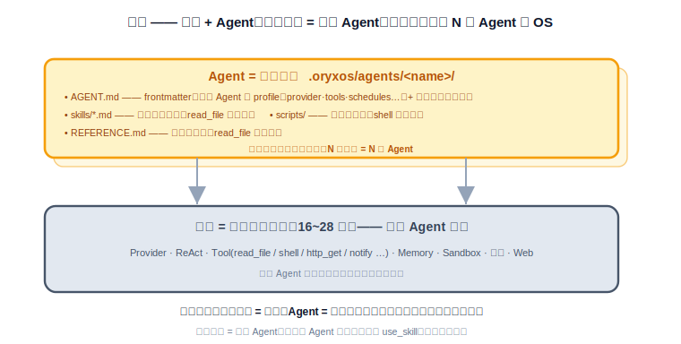
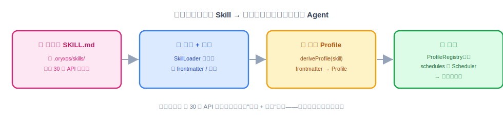
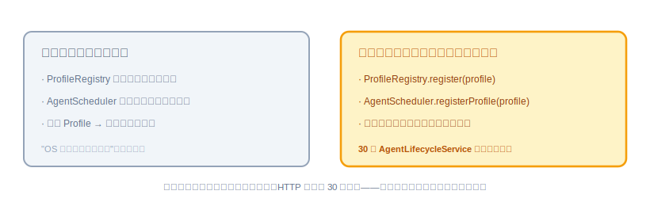

# 插件化 Agent：用 Skill 定义一个 Agent

前面 28 节做完，一个事实值得停下来看清楚：我们搭了一整套能跑、跑得稳的系统，但**还没有真正"定义"过一个业务 Agent**——测试用的 Profile 都是顺手配的。这节讲这门课最关键的一次视角转换：底座是底座、Agent 是 Agent；然后动手做第一件"在底座上定义 Agent"的事——用 Skill 把一个 Agent 声明式地配出来，让它跟定时模块联动、自己跑起来。照旧：是什么、想清楚、代码怎么写、做完怎么验。

---

## 一、插件化 Agent 是什么

一句话：**一个业务 Agent = 一份 Skill（做什么）+ 一份绑定它的 Profile（怎么跑）——前面 28 节做的所有东西都是底座，不是 Agent。**

这个区分是"OS"这个词的关键体现。类比操作系统：进程调度、内存管理、系统调用是 OS 的能力，但 OS 本身不是任何一个程序——程序是跑在上面的可执行文件。对应过来：Provider、ReAct、Tool、Memory、Sandbox、定时、Web Service 是 OryxOS 的内核能力，而**Skill 就是这里的"可执行文件"**——业务方定义一个新 Agent，写的就是一份 Skill。



两个角色各管一半，不越界：

- **Skill（`SKILL.md`）**：这个 Agent 该做什么、什么时候该做。业务能力的定义本体，一份带 frontmatter 的 markdown。
- **Profile（YAML）**：这个 Agent 怎么跑起来——用哪个 provider/model、能用哪些 Tool、往哪推通知、要不要定时。底座提供的运行时绑定。

没绑任何 Skill 的 Profile 只是一个通用助手骨架，能聊天，但不是这个项目要交付的"业务 Agent"。

"插件化"说的就是这件事的形态：**定义一个新 Agent 不写一行 Java、不动一行底座代码**——写两份文本文件、插进 `.oryxos/` 工作区，它就成了这台"OS"上一个新"程序"。

---

## 二、动手前先想清楚几件事

**第一，Skill 是 prompt 的输入，不是 Tool。** 20 节讲过这个归属：`SKILL.md` 由 `ContextLoader` 加载、注入 system prompt，跟 Bootstrap 文件同类——它是给 LLM 看的任务说明，不是可执行的东西。LLM 读完 Skill 自己理解任务、自己决定调哪些工具、自己组合完成，OryxOS 不解析任务步骤、不做工作流引擎。把 Skill 塞进 ToolRegistry 是最经典的概念错位，执行时必报错。

**第二，声明式，别命令式。** 定义 Agent 的方式是"声明它是什么"（两份文件），不是"编码它怎么做"（写类、注册 Bean）。这决定了后面 30 节能做出"通过 API 创建 Agent"——文件能通过 API 写，代码不能。

**第三，手动路径的生效边界要摸清。** 两份文件的生效时机不一样：**Skill 正文改动即时生效**——`ContextLoader` 每次组装 prompt 都重新读文件、不缓存（跟 22 节 Memory 不缓存是同一个设计），改完保存、下一轮对话就是新的；**新增 Profile 却要重启**——`ProfileRegistry` 和 `AgentScheduler` 都只在启动时扫描注册。这个不对称就是本节代码要补的短板。



**第四，能力和入口分两步走。** 补短板的办法是给 `ProfileRegistry` 和 `AgentScheduler` 各加一个**运行时注册方法**。但这节只把方法立好、单独验证，**不做 HTTP 入口**——入口是 30 节 `POST /api/v1/agents` 的事。能力和入口拆开，各自都好验，也不会让这节膨胀。

---

## 三、代码怎么写

**第一步：写一份 Skill。** 用一个最小但五脏俱全的例子——每天早上向团队问好并播报今天日期的 Agent（天气和日报两个正式 Demo 留给 31 节，这里刻意用个简单的，把注意力放在机制上）：

```markdown
---
name: daily-greeting
description: 每天早上向团队群问好
trigger: 每天早上定时触发
required_tools:
  - notify
---

你是团队的晨间助手。被触发时：
1. 组织一句简短、友好的早安问候，包含今天的日期和星期几；
2. 调用 notify 工具把问候发送出去；
3. 不需要等待任何回复。
```

存成 `.oryxos/skills/daily-greeting.md`。frontmatter 四个字段：`name`（唯一标识）、`description`（干什么的）、`trigger`（什么时候该做）、`required_tools`（依赖哪些工具，加载时可校验）；正文就是给 LLM 的任务说明——写给"人"看的清晰程度，就是它执行的准确程度。

**第二步：写 Profile 绑定它。**

```yaml
# .oryxos/profiles/daily-greeting.yaml
name: daily-greeting
description: 晨间问候 Agent
identity:
  agent_name: 晨间小欧
  prompt: 你是一个简洁友好的助手。
provider:
  name: deepseek
  model: deepseek-chat
tools:
  - notify
skills:
  - daily-greeting          # 绑定上面那份 Skill
notify_channels:
  - type: webhook
    url: ${TEAM_WEBHOOK_URL}
schedules:
  - id: morning-greeting
    cron: "0 0 9 * * *"
    zone: Asia/Shanghai
    message: 到点了，按你的技能说明执行晨间问候。
bootstrap:
  - AGENTS.md
settings:
  max_iterations: 5
```

注意各字段跟前面各节一一对应：`tools` 只给它 `notify`（20 节的最小权限）、`notify_channels` 是 19 节的、`schedules` 是 25 节的。**两份文件写完，这个 Agent 就定义完了**——重启一次 `oryxos serve`，第二天早上九点它自己会说话。

**第三步：补运行时注册，去掉"重启"这个尾巴。**



两个方法，各自都是把启动时那套逻辑抽出来复用，不写第二套：

```java
// ProfileRegistry：启动扫描和运行时注册走同一个入口
public class ProfileRegistry {

    private final Map<String, Profile> profiles = new ConcurrentHashMap<>();

    public void register(Profile profile) {
        profileValidator.validate(profile);       // 复用启动时那套校验：
        profiles.put(profile.getName(), profile); // provider 存在、tool 已注册、skill 文件存在
    }
}
```

```java
// AgentScheduler：把 25 节 registerAll() 里的循环体抽成单个 Profile 的注册
public class AgentScheduler {

    public void registerProfile(Profile profile) {
        for (ScheduleConfig sc : profile.getSchedules()) {
            ScheduledFuture<?> future = taskScheduler.schedule(
                () -> runOnce(profile, sc),
                new CronTrigger(sc.getCron(), sc.getZoneId()));
            scheduledTasks.put(sc.getId(), future);   // 留着句柄，将来注销/更新要用（30 节）
        }
    }

    @PostConstruct
    public void registerAll() {
        profileRegistry.all().forEach(this::registerProfile);   // 启动时就是逐个调它
    }
}
```

两处共同的讲究：**运行时路径和启动路径必须是同一段代码**。如果 `register()` 另写一套校验、`registerProfile()` 另写一套注册，两条路径迟早行为漂移——"API 建的 Agent 和文件建的 Agent 表现不一样"这种 bug 最难查。另外 `scheduledTasks` 这个句柄表是给 30 节埋的：更新、删除 Agent 时要能把旧定时任务注销掉，现在不留句柄，将来就只能重启。

> **对齐既有实现（上面是示意，按 16/25 节已落地的真实代码改，别照抄示意）：**
> - `ProfileRegistry`（16 节）现在是**不可变**的（构造注入 `Map.copyOf`，无 `register`）。本节把它改成持有可变并发 Map，新增 `register(Profile)` / `remove(String)` / `exists(String)`——这是 16 节 javadoc 里就预告过的"29 节补运行时 register"，属课件明列的改造点。校验要复用 16 节 `ProfileLoader` 那套（provider 存在 / tool 已注册 / skill 文件存在），不新写一套。
> - `AgentScheduler`（25 节）实际是**构造注入的纯 POJO**，启动注册走 `@Bean(initMethod="registerAll")`（**不是** `@PostConstruct`，别把 Spring 注解塞回 core 类）；`ScheduleConfig` 是 `Profile.ScheduleConfig` **record**，用 `sc.id()/cron()/zone()/message()`、`profile.name()/schedules()`（**不是** getter），时区经 `ZoneId.of(sc.zone())`、空则系统默认。本节把 25 节 `registerAll` 里的循环体抽成 `registerProfile(Profile)`，并保留 25 节**每条 try/catch 跳过非法 cron**（FR-007）；`registerAll` 改成 `profileRegistry.all().forEach(this::registerProfile)`。
> - 25 节已有一张按任务 id 的 `taskLocks`（防重叠锁）。本节**新增**一张 `scheduledTasks`（`Map<String, ScheduledFuture<?>>` 句柄表，为 30 节注销用）——两张表并存、各管一事，别合并、别互相覆盖。

**有几样先别做。** Skill 的版本管理、Skill 市场/共享、`trigger` 字段的自动解析（现在只是给人和 LLM 看的说明，不驱动任何机制）、Profile 热更新的文件监听——都放扩展阶段。这节做到"两份文件定义一个 Agent + 运行时注册能力就位"就够。

**本节交付物**（Spec-Kit 拆解锚点）：

- 代码：`ProfileRegistry.register(profile)`（复用启动校验）、`AgentScheduler.registerProfile(profile)` + `scheduledTasks` 句柄表
- 测试：`ProfileRegistryRuntimeTest`、`AgentSchedulerRegisterTest`、`SkillConsistencyTest`（见验收 harness）
- 文件：`daily-greeting` 示例的 SKILL.md + Profile YAML（手动路径的参照物）
- 校验：`required_tools` 与 Profile `tools` 的一致性检查（缺失告警）

---

## 四、验收 harness：把验收标准变成可执行的测试

这节的两个方法都是"复用启动逻辑"，所以 harness 的核心使命是**钉死"两条路径同一段代码"**——将来谁给运行时路径单开一套逻辑，测试立刻红：

| 测试类 | 覆盖的验收点 |
|---|---|
| `ProfileRegistryRuntimeTest` | `register()` 后立即 `get()` 可见；**非法 Profile 的报错与启动路径完全一致**（同一异常类型 + 同一消息格式——复用的直接证据） |
| `AgentSchedulerRegisterTest` | `registerProfile` 后 `scheduledTasks` 里有句柄（30 节注销的前提）；`taskScheduler.schedule` 收到的 cron/时区与配置一致 |
| `SkillConsistencyTest` | `required_tools` 里有 Profile `tools` 没给的工具 → 加载时产生明确告警 |

最值钱的一个：

```java
@Test
void 运行时注册与启动加载_必须是同一套校验() {
    Profile bad = profileReferencing("nonexistent-provider");

    var startupEx = assertThrows(ProfileValidationException.class,
        () -> profileLoader.load(yamlOf(bad)));          // 启动路径
    var runtimeEx = assertThrows(ProfileValidationException.class,
        () -> profileRegistry.register(bad));            // 运行时路径

    assertEquals(startupEx.getMessage(), runtimeEx.getMessage());   // 行为漂移在此现形
}
```

"Skill 即时生效"（改文件下一轮读到新内容）不用在这节重测——17 节 `ContextLoaderTest` 的无缓存回归已经钉死了，harness 不重复钉同一颗钉子。

---

## 五、怎么用，做完怎么验

```bash
vim .oryxos/skills/daily-greeting.md       # 定义"做什么"
vim .oryxos/profiles/daily-greeting.yaml   # 绑定"怎么跑"
oryxos serve                               # 重启注册（30 节之后这步就免了）
oryxos profile list                        # 能看到 daily-greeting
```

harness 全绿后，剩下的人工确认：

- 全程没写一行 Java：两份文本文件，`daily-greeting` 出现在 `profile list` 和 `GET /api/v1/profiles` 里。
- 真实到点执行：webhook 收到问候、审计有账（真模型链路）。
- **Skill 即时生效**的真实体感：改正文里的问候风格，不重启，下一次触发就用了新说明。
- 运行时注册可见性、校验复用、句柄留存、required_tools 一致性——已由 harness 覆盖，`mvn test` 绿即打勾。

到这里，"在底座上定义一个 Agent"这件事在机制上完全成立了，只是入口还停在"登录服务器改文件"。下一节把最后一块拼上：把这套能力包成 `POST /api/v1/agents`，让业务系统一次 API 调用就定义出一个会自己跑的 Agent——管理平台也从"只能看"升级成"真能管"。
