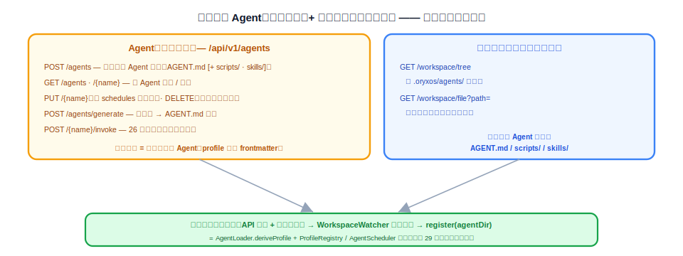
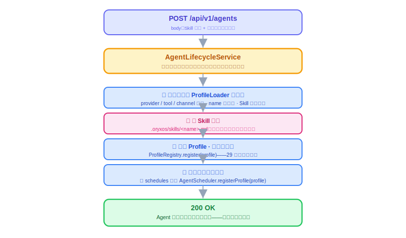

# Web Service 动态管理 Agent

上一节把"定义一个 Agent"的机制立住了：两份文件 + 运行时注册能力。但入口还停在"登录服务器改文件"——业务系统没法用，管理平台也只能看不能管。这节把最后一块拼上：`/api/v1/agents` 的增删改查，一次 API 调用定义出一个会自己跑的 Agent。照旧：是什么、想清楚、代码怎么写、做完怎么验。

---

## 一、这组接口是什么

一句话：**把"Agent"作为一个对外资源来管理——业务系统 POST 一次，一个新 Agent 立刻可用、到点自己跑，全程不重启。**

对外的资源就是 **Agent** 这一个概念。业务方心智里创建的是"一个每天推日报的 Agent"，不是"一份 Skill 加一份 Profile"——所以 API 不拆成 Skill 和 Profile 两套 CRUD 让调用方自己拼装，而是一个入口收进来、内部拆成两个动作。四个端点，挂在 26 节已有的 `AgentApiController` 上（那里已经有 `POST /agents/{name}/invoke`）：



这组接口做完，26 节管理平台"只读"的限制同时解除：加一个"新建 Agent"表单，管理平台从"能看"变成"真能管"。

---

## 二、动手前先想清楚几件事

**第一，编排复用，不写第二套。** 创建一个 Agent 内部要干四件事：校验、写 Skill 文件、注册 Profile、注册定时。这四步没有一步是新能力——校验复用 `ProfileLoader` 启动时那套，注册复用 29 节立好的 `ProfileRegistry.register()` 和 `AgentScheduler.registerProfile()`。新增的只有一个**编排者** `AgentLifecycleService`（归 `oryxos-core`），把四步按顺序串起来。判断标准还是 29 节那句：**API 建的 Agent 和手写文件建的 Agent，行为必须一模一样**——保证这一点的唯一办法就是两条路径走同一段代码。

**第二，四步是一个整体，缺一个闭环就断。** 少了写 Skill，Profile 没东西可引用；少了运行时注册，创建了也要等重启；少了定时注册，"会自己跑"就是空话。所以这四步在一个方法里顺序完成，中途失败要把已做的步骤回滚掉（比如 Skill 文件写了、Profile 校验挂了，得把文件删回去），不能留半个 Agent 在系统里。

**第三，错误码沿用 26 节的口径。** name 已存在、Skill 字段非法、引用了不存在的 provider——都是 400，`errorCode` 各自区分；查/改/删一个不存在的 Agent——404。不发明新状态码。

**第四，删除和更新的语义提前定死。** **删除**：先注销定时（29 节存的 `scheduledTasks` 句柄这时兑现价值）、再从 `ProfileRegistry` 移除、最后把两份文件移进归档目录（`.oryxos/archive/`）——**不物理删**，这个 Agent 干过的事都在审计表里，定义文件也应该可追溯。**更新**：Skill 正文覆写文件即可（`ContextLoader` 每次重读，天然即时生效）；`schedules` 变了则先注销旧句柄再注册新的，不然旧 cron 会跟新 cron 一起跑。

---

## 三、代码怎么写

**第一步：Controller，照旧很薄。**

```java
@RestController
@RequestMapping("/api/v1/agents")
public class AgentApiController {

    private final AgentLifecycleService lifecycle;

    @PostMapping
    public AgentResponse create(@RequestBody CreateAgentRequest req) {
        return lifecycle.create(req);          // 所有逻辑在编排者里
    }

    @GetMapping("/{name}")
    public AgentResponse get(@PathVariable String name) { return lifecycle.get(name); }

    @PutMapping("/{name}")
    public AgentResponse update(@PathVariable String name, @RequestBody UpdateAgentRequest req) {
        return lifecycle.update(name, req);
    }

    @DeleteMapping("/{name}")
    public void delete(@PathVariable String name) { lifecycle.delete(name); }
}
```

请求体的字段跟技术方案定的一致——前四个对应 Skill 的 frontmatter 加正文，后面是可选的运行时绑定，不填就用系统默认：

```json
{
  "name": "daily-greeting",
  "description": "每天早上向团队群问好",
  "trigger": "每天早上定时触发",
  "required_tools": ["notify"],
  "skill_content": "你是团队的晨间助手。被触发时：……",
  "provider": {"name": "deepseek", "model": "deepseek-chat"},
  "tools": ["notify"],
  "mcp_servers": [],
  "schedules": [{"id": "morning", "cron": "0 0 9 * * *", "zone": "Asia/Shanghai",
                 "message": "到点了，按你的技能说明执行。"}]
}
```

**第二步：编排者 AgentLifecycleService。** 一次 `create` 从头到尾：



```java
@Service
public class AgentLifecycleService {

    public AgentResponse create(CreateAgentRequest req) {
        if (profileRegistry.exists(req.name())) {
            throw new InvalidRequestException("Agent 已存在: " + req.name());   // → 400
        }
        Profile profile = deriveProfile(req);          // ① 先校验：复用 ProfileLoader 那套
        profileValidator.validate(profile);            //    provider/tool/skill 引用全查一遍
        Path skillFile = skillStore.write(req.name(), req.toSkillMarkdown());  // ② 写 Skill 文件
        try {
            profileStore.write(profile);               // ③ Profile 落盘
            profileRegistry.register(profile);         //    + 运行时注册（29 节的方法）
            if (!profile.getSchedules().isEmpty()) {
                agentScheduler.registerProfile(profile);   // ④ 注册定时（29 节的方法）
            }
        } catch (RuntimeException e) {
            skillStore.delete(skillFile);              // 中途失败：把已写的文件回滚掉
            throw e;
        }
        return AgentResponse.from(profile);
    }

    public void delete(String name) {
        Profile profile = profileRegistry.get(name)
                .orElseThrow(() -> new AgentNotFoundException(name));   // → 404
        agentScheduler.unregisterProfile(profile);     // 先停定时（用 29 节留的句柄）
        profileRegistry.remove(name);                  // 再移出索引
        skillStore.archive(name);                      // 文件移入 .oryxos/archive/，不物理删
        profileStore.archive(name);
    }
}
```

`update` 是两者的组合：Skill 内容变了就覆写文件（即时生效，不用碰注册）；运行时绑定变了就重新校验、更新索引；`schedules` 变了就 `unregisterProfile` + `registerProfile` 一进一出。`UpdateAgentRequest` 的字段与 Create 相同但全部可选——只传要改的（`description`/`trigger`/`required_tools`/`skill_content`/`provider`/`tools`/`mcp_servers`/`schedules`），`name` 在路径里、不可改。

**第三步：管理平台补上"管"。** 给 26 节的提示词追加一段，让 AI 在原有五个只读页面之外加一页：

```text
再加一个"Agent 管理"页：表格列出 GET /api/v1/agents 的结果；
"新建"按钮弹表单（名称、描述、技能说明正文、cron、webhook 地址），提交调 POST /api/v1/agents；
每行带"查看/编辑/删除"，分别调 GET / PUT / DELETE；删除前要二次确认。
```

**有几样先别做。** 认证鉴权（谁能建 Agent——核心阶段内网假设，扩展阶段跟 API Key/RBAC 一起补）、Agent 的启用/停用状态位、创建时的干跑测试（dry-run）、Skill 内容的版本历史——都放扩展阶段。

**本节交付物**（Spec-Kit 拆解锚点）：

- 代码：`AgentApiController` 四个端点、`AgentLifecycleService`（create 四步编排含回滚 / get / update / delete）、`AgentScheduler.unregisterProfile`、`skillStore`/`profileStore` 的 write/archive
- 测试：`AgentLifecycleServiceTest`、`AgentApiControllerTest`（见验收 harness）
- 目录：`.oryxos/archive/`（删除归档，不物理删）
- 前端：管理平台新增 "Agent 管理" 页（列表 + 新建表单 + 编辑/删除）

---

## 四、验收 harness：把验收标准变成可执行的测试

这节的复杂度全在**编排顺序和失败路径**，恰好是单测的主场——`skillStore`/`profileStore`/`registry`/`scheduler` 全部 mock，用 `InOrder` 钉顺序、用异常注入钉回滚：

| 测试类 | 覆盖的验收点 |
|---|---|
| `AgentLifecycleServiceTest` | create 四步按序执行（InOrder）；**name 冲突在第①步就拒绝、一个文件都不写**；**第③步失败回滚已写的 Skill 文件**；delete 按"注销定时 → 移出索引 → 归档"顺序；update 改 schedules 时先 unregister 后 register |
| `AgentApiControllerTest`（@WebMvcTest） | 四个端点薄转发；冲突 → 400、不存在 → 404，走统一 ErrorBody |

两个最值钱的：

```java
@Test
void 第三步注册失败_必须回滚已写的Skill文件_不留半个Agent() {
    doThrow(new ProfileValidationException("bad")).when(profileRegistry).register(any());

    assertThrows(ProfileValidationException.class, () -> lifecycle.create(validRequest("half-agent")));

    verify(skillStore).delete(any());                          // 第②步写的文件被删回去
    verify(agentScheduler, never()).registerProfile(any());    // 第④步根本没走到
    assertFalse(profileRegistry.exists("half-agent"));         // 系统里干干净净
}

@Test
void 删除必须先停定时_再动索引和文件() {
    lifecycle.delete("weather-daily");

    InOrder inOrder = inOrder(agentScheduler, profileRegistry, skillStore);
    inOrder.verify(agentScheduler).unregisterProfile(any());   // 顺序反了的后果：
    inOrder.verify(profileRegistry).remove("weather-daily");   // 定时器还在跑，Profile 已经没了
    inOrder.verify(skillStore).archive("weather-daily");       // ——触发即空指针
}
```

第二个测试的注释说明了为什么顺序值得一个专门断言：先删索引后停定时，中间那个窗口里 cron 一触发就是空指针——这种时序 bug 靠人工验收几乎撞不上，只有测试能稳定钉住。

---

## 五、怎么用，做完怎么验

```bash
curl -X POST localhost:8080/api/v1/agents \
     -H 'Content-Type: application/json' -d @daily-greeting.json
curl localhost:8080/api/v1/agents/daily-greeting     # 看定义
curl -X DELETE localhost:8080/api/v1/agents/daily-greeting
```

harness 全绿后，剩下的人工确认：

- **创建即可用**（真实链路）：POST 成功后不重启，`profile list` 立刻可见；cron 临时设每分钟，到点真的自己跑、webhook 收到消息。
- **文件落对了地方**：POST 完目检 `.oryxos/skills/` 和 `.oryxos/profiles/`，格式跟 29 节手写的一模一样。
- **删除的审计连续性**：DELETE 后文件在 `.oryxos/archive/`，历史 `llm_calls`/`tool_invocations` 还查得到。
- **管理平台**：纯界面走一遍"新建 → 看它自己跑 → 编辑 → 删除"。
- 编排顺序、失败回滚、冲突 400、删除时序——已由 harness 覆盖，`mvn test` 绿即打勾。

到这里，技术方案里"业务系统通过 API 定义一个新 Agent 并让它定时自动运行"的完整闭环合上了。底座（第一部分）和定义 Agent（第二部分）都齐了——下一节交付验收：用这套机制做出天气、日报两个真实 Agent，打包发布第一个版本。
