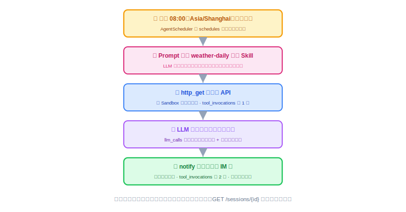
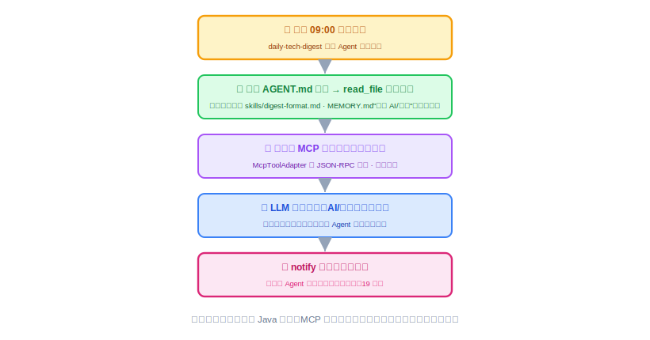
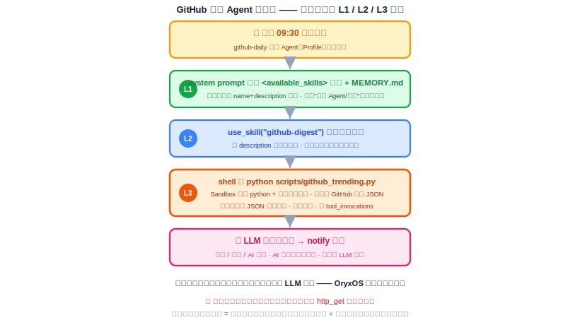
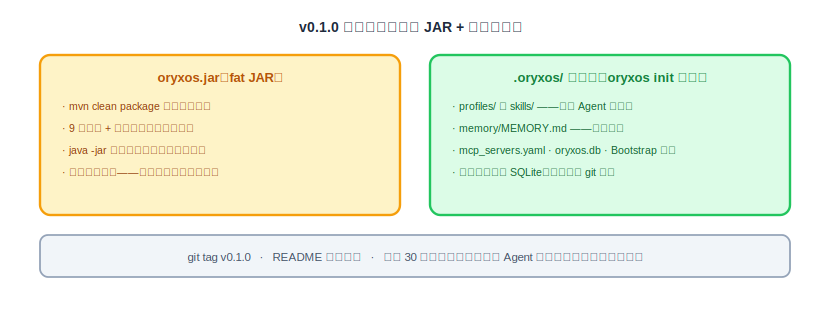

# 天气、科技日报、GitHub 日报 Agent 开发与演示：发布、打包、第一个版本

机制全部就位：底座跑得稳（27、28 节），Agent 能声明式定义（29 节：一个目录 = 一个 Agent）、能通过 API 动态管理（30 节）。这节是整个第一阶段的验收——做出**三个真实的业务 Agent**（每日天气、每日科技日报、每日 GitHub 日报），演示它们自己按点干活，然后打包发布第一个版本。三个 Demo 把 Agent 目录的形态从"光杆"到"带子指令"到"带脚本"各演一个，跑通它们是核心功能发布的硬条件，也是"驾驭层"学成的证据。

---

## 一、这节要交付什么

一句话：**三个到点自动跑的 Agent + 一个打了 tag 的可部署版本。**

三个 Demo 是刻意挑过的，合起来把前面所有能力压过一遍，也把**一个 Agent 目录的三种丰富度**各演到一个——从只有一个 `AGENT.md`，到目录里带一份子指令，到目录里带一个脚本：

| | Demo 一：每日天气 | Demo 二：每日科技日报 | Demo 三：每日 GitHub 日报 |
|---|---|---|---|
| 场景 | 每天 08:00 查天气、穿搭建议、推群 | 每天 09:00 汇总科技新闻、推群，体现偏好 | 每天 09:30 GitHub 今日/本月热门 + AI 项目总结、推群 |
| 压到的能力 | Provider + ReAct + 内置 HTTP + Sandbox + 定时 + Notify | + 目录带**子指令**（`read_file` 按需读）+ MCP + Memory | + 目录带**脚本**（`shell` 跑）+ 沙箱信任边界 + Memory |
| Agent 目录形态 | 光杆 `AGENT.md` | `AGENT.md` + `skills/*.md` | `AGENT.md` + `scripts/*.py` |
| Agent 怎么建 | 走 30 节的 API / 管理平台 | 走 29 节的手写目录 | 走 29 节的手写目录 |

三个各证一件事：天气证明"一个 `AGENT.md` 就能定义一个会自己跑的 Agent"、日报证明"Agent 目录里的子指令用 `read_file` 按需读进来"、GitHub 日报证明"Agent 目录里的脚本用 `shell` 跑、拿确定性数据"。这就是 29 节"一个目录 = 一个 Agent"的完整验收。

## 二、Demo 一：每日天气 Agent（光杆 AGENT.md，走 API 建）

**第一步：定义。** 天气这件事简单——**一个 `AGENT.md` 就够**，不需要子指令、不需要脚本。在管理平台"新建 Agent"表单里填（或直接 `POST /api/v1/agents`，系统据此写出 `.oryxos/agents/weather-daily/AGENT.md`）：

```markdown
---
name: weather-daily
description: 每天早上查北京天气并推送穿搭建议
provider: deepseek
model: deepseek-chat
tools: [http_get, notify]
notify_channels:
  - {type: webhook, url: ${TEAM_WEBHOOK_URL}}
schedules:
  - {cron: "0 0 8 * * *", zone: Asia/Shanghai, message: 到点了，按你的说明执行。}
---

你是天气助手。被触发时：
1. 调用 http_get 请求 https://api.open-meteo.com/v1/forecast?latitude=39.9&longitude=116.4&current=temperature_2m,precipitation,wind_speed_10m 获取北京当前天气；
2. 根据天气给出一段简短实用的穿搭建议；
3. 把"今日天气 + 穿搭建议"组织成一条消息，调用 notify 发送出去。
```

天气源钉死用 **open-meteo**（免费、免 API key、返回 JSON），白名单里加 `api.open-meteo.com`；`notify_channels` 用 28 节配好的团队 webhook——前置条件清单这时兑现价值。不自己挑 API 的原因很实际：Demo 现场最怕"接口要注册账号 / 要充值 / 被墙"这类和课程无关的意外。（最小权限体现在 `tools` 只给 `http_get`/`notify`——它不读子指令、不跑脚本，就不给 `read_file`/`shell`。）

> **跑起来之前，先过三道环境门（不过就是空转，别急着等钟推）：**
> 1. **启动 key**：`export DEEPSEEK_API_KEY=...`。因为 26 节已排除 `OpenAiAutoConfiguration`，`serve` 只需要这一个 key 就能起——若它还索要 `spring.ai.openai.api-key`，说明 26 节那个排除没落地，回去补。
> 2. **白名单**（24 节 Sandbox 默认 deny-all，会拦自己）：`http.allowed_domains` 里必须有 `api.open-meteo.com` **和** 团队 webhook 的域名（飞书 `*.feishu.cn` / 企业微信 `qyapi.weixin.qq.com`，按实际渠道）。少一个，`tool_invocations` 就是一片 `success=false`。
> 3. **webhook 可达**：一个真能收消息的群机器人地址，配进 `notify_channels`。

**第二步：调试，先人推再钟推。** 别干等八点。先手动补跑一次把链路调通：

```bash
oryxos chat --profile weather-daily
> 到点了，按你的说明执行。
```

或者 `POST /agents/weather-daily/invoke`。人推和钟推走同一条链路（25 节验证过的），人推通了，钟推基本就通——这就是当初坚持"同一个 `AgentService` 入口"在调试体验上的回报。常见两类问题这一步就能暴露：天气 API 域名没进白名单（Sandbox 拦截，看 `tool_invocations` 的 `error_message`）、正文写得含糊导致模型不调工具（改 `AGENT.md` 正文，用 30 节 `PUT` 覆写即时生效，再试）。

**第三步：等真正的钟推，对账。** 把 cron 临时改成几分钟后，看它完整自跑一轮：



对账清单（跟需求文档的验收标准一字对齐）：无人触发；`http_get` 和 `notify` 两次涉外调用都过了白名单、都写进 `tool_invocations`；`llm_calls` 两条；`GET /api/v1/sessions/{id}` 能查到这次自动触发的完整对话；群里收到了消息。

## 三、Demo 二：每日科技日报 Agent（目录带子指令，走手写目录）

这个 Demo 的重点是演**一个 Agent 目录里的子指令按需加载**：把"组稿排版规范"这段较长的说明,单独放进 Agent 目录的 `skills/` 里,Agent 正文只说"要组稿时去读它",到时用 `read_file` 读进来。

**第一步：搞定"拉科技新闻"这个外部能力——两条路，先保证能跑。** 这个 Agent 需要拉当日科技新闻，实现上两条路，按"Demo 必须跑起来"的优先级选：

- **路一（稳，建议默认）：直接用内置 `http_get`。** 找一个免 key、返回 JSON、稳定可达的新闻源（某科技媒体 RSS-to-JSON、或公开新闻聚合 JSON 接口），正文里让 LLM 调 `http_get` 取回、自己挑选组稿。Agent 的 `tools` 加 `http_get`、白名单加该新闻源域名即可——不引入外部进程，Demo 命运握在自己手里。
- **路二（MCP 实练，锦上添花）：声明一个新闻 MCP server。** 在 `.oryxos/mcp_servers.yaml` 里声明，重启后 `oryxos tool list` 能看到它暴露的工具。这是 20 节"方式二"的真实练手。**若走这条，务必提前把 `news-mcp` 写好、连通验证过，别 Demo 现场才写**——按 20 节方式二自己写一个最小 `news-mcp`（读两三个科技媒体 RSS、暴露一个 `fetch_tech_news` 返回标题列表，几十行任何语言都行），别赌社区某个 server 恰好活着；连不上时 MCP 会被 WARN 跳过（28 节"外部依赖不拖垮启动"），届时 Demo 就哑了。

**第二步：种一条偏好进记忆。** 先跟任意 Agent 聊一句：

```text
> 以后帮我关注科技新闻的话，我更关注 AI 和芯片方向。
```

模型判断值得长期记，调 `save_memory` 写进 `MEMORY.md`（22 节的机制）。确认文件里真的多了这一条再往下走。

**第三步：写 Agent 目录（带一份子指令）。** `.oryxos/agents/daily-tech-digest/`：

`AGENT.md`：

```markdown
---
name: daily-tech-digest
description: 每天早上编一份科技日报推送到群
provider: deepseek
model: deepseek-chat
tools: [http_get, read_file, notify]     # read_file 用来读 skills/ 里的子指令
notify_channels:
  - {type: webhook, url: ${TEAM_WEBHOOK_URL}}
schedules:
  - {cron: "0 0 9 * * *", zone: Asia/Shanghai, message: 到点了，编今天的科技日报。}
---

你是科技日报编辑。被触发时：
1. 调用可用的新闻工具（http_get 拉新闻源，或新闻 MCP 工具）取当日科技新闻；
2. 组稿排版规范较长，读 `skills/digest-format.md` 照它做；
3. 如果长期记忆里有用户关注方向的偏好，优先挑选并排列相关条目；
4. 调用 notify 把日报发送出去。
```

`skills/digest-format.md`（子指令，用到才 `read_file` 读进来——不塞进 system prompt）：

```markdown
# 科技日报组稿规范
- 挑最重要的 5~8 条，每条一行：标题 + 一句话点评 + 链接。
- 按重要性排序；有用户偏好方向的排在最前。
- 开头一句今日总览，结尾不加口号。
```

**全程零 Java 代码**——一个目录、两份 markdown。注意分工：**Agent 正文只说"去读 `skills/digest-format.md`"**，那段较长的规范平时不占 system prompt，Agent 跑到组稿那一步才用 `read_file` 读进来。这正是 29 节渐进式披露在一个 Agent 内部的样子（子指令按需、用底座的 `read_file`，没有什么特殊机制）。沙箱前置：`file.allowed_paths` 覆盖 `.oryxos/agents/daily-tech-digest/`。

**第四步：调试与对账。** 还是先人推补跑，再看钟推：



对账重点比天气 Agent 多两条：**Agent 真的用 `read_file` 读了 `skills/digest-format.md`**（子指令按需加载的直接证据，`tool_invocations` 里有这条）；**日报内容真的把 AI / 芯片条目排在前面**——记忆在跨天场景里生效，也是最能打动人的一刻，因为这个偏好不在目录里、不在代码里，只在记忆里；**LLM 自己决定调新闻工具、自己组稿**——OryxOS 没有解析任何任务步骤。

## 四、Demo 三：每日 GitHub 日报 Agent（目录带脚本，走手写目录）

这个 Demo 的重点是演**一个 Agent 目录里的脚本**：把"抓 GitHub 热门项目"这件确定性的活，做成 Agent 目录里**捆绑的一个脚本**，Agent 用 `shell` 跑它拿数据。它也是最"复杂"的一个：今日热门 + 本月热门 + 专挑 AI 相关项目做总结，还结合记忆偏好。

**第一步：写 Agent 目录（带一个脚本）。** `.oryxos/agents/github-daily/`：

`AGENT.md`：

```markdown
---
name: github-daily
description: 每天早上编一份 GitHub 热门 + AI 项目日报推送到群
provider: deepseek
model: deepseek-chat
tools: [shell, notify]     # shell 用来跑 scripts/github_trending.py
notify_channels:
  - {type: webhook, url: ${TEAM_WEBHOOK_URL}}
schedules:
  - {cron: "0 30 9 * * *", zone: Asia/Shanghai, message: 到点了，编今天的 GitHub 日报。}
---

你是开源情报编辑。被触发时：
1. 运行 `python scripts/github_trending.py`，它返回 JSON：today（今日新星）、month（本月新星）、ai（本月 AI 相关热门），每条含 name / stars / desc / url；
2. 组织成三段：今日热门 Top5 / 本月热门 Top5 / 本月 AI 项目重点；
3. 如果长期记忆里有用户关注的方向（如某类框架 / 主题），在"AI 项目重点"里优先排它相关的；
4. 调用 notify 把日报发送出去。
```

`scripts/github_trending.py`（**捆绑脚本**，确定性抓数据、无需 key、零外部依赖）：

```python
import json, sys
from datetime import date, timedelta
from urllib.request import Request, urlopen
from urllib.parse import quote

API = "https://api.github.com/search/repositories"
HDR = {"User-Agent": "oryxos-github-digest", "Accept": "application/vnd.github+json"}

def search(q, n=5):
    url = f"{API}?q={quote(q)}&sort=stars&order=desc&per_page={n}"
    with urlopen(Request(url, headers=HDR), timeout=15) as r:
        items = json.load(r).get("items", [])
    return [{"name": i["full_name"], "stars": i["stargazers_count"],
             "desc": (i.get("description") or "")[:120], "url": i["html_url"]} for i in items]

today = date.today()
yday = (today - timedelta(days=1)).isoformat()
month0 = today.replace(day=1).isoformat()
out = {
    "today": search(f"created:>{yday}"),
    "month": search(f"created:>{month0}"),
    "ai":    search(f"created:>{month0} topic:ai topic:machine-learning topic:llm"),
}
json.dump(out, sys.stdout, ensure_ascii=False)
```

数据源钉死 **GitHub Search API**（免 token；未认证限速 10 次/分钟，日跑一次绰绰有余）。用"按创建日期区间 + stars 排序"近似 trending，避开没有官方 trending API 的坑。

> **脚本的信任边界，当着观众说清楚（29 节 §2.4）**：这个脚本自己发了网络请求到 `api.github.com`——它**绕过了 `http_get` 的域名白名单**（白名单只管内置 `http_get` 工具，管不到 `python` 子进程的网络）。所以**装 `github-daily` 这个带脚本的 Agent = 信任写它的人**。核心阶段的沙箱对脚本只做两道白名单：`shell.allowed_commands` 放行 `python`、`file.allowed_paths` 限定到这个 Agent 的 `scripts/` 目录；把第三方 Agent 关进受限容器 / 网络隔离是扩展阶段的事。这条对做 Agent OS 很关键：**能跑第三方 Agent 很强，但信任从"底座"挪到了"Agent 作者"。**

沙箱前置：`shell.allowed_commands` 加 `python`、`http.allowed_domains` 加 `api.github.com`（脚本走的是子进程网络、不过 `http_get`，但把域名列进去便于审计与将来收口）、`file.allowed_paths` 覆盖 `.oryxos/agents/github-daily/`。

**第二步：种一条偏好进记忆。** 跟任意 Agent 聊一句"我更关注 Agent 框架和推理引擎方向的开源项目"，模型 `save_memory` 写进 `MEMORY.md`。

**第三步：调试与对账。** 先人推补跑（`oryxos chat --profile github-daily`），再看钟推。



对账重点：

- **脚本跑到了**：`tool_invocations` 里有 `shell` 跑 `python scripts/github_trending.py`——**确定性数据由脚本拿、代码不进上下文**，只有它返回的 JSON 进；
- **Memory**：日报"AI 项目重点"里，Agent 框架 / 推理引擎类项目排在前——记忆偏好在跨天场景里生效；
- **LLM 自主**：抓数据是脚本干的、组稿排序是 LLM 干的，OryxOS 没解析任何步骤。

## 五、发布、打包、第一个版本

三个 Agent 都稳定自跑之后，把整个东西变成一个可交付的版本：

```bash
mvn clean verify              # 全量测试最后一道关
mvn clean package             # 产出 fat JAR
git tag v0.1.0 && git push --tags
```



发布不只是打个包，要按"可运维性验收"的标准过一遍：找一台干净机器（或删掉本地 `.oryxos/`），照着 README 从零走一遍——`java -jar oryxos.jar init`、配 API key 环境变量、配白名单和 webhook、放进三个 Agent 目录、看它们跑起来。**新手 30 分钟内能走完**，这个版本才算能发；哪一步卡住了，说明缺的是文档不是代码。

**本节交付物**（Spec-Kit 拆解锚点）：

- Agent 目录：`weather-daily/`（光杆 `AGENT.md`、API 创建）、`daily-tech-digest/`（`AGENT.md` + `skills/digest-format.md`、手写目录）、`github-daily/`（`AGENT.md` + `scripts/github_trending.py`、手写目录）
- 外部依赖与白名单：`api.open-meteo.com`（天气）、团队 webhook 域名（notify）、新闻源（`http_get` 或自写 `news-mcp`）、`api.github.com`（GitHub 脚本）；沙箱 `shell.allowed_commands` 放行 `python`、`file.allowed_paths` 覆盖各 Agent 目录；启动只需 `DEEPSEEK_API_KEY`（26 节已排除 OpenAiAutoConfiguration）
- 发布物：fat JAR、`v0.1.0` tag、README 快速开始（30 分钟部署标准）

## 六、做完怎么验

- **Demo 一全绿**：连续两天 08:00 自动推送穿搭建议；审计对账不多不少；人推补跑与钟推行为一致；光杆 `AGENT.md`、不带子指令/脚本。
- **Demo 二全绿（子指令）**：连续两天 09:00 自动推送日报；`tool_invocations` 里有 `read_file` 读 `skills/digest-format.md`；内容体现记忆偏好；全程零 Java 代码。
- **Demo 三全绿（脚本）**：连续两天 09:30 自动推送 GitHub 日报；`tool_invocations` 里有 `shell` 跑 `python scripts/github_trending.py`；今日 / 本月 / AI 三段齐、AI 段体现记忆偏好；脚本产出的 JSON 进了上下文、脚本代码没进。
- **三种目录形态各演一个**：天气 = 光杆 `AGENT.md`、日报 = `+ skills/`（read_file 按需）、GitHub 日报 = `+ scripts/`（shell 跑）；`.oryxos/agents/` 里三个目录各就各位。
- **双路径一致**：Agent 走 API 创建（天气）与走手写目录（日报 / GitHub），`.oryxos/agents/` 里产物格式一致，运行行为无差别。
- **版本可交付**：`mvn clean verify` 全绿；fat JAR 在干净机器上 30 分钟从零跑通；`v0.1.0` tag 已打。
- **演示彩蛋**：现场改一下 `github-daily/AGENT.md` 的正文（比如"AI 段每条加一句一句话点评"），不重启，下一次触发拿到的就是新版——把"声明式定义 + 即时生效"当着观众的面演出来。

到这里，第一阶段的目标物全部交付：一个能跑的 Agent OS 底座、一套定义 Agent 的机制（一个目录 = 一个 Agent）、三个每天自己干活的真实 Agent（覆盖光杆 / 带子指令 / 带脚本三种目录形态）、一个打了 tag 的版本。最后一节，我们把这五周走过的路、沉淀下来的方法，以及接下来往哪走，做一次收束。
