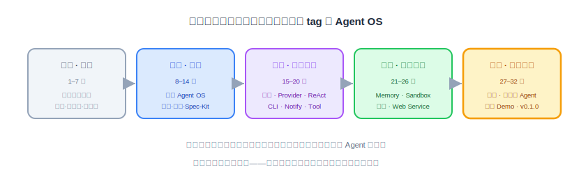
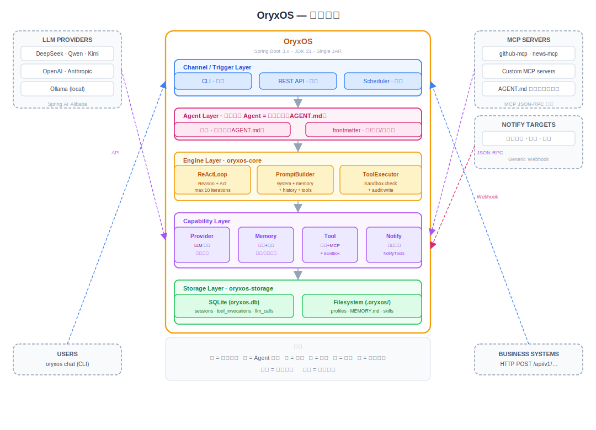

# 第一阶段总结、后续规划与社区推进

第一阶段收官。这节不写代码，做三件事：回头看清楚这五周到底建了什么、沉淀了什么；往前看扩展阶段的路怎么排；最后讲怎么把 OryxOS 和你自己都接到更长期的路上——社区与开源。

---

## 一、五周走过的路

回头看这条路的节奏是刻意的：前两周几乎不写代码——认知、方法论、工作流、需求分析、技术评审、Spec-Kit；后三周才动手，但每一步都踩在前两周立好的判断上。最终交付物是三样：**一个跑得稳的 Agent OS 底座、一套声明式定义 Agent 的机制、两个每天自己干活的真实 Agent（v0.1.0）**。

## 二、最重要的一张图：底座与 Agent 的分界

如果整个第一阶段只能带走一个架构认知，是这条分界线：

**1~28 节做的所有东西——Provider、ReAct、CLI、Notify、Tool、Memory、Sandbox、定时、Web Service——都是底座，不是 Agent。** 就像操作系统提供进程调度和系统调用，但 OS 本身不是任何一个程序。真正的业务 Agent 是 29 节才出现的：一份 Skill（做什么）+ 一份 Profile（怎么跑），插在底座上就能活。天气和日报两个 Agent 合计不到一百行文本、零行 Java——这个"不成比例"，就是底座价值的直接度量：**底座做得越对，定义一个 Agent 就越便宜。**

## 三、四条反复出现的设计母题

三十二节课，真正的设计决策翻来覆去就四条。它们不是 OryxOS 特有的，是可以带去任何项目的：

**接口先行，实现分档。** 先定一个只表达意图、不携带实现细节的接口，核心阶段只填最轻的一档。Notify 的 `NotifyChannelAdapter`（19）、Memory 的 `MemoryService`（21、22）、Sandbox 的 `Sandbox.enforce`（23、24）——三次都是同一招。检验方法也统一：拿最重的未来实现（企业微信 SDK、向量检索、microVM）在脑子里套一遍接口，套得进去，墙才算立住。

**信号驱动升级，不拍脑袋。** 什么时候上向量检索、什么时候上容器隔离、什么时候做自动记忆提炼——答案全都不是"业界都在做"，而是一组写下来的真实信号（检索开始找不准、要跑不可信代码、手动记忆明显漏事）。信号没出现，就顶住焦虑不动。

**分阶段克制。** 每一节都有一段"有几样先别做"：fallback、SSE、分布式锁、Tool Policy、自动提炼……不是不重要，是还没轮到。核心阶段的目标从来是最小完整的运行时内核，不是大而全。

**同一入口，复用不重写。** 人推、钟推走同一个 `AgentService`；API 建 Agent 和文件建 Agent 走同一套校验注册；notify 复用 Sandbox 白名单和 ToolExecutor 审计。凡是出现"第二条路径"，迟早出现"两条路径行为不一致"——这门课里最难查的几个 bug 都是这么来的。

## 四、你带走的工作流

比代码更值钱的是重复了十几遍、已经练进手里的那套节奏：

- **每个模块同一个四段式**：原理（是什么、为什么）→ 动手前想清楚（边界、坑、先不做什么）→ 和 AI 一起实现（执行交给 AI，Spec-Kit 把文档变成任务）→ 验证与讲代码（对着清单打勾，能讲出来才算懂）。
- **文档即规格**：16 节到 31 节这批文档本身就是 Spec-Kit 的输入——写清楚"该长什么样"，实现就是顺着长出来的。这是 SDD 在真实项目里的样子。
- **对账法**：一次调用应该留下且只留下哪些痕迹，逐表核对（27、28 节）。集成问题的照妖镜，也是审计能力的日常用法。
- **坑前置**：JPA 扫描、工具双调、依赖版本、缓存手滑……每个坑都在动手前的"想清楚"里点名。踩过的坑变成下一个项目的检查清单，这才算真正赚到。

## 五、后续规划：扩展阶段的路

技术方案里预留的扩展点，此刻全部有了明确的挂载位置。按模块列出方向和触发信号：

| 方向 | 挂在哪 | 什么信号再动手 |
|---|---|---|
| 多 Channel（企业微信/飞书/钉钉/Slack） | Channel Adapter 插件位（8.4 预留） | 有真实的 IM 接入需求 |
| Notify 专用渠道 Adapter | `NotifyChannelAdapter` 新实现类 | webhook 满足不了（富文本卡片等） |
| Memory 向量检索 | `MemoryService` 门面背后换实现 | 关键词检索找不准 / 记忆量过千 |
| Sandbox 容器 → microVM | `Sandbox` 接口新实现类 | 要跑不可信代码 / 多租户 |
| Tool Policy、认证、SSO、多租户 | 治理层预留位 | 走出内网、多团队共用 |
| 审计查询接口与看板 | 两张审计表之上（数据 Day One 就在） | 有人要看报表的那天 |
| SSE 流式、分布式部署、GraalVM | 各自预留位 | 交互体验 / 规模 / 启动时间成为瓶颈 |

注意这张表的共性：**每一项都是"新增实现、不改接口"**——这是第一阶段所有"接口先行"投资的兑现清单。

## 六、社区推进：把它接到更长的路上

OryxOS 的长期目标写在项目第一天：走进 Apache 基金会，成为顶级项目。从 v0.1.0 到那一步，近期能做的事很具体：

- **开出去**：仓库公开、License 与贡献指南齐备、项目主页（第 5 节做的那个官网）挂上 quickstart 和这套文档；
- **降低第一次贡献的门槛**：好上手的 issue 从扩展表里拆——一个新的 NotifyAdapter、一个新的内置 Tool，都是几百行以内、有现成接口可依的"第一个 PR"好题目；
- **让 Skill 生态先跑起来**：定义 Agent 不需要写 Java，意味着贡献者不需要懂 Java——分享一份好用的 SKILL.md 就是贡献，这是社区最宽的入口；
- **用这套文档教下一批人**：课程文档、技术方案、需求文档三件套本身就是社区的 onboarding 材料。

对你自己：第一阶段练的是"驾驭"——把一个真项目从零做成。接下来的进阶层，练的是把这套能力泛化——换一个领域、换一个技术栈，四段式节奏、四条设计母题、对账法照用。**认知和判断力是这门课真正想给你的东西，OryxOS 是它们的第一个产物，不该是最后一个。**

---

第一阶段，交卷。两个 Agent 明天早上还会准时出现在群里——不用任何人喊它们。
